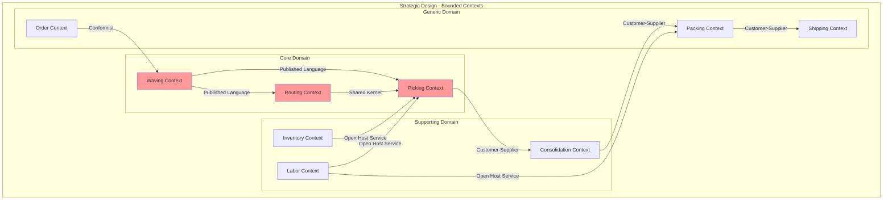
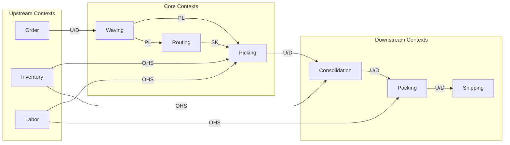
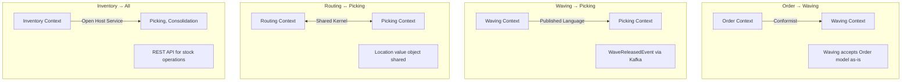
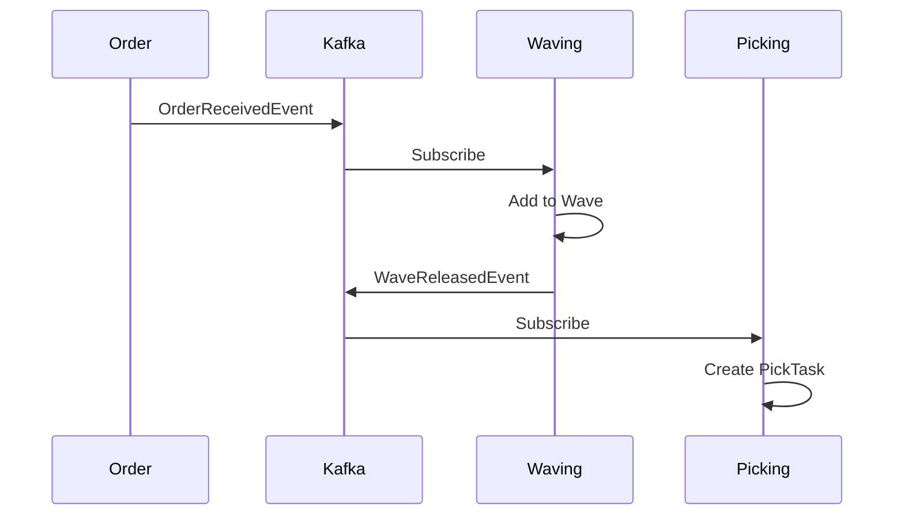
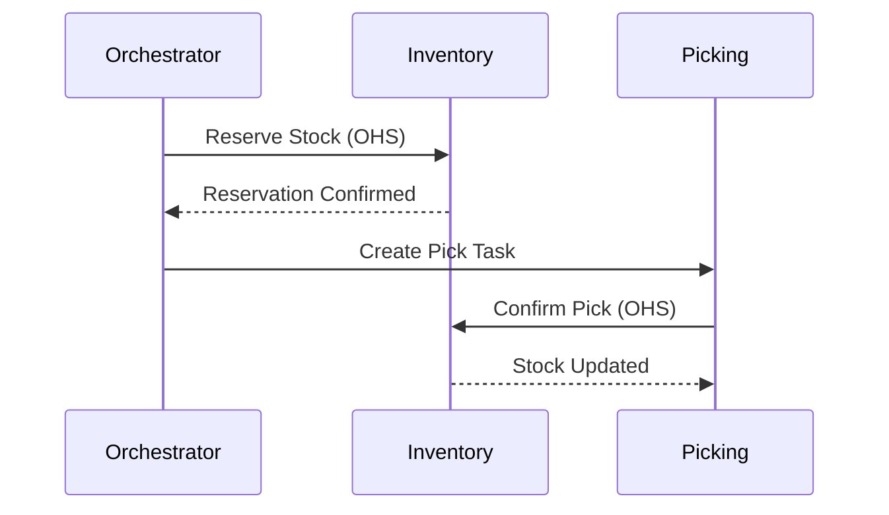
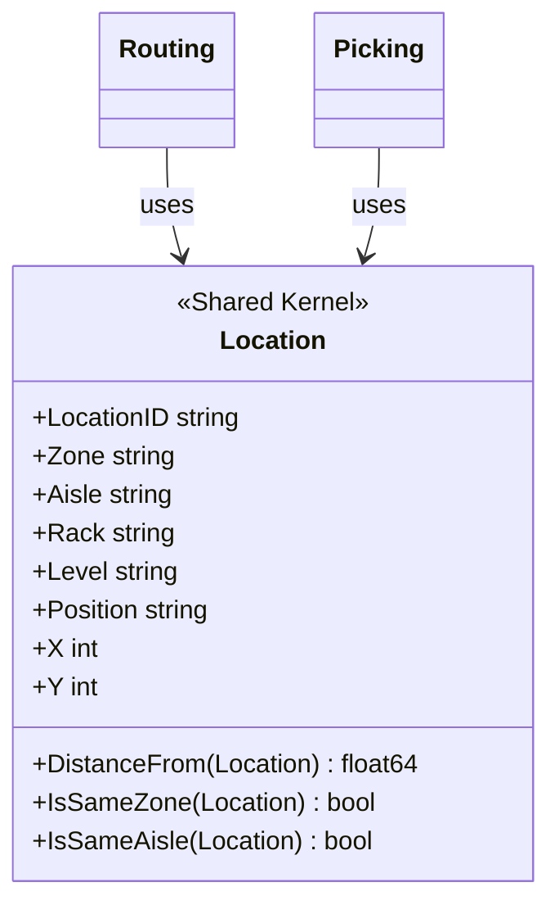
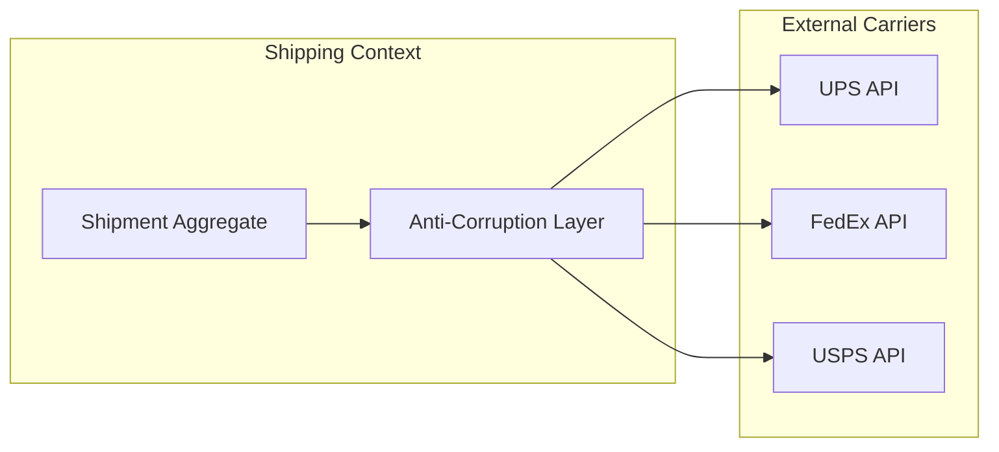

# WMS Platform - DDD Context Map

This document shows the bounded contexts and their relationships following Domain-Driven Design strategic patterns.

## Context Map Overview

## Detailed Relationship Map

## Context Relationships

### Relationship Types

| Pattern | Description | Usage |
|---------|-------------|-------|
| **Conformist (CF)** | Downstream conforms to upstream model | Order → Waving |
| **Customer-Supplier (U/D)** | Upstream serves downstream needs | Picking → Consolidation |
| **Published Language (PL)** | Shared language via events | Waving → Picking (CloudEvents) |
| **Shared Kernel (SK)** | Shared code between contexts | Routing ↔ Picking (Location) |
| **Open Host Service (OHS)** | Public API for multiple consumers | Inventory, Labor services |
| **Anti-Corruption Layer (ACL)** | Translation layer | External carrier integration |

### Context Relationships Detail

## Bounded Context Descriptions

### Core Domain Contexts

| Context | Responsibility | Aggregate Root |
|---------|---------------|----------------|
| **Picking** | Warehouse picking operations | PickTask |
| **Routing** | Pick path optimization | PickRoute |
| **Waving** | Batch order grouping | Wave |

### Supporting Domain Contexts

| Context | Responsibility | Aggregate Root |
|---------|---------------|----------------|
| **Inventory** | Stock management | InventoryItem |
| **Labor** | Workforce management | Worker |
| **Consolidation** | Multi-item combining | ConsolidationUnit |

### Generic Domain Contexts

| Context | Responsibility | Aggregate Root |
|---------|---------------|----------------|
| **Order** | Order lifecycle | Order |
| **Packing** | Package preparation | PackTask |
| **Shipping** | Carrier integration | Shipment |

## Integration Patterns

### Event-Based Integration

### API-Based Integration

## Shared Kernel: Location

The `Location` value object is shared between Routing and Picking contexts:

## Anti-Corruption Layer

## Team Ownership

| Context | Team | Deployment |
|---------|------|------------|
| Order | Order Team | order-service |
| Inventory | Inventory Team | inventory-service |
| Waving | Fulfillment Team | waving-service |
| Routing | Fulfillment Team | routing-service |
| Picking | Fulfillment Team | picking-service |
| Consolidation | Fulfillment Team | consolidation-service |
| Packing | Shipping Team | packing-service |
| Shipping | Shipping Team | shipping-service |
| Labor | Operations Team | labor-service |

## Related Documentation

- [Ecosystem](../ecosystem.md) - Platform architecture
- [Domain Events](domain-events.md) - Event flows
- [Order Fulfillment Flow](../order-fulfillment-flow.md) - End-to-end workflow
