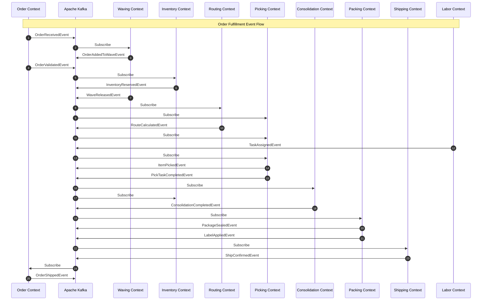
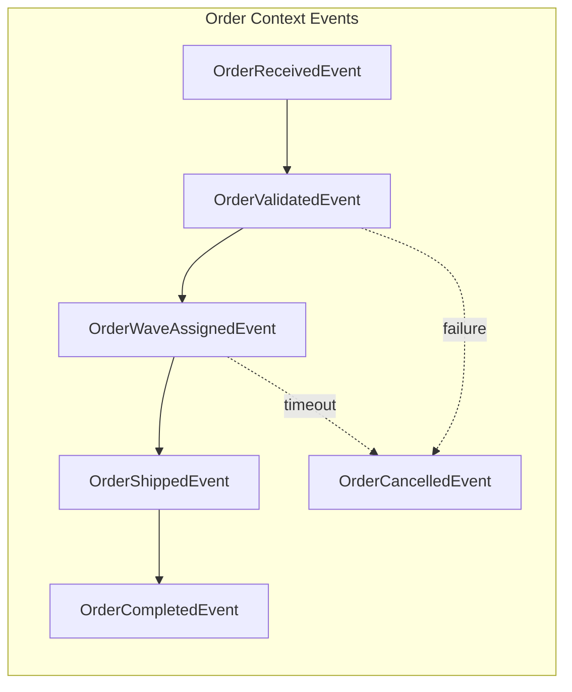
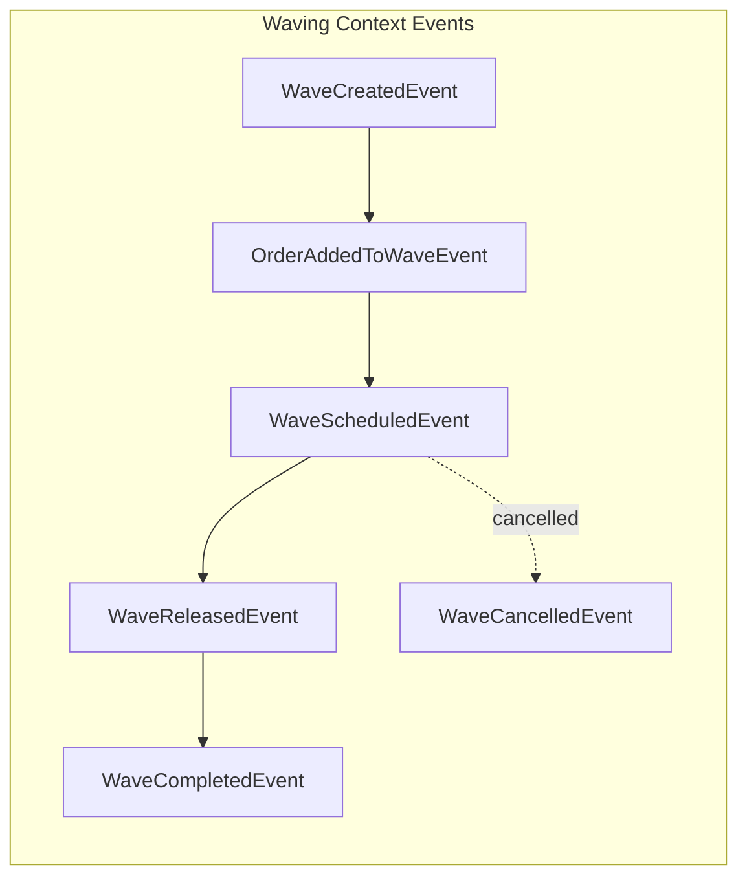
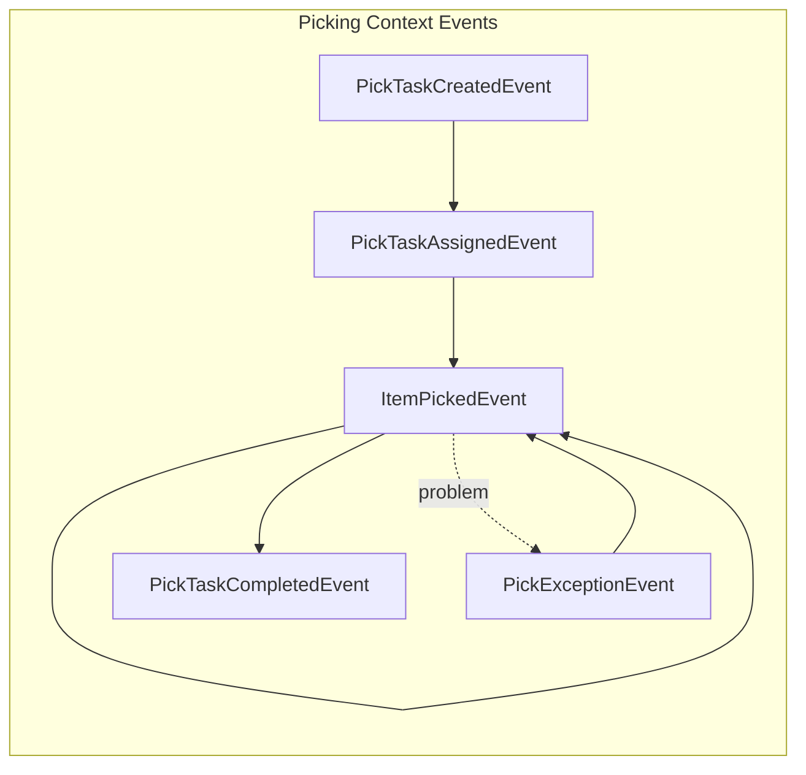
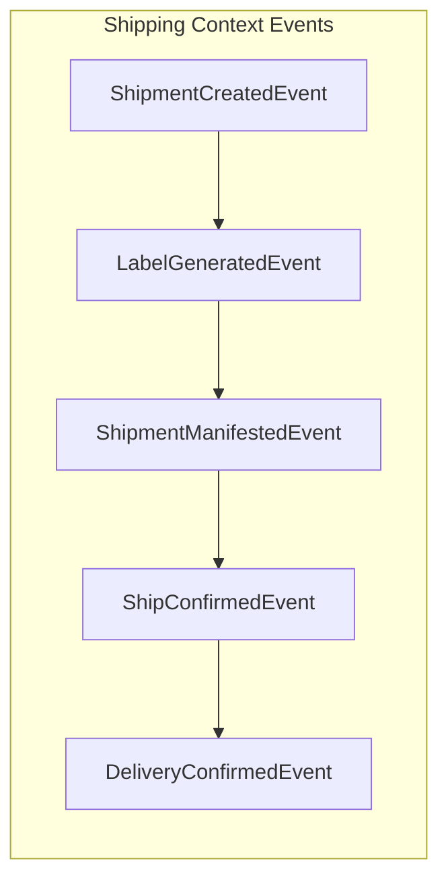
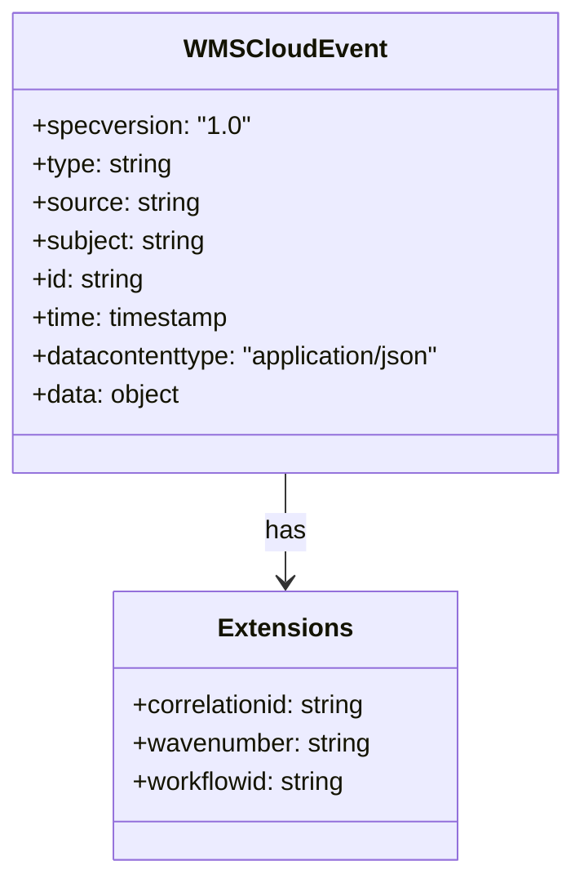
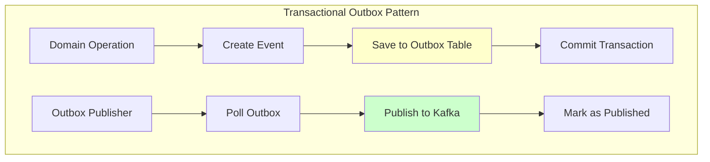
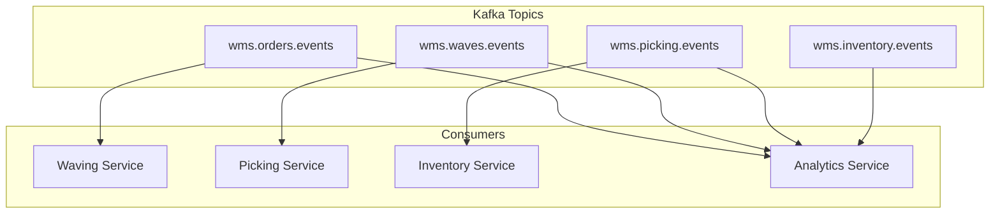
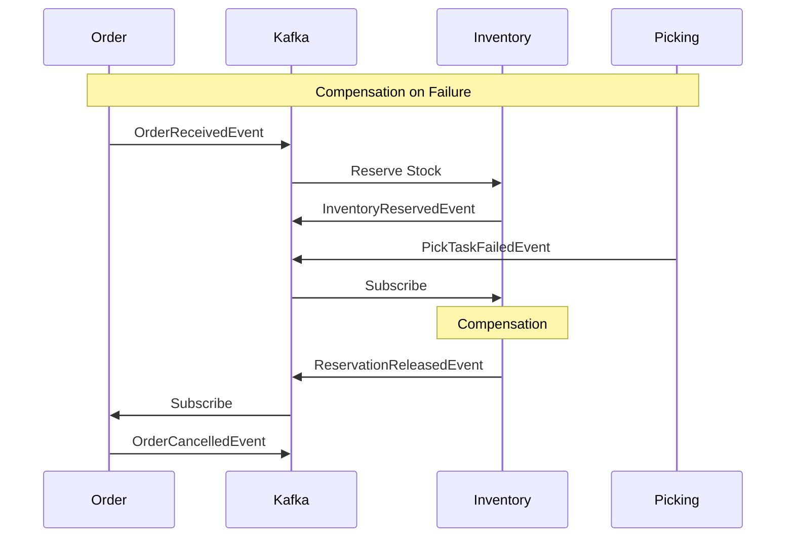

# WMS Platform - Domain Events Flow

This document shows the domain events and their flow across bounded contexts.

## Event Flow Overview

## Event Categories

### Order Events

### Wave Events

### Picking Events

### Shipping Events

## Event Catalog

### All Domain Events (58 Total)

| Context | Event Type | Kafka Topic | Description |
|---------|------------|-------------|-------------|
| **Order** | wms.order.received | wms.orders.events | Order placed |
| | wms.order.validated | wms.orders.events | Validation passed |
| | wms.order.wave-assigned | wms.orders.events | Assigned to wave |
| | wms.order.shipped | wms.orders.events | Order shipped |
| | wms.order.cancelled | wms.orders.events | Order cancelled |
| | wms.order.completed | wms.orders.events | Delivery confirmed |
| **Wave** | wms.wave.created | wms.waves.events | Wave created |
| | wms.wave.order-added | wms.waves.events | Order added |
| | wms.wave.scheduled | wms.waves.events | Wave scheduled |
| | wms.wave.released | wms.waves.events | Released to picking |
| | wms.wave.completed | wms.waves.events | All orders done |
| | wms.wave.cancelled | wms.waves.events | Wave cancelled |
| **Routing** | wms.routing.route-calculated | wms.routes.events | Route optimized |
| | wms.routing.route-started | wms.routes.events | Picking started |
| | wms.routing.stop-completed | wms.routes.events | Stop picked |
| | wms.routing.route-completed | wms.routes.events | Route finished |
| **Picking** | wms.picking.task-created | wms.picking.events | Task created |
| | wms.picking.task-assigned | wms.picking.events | Worker assigned |
| | wms.picking.item-picked | wms.picking.events | Item picked |
| | wms.picking.exception | wms.picking.events | Problem reported |
| | wms.picking.task-completed | wms.picking.events | Task done |
| **Consolidation** | wms.consolidation.started | wms.consolidation.events | Started |
| | wms.consolidation.item-consolidated | wms.consolidation.events | Item scanned |
| | wms.consolidation.completed | wms.consolidation.events | All items done |
| **Packing** | wms.packing.task-created | wms.packing.events | Task created |
| | wms.packing.packaging-suggested | wms.packing.events | Package selected |
| | wms.packing.package-sealed | wms.packing.events | Package sealed |
| | wms.packing.label-applied | wms.packing.events | Label affixed |
| | wms.packing.task-completed | wms.packing.events | Task done |
| **Shipping** | wms.shipping.shipment-created | wms.shipping.events | Shipment created |
| | wms.shipping.label-generated | wms.shipping.events | Label printed |
| | wms.shipping.manifested | wms.shipping.events | Added to manifest |
| | wms.shipping.confirmed | wms.shipping.events | Shipped |
| **Inventory** | wms.inventory.received | wms.inventory.events | Stock received |
| | wms.inventory.reserved | wms.inventory.events | Stock reserved |
| | wms.inventory.picked | wms.inventory.events | Stock picked |
| | wms.inventory.adjusted | wms.inventory.events | Stock adjusted |
| | wms.inventory.low-stock-alert | wms.inventory.events | Low stock |
| **Labor** | wms.labor.shift-started | wms.labor.events | Shift began |
| | wms.labor.shift-ended | wms.labor.events | Shift ended |
| | wms.labor.task-assigned | wms.labor.events | Task assigned |
| | wms.labor.task-completed | wms.labor.events | Task done |
| | wms.labor.performance-recorded | wms.labor.events | Metrics updated |

## Event Structure (CloudEvents 1.0)

## Event Publishing Pattern

## Event Consumers

## Saga Compensation Events

## Related Documentation

- [Context Map](context-map.md) - Bounded context relationships
- [Ecosystem](../ecosystem.md) - Platform architecture
- [Order Fulfillment Flow](../order-fulfillment-flow.md) - Workflow integration
