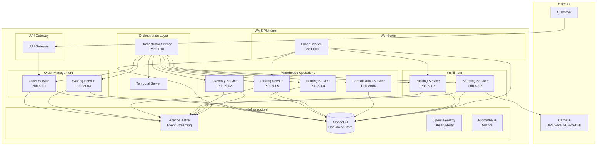
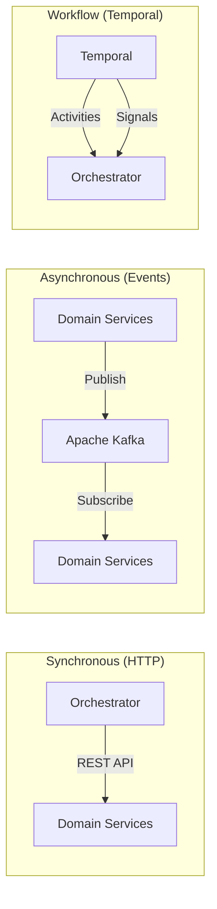

# WMS Platform Ecosystem

This diagram provides a high-level overview of the WMS (Warehouse Management System) platform architecture, showing all microservices, orchestration layer, and infrastructure components.

## Architecture Overview

## Service Communication Patterns

## Legend

| Symbol | Meaning |
|--------|---------|
| Rectangle | Microservice |
| Cylinder | Database |
| Arrow | Communication flow |
| Subgraph | Logical grouping |

## Related Diagrams

- [Order Fulfillment Flow](order-fulfillment-flow.md) - End-to-end order processing
- [Order Cancellation Flow](order-cancellation-flow.md) - Compensation pattern
- [Context Map](ddd/context-map.md) - DDD bounded contexts
