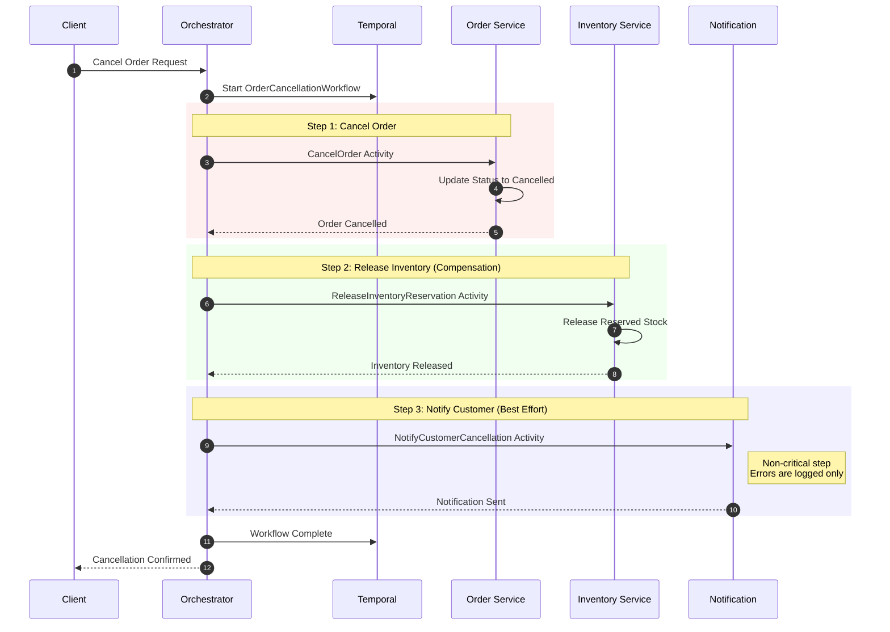
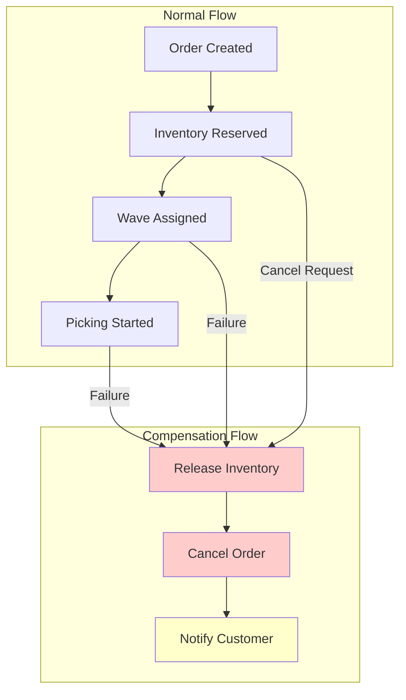
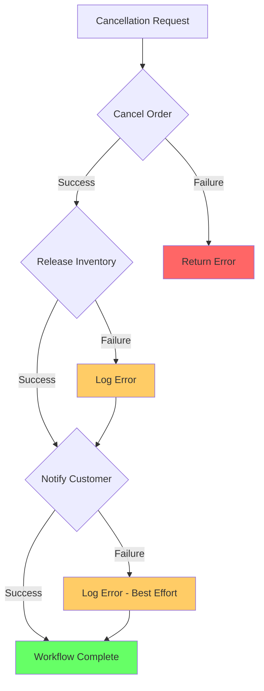

# Order Cancellation Flow

This diagram shows the order cancellation workflow with the Saga compensation pattern.

## Cancellation Sequence

## Compensation Pattern

## Error Handling Strategy

## Retry Policy

| Activity | Max Attempts | Initial Interval | Backoff |
|----------|--------------|------------------|---------|
| CancelOrder | 3 | 1 second | 2.0x |
| ReleaseInventoryReservation | 3 | 1 second | 2.0x |
| NotifyCustomerCancellation | 1 | - | None (best-effort) |

## Activity Options

- **StartToCloseTimeout**: 5 minutes
- **RetryPolicy**: Standard retry with 3 max attempts
- **Non-Retryable Errors**: ValidationError, NotFoundError

## Cancellation Rules

| Order Status | Can Cancel? | Notes |
|--------------|-------------|-------|
| received | Yes | Full refund |
| validated | Yes | Full refund |
| wave_assigned | Yes | Full refund |
| picking | Yes | May have partial pick |
| consolidated | Yes | Items returned to stock |
| packed | Yes | Package unpacked |
| shipped | No | Contact carrier |
| delivered | No | Return process required |

## Related Diagrams

- [Order Fulfillment Flow](order-fulfillment-flow.md) - Normal order flow
- [Ecosystem](ecosystem.md) - Platform overview
- [Domain Events](ddd/domain-events.md) - OrderCancelledEvent
