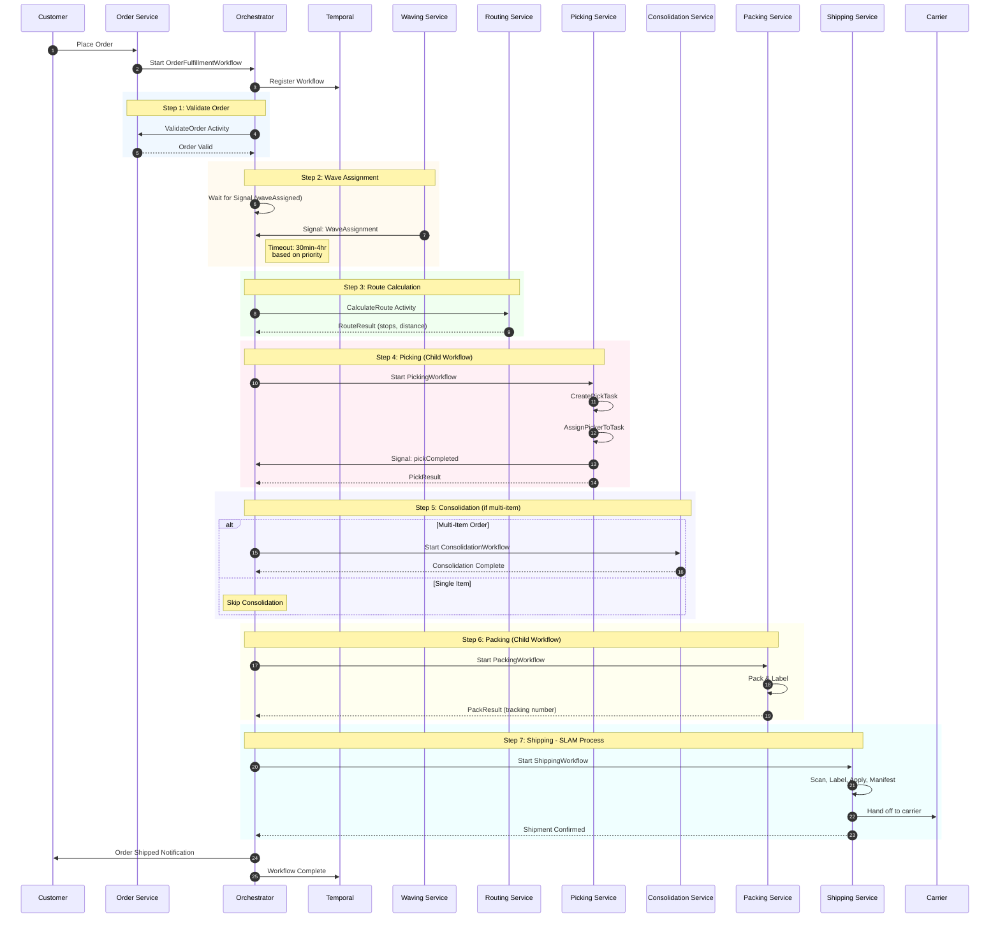
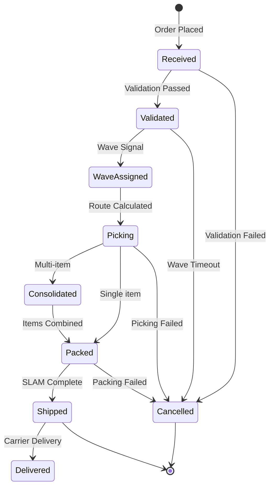

# Order Fulfillment Flow

This diagram shows the complete end-to-end order fulfillment saga, from order receipt to shipment confirmation.

## High-Level Flow

## Workflow States

## Priority-Based Timeouts

| Priority | Wave Timeout | Description |
|----------|--------------|-------------|
| same_day | 30 minutes | Same-day delivery orders |
| next_day | 2 hours | Next-day delivery orders |
| standard | 4 hours | Standard delivery orders |

## Error Handling

When any step fails, the workflow triggers compensation:
1. Release inventory reservations
2. Cancel order
3. Notify customer

## Related Diagrams

- [Ecosystem](ecosystem.md) - Platform overview
- [Order Cancellation Flow](order-cancellation-flow.md) - Compensation pattern
- [Picking Workflow](../../orchestrator/docs/diagrams/picking-workflow.md) - Detailed picking
- [Packing Workflow](../../orchestrator/docs/diagrams/packing-workflow.md) - Detailed packing
- [Shipping Workflow](../../orchestrator/docs/diagrams/shipping-workflow.md) - SLAM process
