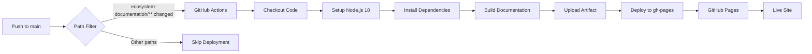

# GitHub Pages Deployment Guide

This guide covers deploying the WMS Platform documentation to GitHub Pages.

## Overview

- **Live URL:** https://temporal-wms.github.io/wms-platform/
- **Repository:** https://github.com/temporal-wms/wms-platform
- **Deployment Branch:** `gh-pages`
- **Deployment Method:** Automatic via GitHub Actions
- **Build Tool:** Docusaurus 3.6.0
- **Node Version:** 20+

## Deployment Architecture



## Automatic Deployment

### Trigger Conditions

Deployment automatically runs when:
- Changes are pushed to the `main` branch
- Files modified in `ecosystem-documentation/` directory
- Changes to `.github/workflows/deploy-docs.yml`

### Workflow Steps

1. **Build Job:**
   - Checkout repository with full history
   - Setup Node.js 20 with npm caching
   - Install dependencies (`npm ci`)
   - Build static site (`npm run build`)
   - Upload build artifact

2. **Deploy Job:**
   - Download build artifact
   - Deploy to GitHub Pages
   - Update live site

### Monitoring Deployment

**Check workflow status:**
```bash
# View workflow runs
gh run list --workflow=deploy-docs.yml

# Watch latest run
gh run watch

# View logs
gh run view --log
```

**Web interface:**
- Workflow runs: https://github.com/temporal-wms/wms-platform/actions/workflows/deploy-docs.yml
- GitHub Pages: https://github.com/temporal-wms/wms-platform/settings/pages

### Typical Deployment Time

- Build job: 2-3 minutes
- Deploy job: 30-60 seconds
- GitHub Pages propagation: 1-2 minutes
- **Total:** ~4-6 minutes from push to live

## Manual Deployment

### Prerequisites

```bash
cd ecosystem-documentation
npm install
```

### Deploy Command

```bash
# Set your GitHub username
export GIT_USER=your-github-username

# Deploy
npm run deploy
```

This will:
1. Build the documentation
2. Push to `gh-pages` branch
3. Trigger GitHub Pages deployment

### Using SSH Authentication

```bash
USE_SSH=true GIT_USER=your-github-username npm run deploy
```

## Configuration

### Docusaurus Settings

**File:** `ecosystem-documentation/docusaurus.config.js`

```javascript
{
  url: 'https://temporal-wms.github.io',
  baseUrl: '/wms-platform/',
  organizationName: 'temporal-wms',
  projectName: 'wms-platform',
  deploymentBranch: 'gh-pages',
  trailingSlash: false,
}
```

### GitHub Pages Settings

**Repository Settings > Pages:**
- Source: Deploy from a branch
- Branch: `gh-pages`
- Folder: `/ (root)`
- Enforce HTTPS: Enabled

## Pre-Deployment Checklist

Before deploying changes:

- [ ] Build succeeds locally: `npm run build`
- [ ] No broken links: Check build output
- [ ] Mermaid diagrams render correctly
- [ ] OpenAPI documentation displays
- [ ] Test with production baseUrl: `npm run serve`
- [ ] All navigation links work
- [ ] Images and assets load
- [ ] Dark/light themes work

## Testing Locally

### Development Server

```bash
cd ecosystem-documentation
npm start
```

Opens http://localhost:3000 (without `/wms-platform/` prefix)

### Production Build

```bash
# Build with production baseUrl
npm run build

# Serve built site
npm run serve
```

Opens http://localhost:3000/wms-platform/ (with GitHub Pages baseUrl)

**Important:** Always test `npm run serve` before deploying to verify paths work with `/wms-platform/` prefix.

## Troubleshooting

### Build Failures

**Error: "ReferenceError: variable is not defined"**

**Cause:** MDX interprets `{variable}` as JavaScript expressions

**Fix:** Escape curly braces in markdown:
```markdown
# Wrong
GET /api/v1/orders/{id}

# Correct
GET /api/v1/orders/\{id\}
```

**Error: "Broken links detected"**

**Cause:** Invalid internal links

**Fix:**
- Check all relative links
- Verify linked files exist
- Use directory links without `/index` suffix
- Fix: `./docs/index` → `./docs/`

**Error: "Mermaid syntax error"**

**Cause:** Invalid Mermaid diagram syntax

**Fix:**
- Validate at https://mermaid.live/
- Check for missing semicolons
- Verify diagram type (graph, sequenceDiagram, etc.)

### Deployment Failures

**Workflow not triggering:**

Check:
- Changes pushed to `main` branch
- Modified files in `ecosystem-documentation/`
- GitHub Actions enabled in repository

**Deploy job fails:**

Check:
- GitHub Pages is enabled in repository settings
- `gh-pages` branch permissions
- Repository Pages write permissions in workflow

**404 on GitHub Pages:**

Verify:
- `baseUrl` is `/wms-platform/` in docusaurus.config.js
- GitHub Pages source is `gh-pages` branch
- Wait 2-3 minutes for propagation

### Asset Loading Issues

**Images/CSS not loading:**

**Cause:** Incorrect baseUrl configuration

**Fix:** Ensure `baseUrl: '/wms-platform/'` in docusaurus.config.js

**Fix:** Use absolute URLs from baseUrl:
```markdown
# Wrong


# Correct (Docusaurus handles this automatically)

```

### Cache Issues

**Old content showing after deployment:**

**Solutions:**
1. Hard refresh: `Ctrl+Shift+R` (Windows/Linux) or `Cmd+Shift+R` (Mac)
2. Clear browser cache
3. Use incognito/private window
4. Wait 5-10 minutes for CDN propagation

## Rollback Procedures

### Rollback to Previous Version

```bash
# List recent commits on gh-pages
git log gh-pages --oneline -n 10

# Reset to previous commit
git checkout gh-pages
git reset --hard <commit-hash>
git push --force origin gh-pages
```

### Emergency: Disable Automatic Deployment

**Option 1: Disable workflow**
```bash
# Rename workflow file to disable
mv .github/workflows/deploy-docs.yml .github/workflows/deploy-docs.yml.disabled
git add .github/workflows/
git commit -m "Disable documentation deployment"
git push
```

**Option 2: Edit workflow**

Add condition to workflow:
```yaml
on:
  push:
    branches:
      - main
    paths:
      - 'ecosystem-documentation/**'
  workflow_dispatch:  # Manual trigger only
```

## Maintenance Tasks

### Weekly

- [ ] Review deployment logs for warnings
- [ ] Check broken link warnings
- [ ] Verify all diagrams render correctly

### Monthly

- [ ] Update dependencies: `npm update`
- [ ] Check for Docusaurus updates
- [ ] Review GitHub Actions usage/quotas
- [ ] Audit security vulnerabilities: `npm audit`

### Quarterly

- [ ] Major Docusaurus version updates
- [ ] Review and optimize build performance
- [ ] Update documentation content
- [ ] Test all external links

## Performance Optimization

### Build Performance

Current build time: ~45-60 seconds

**Optimization tips:**
- Use npm caching in GitHub Actions (already configured)
- Minimize large images (compress before adding)
- Limit OpenAPI spec size
- Use incremental builds in development

### Site Performance

**Best practices:**
- Optimize images (use WebP format)
- Minimize custom CSS
- Lazy load large components
- Enable compression (automatic via GitHub Pages)

## Security

### Dependency Security

```bash
# Audit dependencies
npm audit

# Fix vulnerabilities
npm audit fix

# Fix including breaking changes
npm audit fix --force
```

### Access Control

- **Repository access:** Control via GitHub permissions
- **Deployment:** Restricted to `main` branch
- **Pages deployment:** Uses `GITHUB_TOKEN` with minimal permissions

## Monitoring

### Key Metrics

- Build success rate: Target 100%
- Build duration: Target <3 minutes
- Deployment frequency: Per push to main
- Uptime: GitHub Pages SLA 99.9%

### Alerts

GitHub Actions will notify on:
- Build failures (email to commit author)
- Deployment failures (check Actions tab)
- Broken links (build warnings)

## Support

### Resources

- Docusaurus Documentation: https://docusaurus.io/docs
- GitHub Pages Documentation: https://docs.github.com/en/pages
- GitHub Actions Documentation: https://docs.github.com/en/actions

### Getting Help

1. Check this guide first
2. Review GitHub Actions logs
3. Search Docusaurus GitHub issues
4. Ask in project repository discussions

## Changelog

| Date | Version | Changes |
|------|---------|---------|
| 2026-01-09 | 1.0.0 | Initial GitHub Pages deployment setup |
