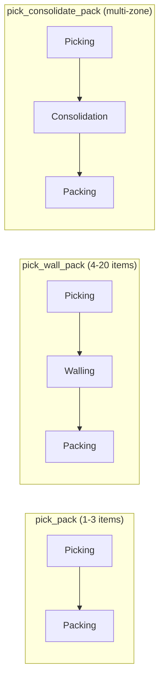

# API Catalog

The WMS Platform exposes APIs through two primary mechanisms: REST APIs (OpenAPI) for synchronous operations and Event APIs (AsyncAPI) for asynchronous, event-driven communication.

## Overview

| Category | Count | Standard |
|----------|-------|----------|
| REST APIs | 16 services | OpenAPI 3.0.3 |
| Event APIs | 15 services | AsyncAPI 3.0.0 |
| Event Format | - | CloudEvents 1.0 |
| Message Broker | - | Apache Kafka |

## Services by Domain

### Core Fulfillment

| Service | Port | REST API | Event API | Description |
|---------|------|----------|-----------|-------------|
| Order Service | 8001 | [OpenAPI](./specs/openapi/order-service.yaml) | [AsyncAPI](./specs/asyncapi/order-service.yaml) | Order lifecycle management |
| Waving Service | 8002 | [OpenAPI](./specs/openapi/waving-service.yaml) | [AsyncAPI](./specs/asyncapi/waving-service.yaml) | Wave planning and scheduling |
| WES Service | 8016 | [OpenAPI](./specs/openapi/wes-service.yaml) | [AsyncAPI](./specs/asyncapi/wes-service.yaml) | Warehouse execution orchestration |
| Orchestrator | 30010 | [OpenAPI](./specs/openapi/orchestrator.yaml) | - | Temporal workflow coordination |

### Warehouse Operations

| Service | Port | REST API | Event API | Description |
|---------|------|----------|-----------|-------------|
| Routing Service | 8003 | [OpenAPI](./specs/openapi/routing-service.yaml) | [AsyncAPI](./specs/asyncapi/routing-service.yaml) | Pick route optimization |
| Picking Service | 8004 | [OpenAPI](./specs/openapi/picking-service.yaml) | [AsyncAPI](./specs/asyncapi/picking-service.yaml) | Pick task management |
| Walling Service | 8017 | [OpenAPI](./specs/openapi/walling-service.yaml) | [AsyncAPI](./specs/asyncapi/walling-service.yaml) | Put-wall sorting operations |
| Consolidation Service | 8005 | [OpenAPI](./specs/openapi/consolidation-service.yaml) | [AsyncAPI](./specs/asyncapi/consolidation-service.yaml) | Multi-item order consolidation |
| Packing Service | 8006 | [OpenAPI](./specs/openapi/packing-service.yaml) | [AsyncAPI](./specs/asyncapi/packing-service.yaml) | Package and label management |
| Shipping Service | 8007 | [OpenAPI](./specs/openapi/shipping-service.yaml) | [AsyncAPI](./specs/asyncapi/shipping-service.yaml) | SLAM and carrier integration |

### Inventory & Inbound

| Service | Port | REST API | Event API | Description |
|---------|------|----------|-----------|-------------|
| Inventory Service | 8008 | [OpenAPI](./specs/openapi/inventory-service.yaml) | [AsyncAPI](./specs/asyncapi/inventory-service.yaml) | Stock management |
| Receiving Service | 8011 | [OpenAPI](./specs/openapi/receiving-service.yaml) | [AsyncAPI](./specs/asyncapi/receiving-service.yaml) | Inbound shipment processing |
| Stow Service | 8012 | [OpenAPI](./specs/openapi/stow-service.yaml) | [AsyncAPI](./specs/asyncapi/stow-service.yaml) | Putaway task management |

### Infrastructure & Support

| Service | Port | REST API | Event API | Description |
|---------|------|----------|-----------|-------------|
| Labor Service | 8009 | [OpenAPI](./specs/openapi/labor-service.yaml) | [AsyncAPI](./specs/asyncapi/labor-service.yaml) | Workforce management |
| Facility Service | 8010 | [OpenAPI](./specs/openapi/facility-service.yaml) | [AsyncAPI](./specs/asyncapi/facility-service.yaml) | Station and zone configuration |
| Sortation Service | 8013 | [OpenAPI](./specs/openapi/sortation-service.yaml) | [AsyncAPI](./specs/asyncapi/sortation-service.yaml) | Package sortation |

## Process Paths

The WES service orchestrates three fulfillment paths:

## API Standards

### REST APIs

- **Base Path**: `/api/v1`
- **Authentication**: Bearer token via `Authorization` header
- **Content-Type**: `application/json`
- **Correlation**: `X-WMS-Correlation-ID` header for distributed tracing

### Event APIs

- **Format**: CloudEvents 1.0
- **Broker**: Apache Kafka
- **Retention**: 7 days
- **Compression**: gzip

## Kafka Topics

| Topic | Service | Description |
|-------|---------|-------------|
| `wms.orders.events` | Order Service | Order lifecycle events |
| `wms.waves.events` | Waving Service | Wave management events |
| `wms.wes.events` | WES Service | Execution orchestration events |
| `wms.walling.events` | Walling Service | Put-wall sorting events |
| `wms.routes.events` | Routing Service | Route calculation events |
| `wms.picking.events` | Picking Service | Pick task events |
| `wms.consolidation.events` | Consolidation Service | Consolidation events |
| `wms.packing.events` | Packing Service | Packing events |
| `wms.shipping.events` | Shipping Service | SLAM and shipping events |
| `wms.inventory.events` | Inventory Service | Stock management events |
| `wms.labor.events` | Labor Service | Workforce events |

## Shared Components

- [Common OpenAPI Components](./specs/openapi/common-components.yaml) - Shared schemas and parameters
- [WMS Events Schema](./specs/asyncapi/wms-events.yaml) - Platform-wide event definitions

## Quick Links

- [REST API Guide](./rest-api) - REST conventions and examples
- [Events API Guide](./events-api) - Event format and Kafka topics
- [OpenAPI Specifications](./specs/openapi/) - All REST API specs
- [AsyncAPI Specifications](./specs/asyncapi/) - All Event API specs
