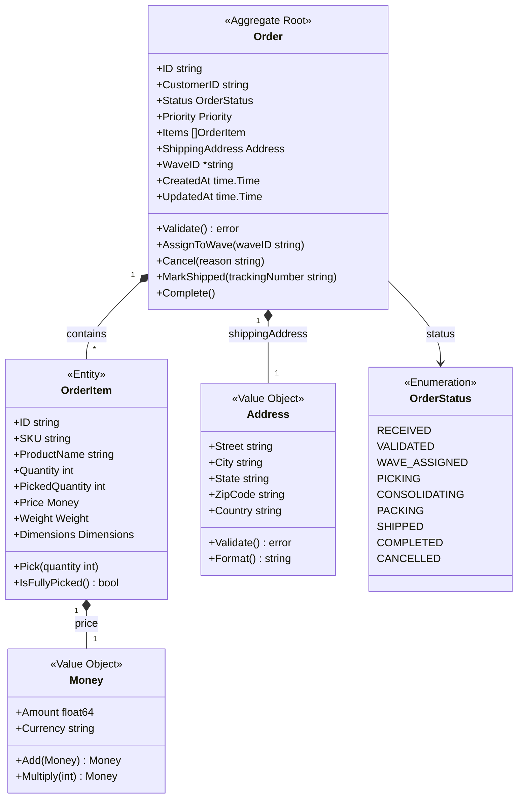
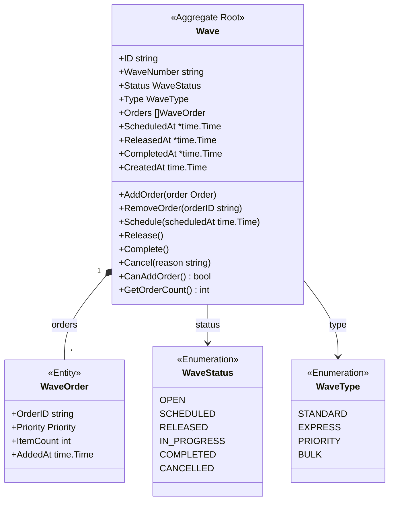
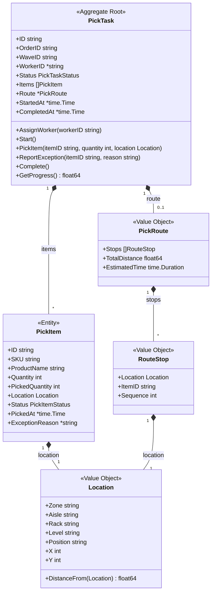
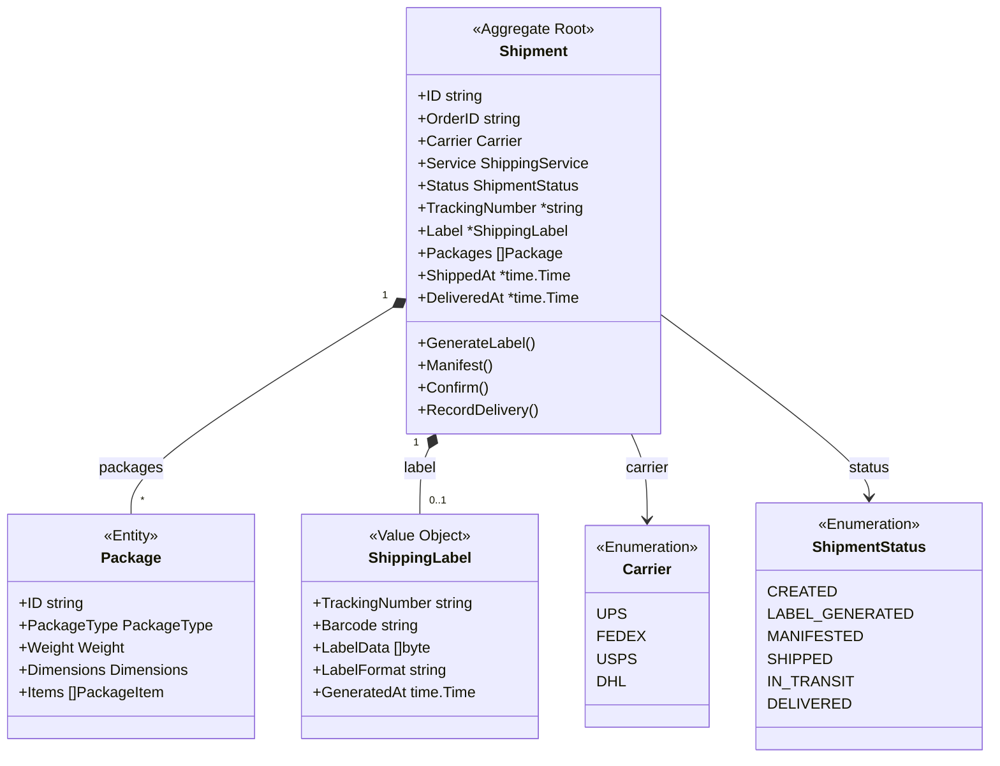
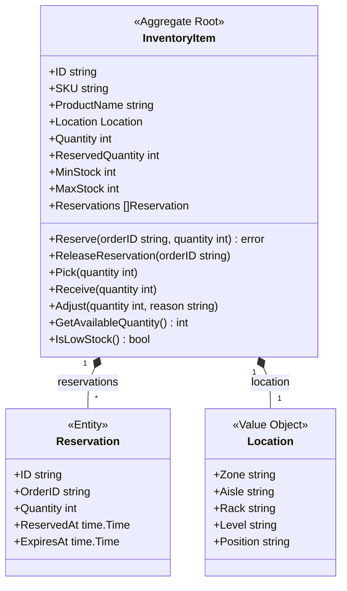
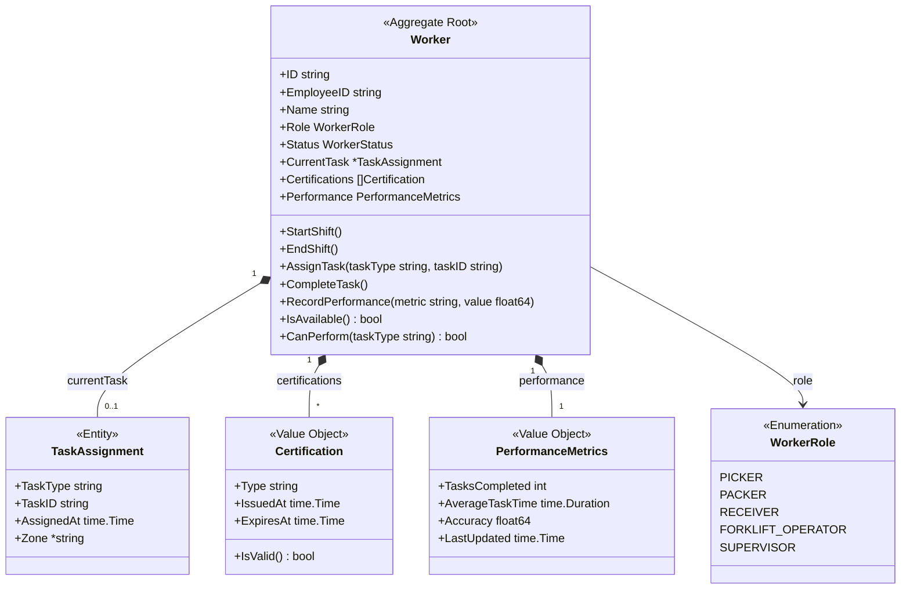
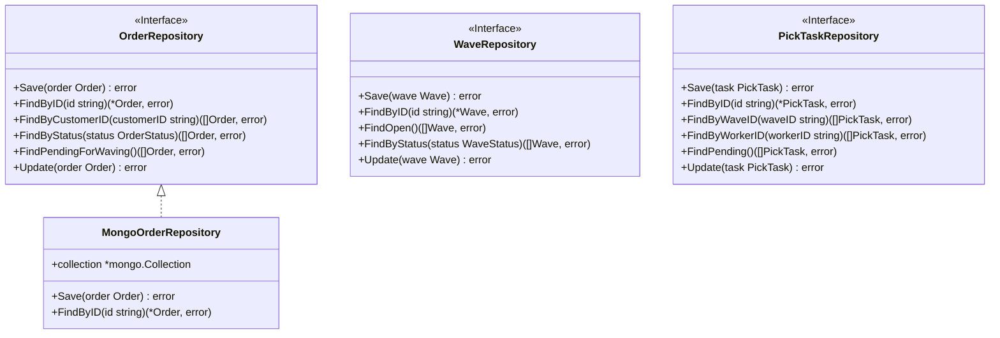
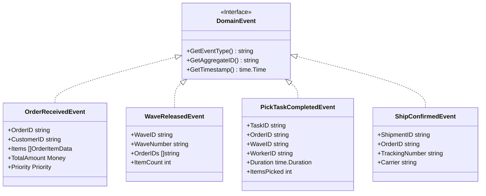

# C4 Level 4: Code Diagrams

Code diagrams show the internal structure of components at the class/struct level, focusing on key domain aggregates and their relationships.

## Order Aggregate

## Wave Aggregate

## PickTask Aggregate

## Shipment Aggregate

## InventoryItem Aggregate

## Worker Aggregate

## Repository Interfaces

## Event Types

## Related Diagrams

- [Component Diagram](./components) - Component-level view
- [Aggregates](/domain-driven-design/aggregates/order) - Detailed aggregate documentation
- [Domain Events](/domain-driven-design/domain-events) - Complete event catalog
