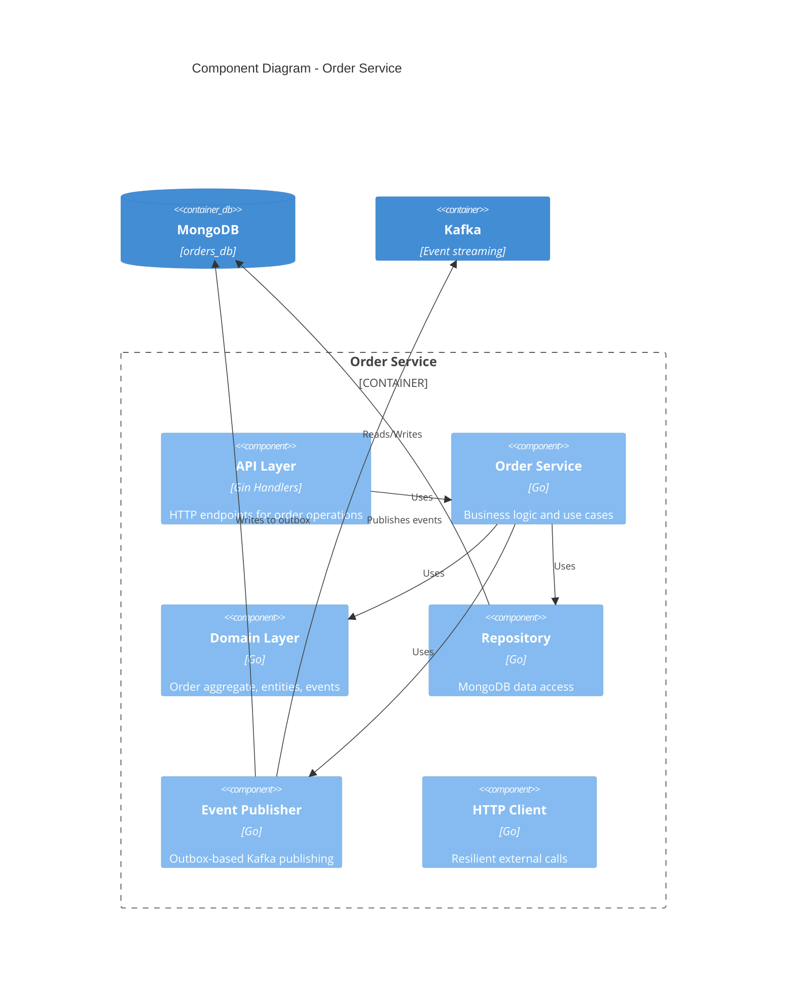
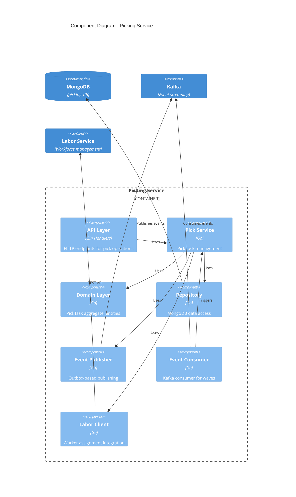
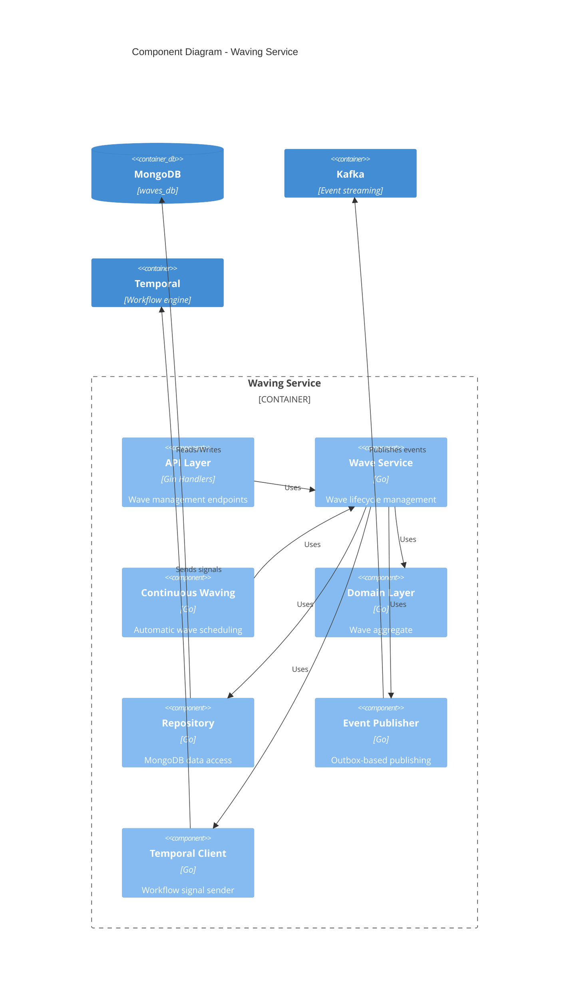
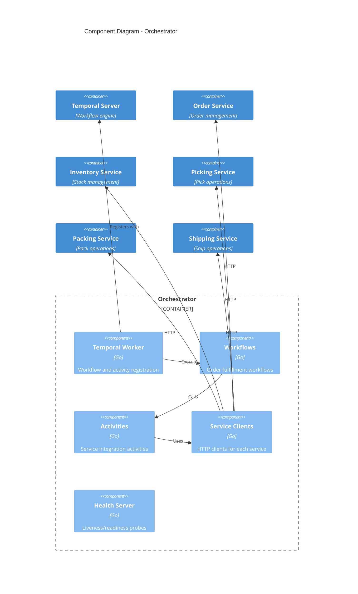
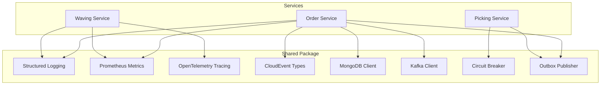
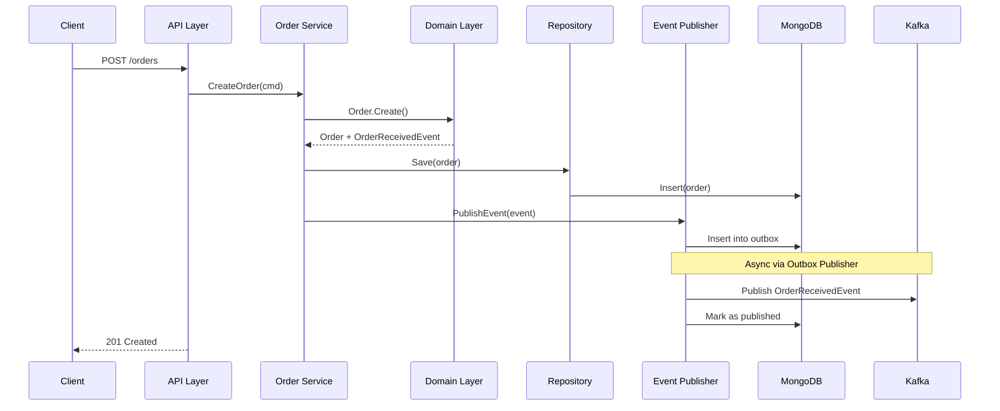

# C4 Level 3: Component Diagrams

Component diagrams show the internal structure of each container, revealing the major building blocks and their interactions.

## Order Service Components

### Order Service Components

| Component | Responsibility |
|-----------|---------------|
| **API Layer** | HTTP handlers, request validation, response mapping |
| **Order Service** | Use cases: CreateOrder, ValidateOrder, CancelOrder |
| **Domain Layer** | Order aggregate, OrderItem entity, domain events |
| **Repository** | CRUD operations, query implementations |
| **Event Publisher** | Outbox pattern implementation, Kafka producer |
| **HTTP Client** | Circuit breaker, retries, timeout handling |

## Picking Service Components

## Waving Service Components

## Orchestrator Components

### Orchestrator Workflows

| Workflow | Description |
|----------|-------------|
| **OrderFulfillmentWorkflow** | Main workflow for end-to-end order processing |
| **PickingWorkflow** | Child workflow for picking operations |
| **ConsolidationWorkflow** | Child workflow for multi-item consolidation |
| **PackingWorkflow** | Child workflow for packing operations |
| **ShippingWorkflow** | Child workflow for shipping and SLAM |

### Orchestrator Activities

| Activity | Service | Operation |
|----------|---------|-----------|
| ValidateOrder | Order Service | Validate order data |
| ReserveInventory | Inventory Service | Reserve stock |
| CreatePickTask | Picking Service | Create picking task |
| GetPickTaskStatus | Picking Service | Check pick status |
| CreateConsolidation | Consolidation Service | Start consolidation |
| CreatePackTask | Packing Service | Create packing task |
| CreateShipment | Shipping Service | Create shipment |

## Shared Components

All services share common infrastructure components:

## Component Interactions

### Order Creation Flow

## Related Diagrams

- [Container Diagram](./containers) - High-level containers
- [Code Diagram](./code) - Class-level details
- [Domain Events](/domain-driven-design/domain-events) - Event catalog
