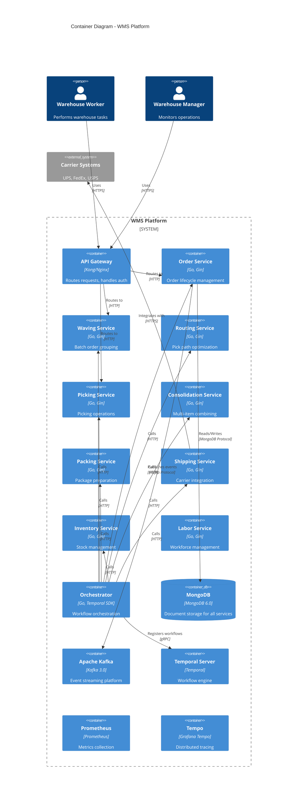
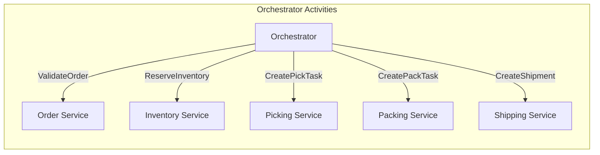
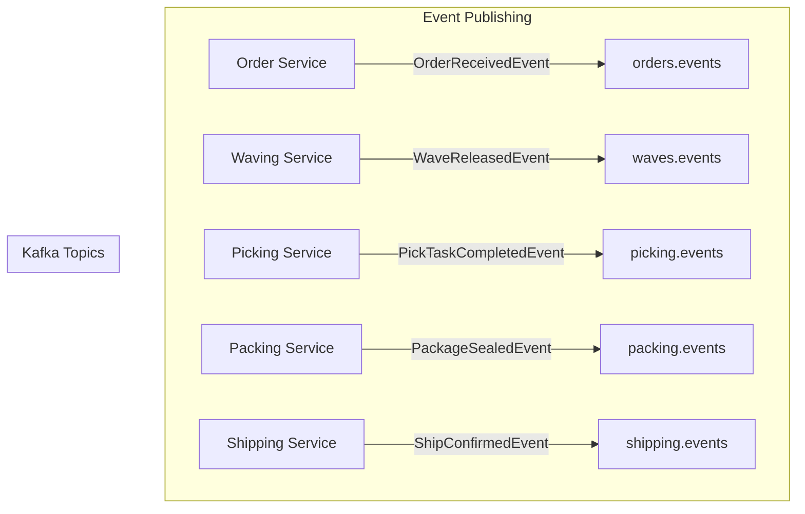
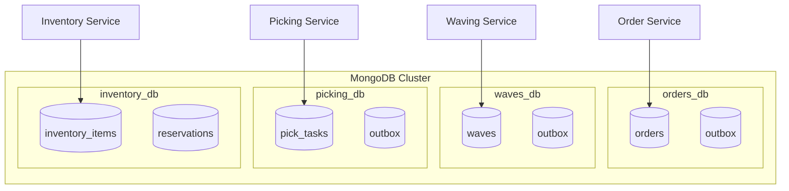
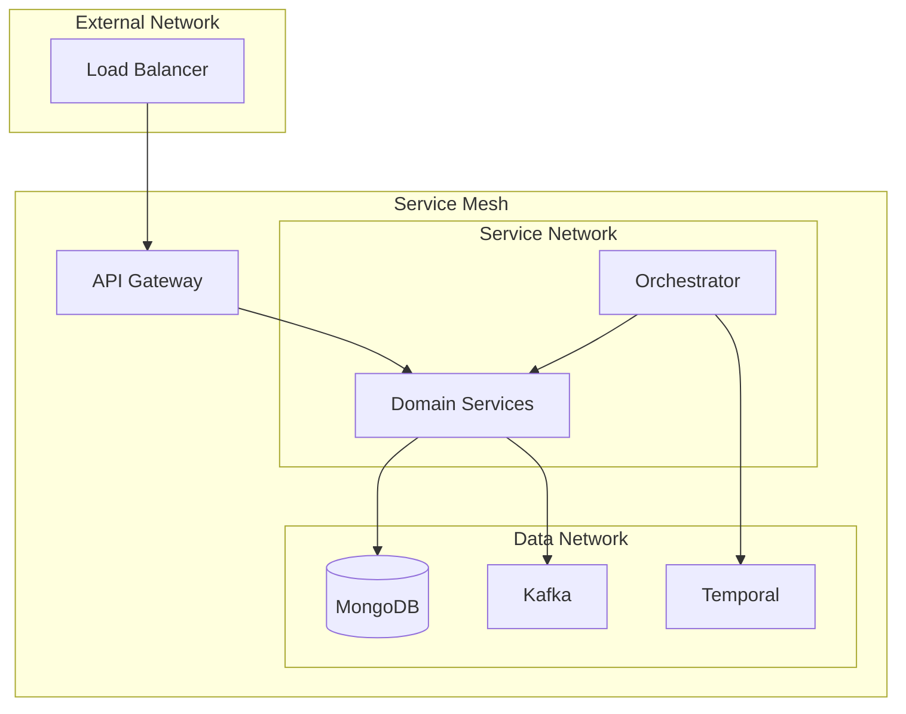

# C4 Level 2: Container Diagram

The Container diagram shows the high-level technology choices and how responsibilities are distributed across containers (applications, databases, etc.).

## Container Diagram

## Container Descriptions

### Application Services

| Container | Technology | Port | Description |
|-----------|------------|------|-------------|
| **Order Service** | Go, Gin | 8001 | Manages order lifecycle from receipt to completion |
| **Waving Service** | Go, Gin | 8002 | Groups orders into waves for efficient picking |
| **Routing Service** | Go, Gin | 8003 | Calculates optimal pick paths through warehouse |
| **Picking Service** | Go, Gin | 8004 | Manages picking task execution |
| **Consolidation Service** | Go, Gin | 8005 | Combines items from multi-item orders |
| **Packing Service** | Go, Gin | 8006 | Handles package preparation and labeling |
| **Shipping Service** | Go, Gin | 8007 | Integrates with carriers for shipping |
| **Inventory Service** | Go, Gin | 8008 | Tracks stock levels and locations |
| **Labor Service** | Go, Gin | 8009 | Manages workforce and task assignments |
| **Orchestrator** | Go, Temporal SDK | 8080 | Executes Temporal workflows |

### Infrastructure Containers

| Container | Technology | Purpose |
|-----------|------------|---------|
| **MongoDB** | MongoDB 6.0 | Document storage (database per service) |
| **Apache Kafka** | Kafka 3.0 | Event streaming and messaging |
| **Temporal Server** | Temporal | Workflow execution engine |
| **Prometheus** | Prometheus | Metrics collection and alerting |
| **Tempo** | Grafana Tempo | Distributed trace storage |

## Service Interactions

### Synchronous Communication

### Asynchronous Communication

## Database Architecture

Each service has its own database:

## Network Topology

## Scalability Considerations

| Container | Scaling Strategy | Notes |
|-----------|-----------------|-------|
| Order Service | Horizontal | Stateless, scale based on order volume |
| Picking Service | Horizontal | Scale based on warehouse zones |
| Orchestrator | Horizontal | Multiple workers for workflow processing |
| MongoDB | ReplicaSet + Sharding | Shard by tenant/warehouse |
| Kafka | Partition-based | Increase partitions for throughput |

## Related Diagrams

- [System Context](./context) - External view
- [Component Diagram](./components) - Internal service structure
- [Infrastructure](../system-diagrams/infrastructure) - Deployment details
