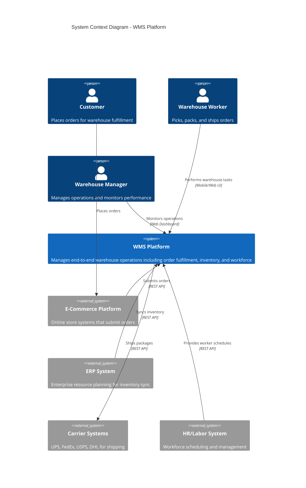
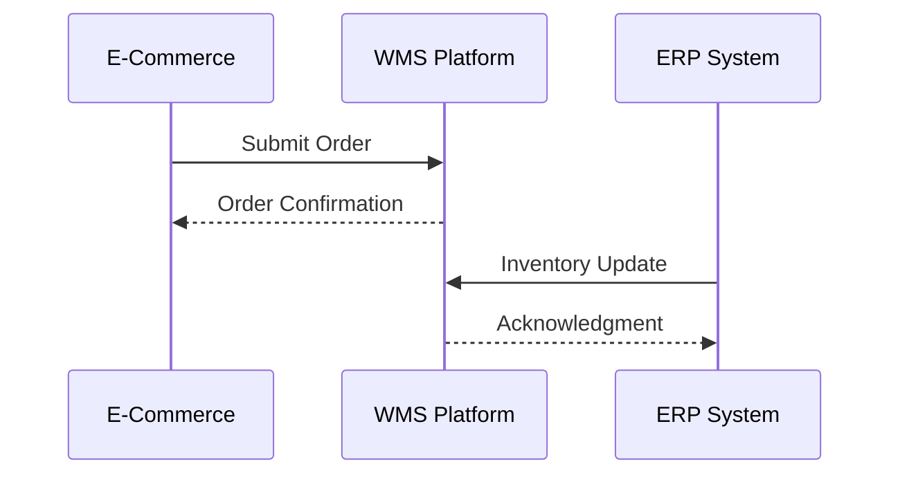
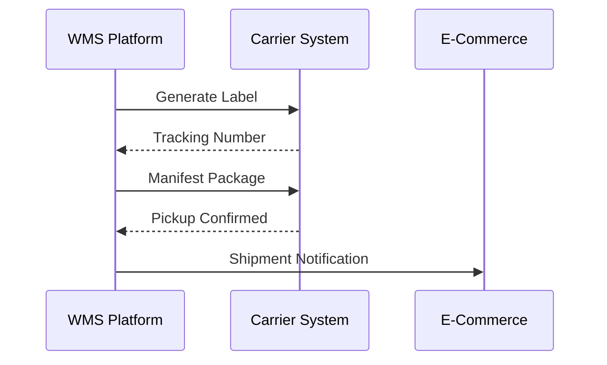
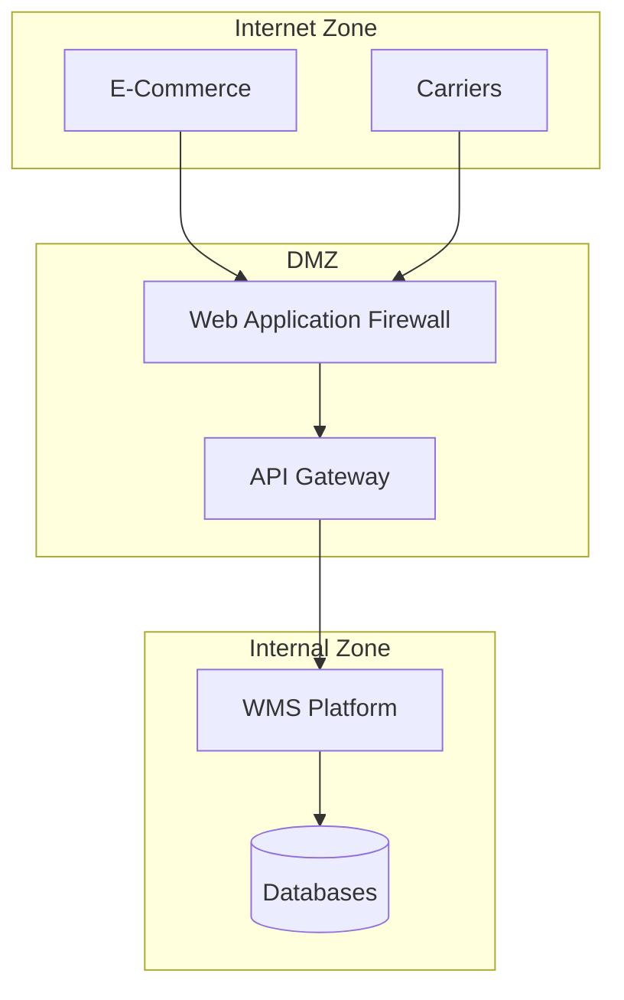

# C4 Level 1: System Context

The System Context diagram shows the WMS Platform as a whole and its relationships with external actors and systems.

## System Context Diagram

## Context Description

### Primary Actors

| Actor | Description | Interactions |
|-------|-------------|--------------|
| **Customer** | End consumer who places orders through e-commerce platforms | Orders are received and fulfilled by WMS |
| **Warehouse Worker** | Employee who performs picking, packing, and shipping | Uses mobile/web interface to complete tasks |
| **Warehouse Manager** | Operations manager who oversees warehouse performance | Monitors dashboards, manages waves, adjusts priorities |

### External Systems

| System | Description | Integration |
|--------|-------------|-------------|
| **E-Commerce Platform** | Shopify, Magento, custom storefronts | REST API for order submission |
| **ERP System** | SAP, Oracle, NetSuite | Inventory synchronization |
| **Carrier Systems** | UPS, FedEx, USPS, DHL | Label generation, tracking, manifesting |
| **HR/Labor System** | Workforce management | Worker schedules, time tracking |

### WMS Platform Capabilities

The WMS Platform provides:

1. **Order Management**
   - Receive and validate orders
   - Track order status through fulfillment
   - Handle order modifications and cancellations

2. **Warehouse Operations**
   - Wave planning and release
   - Pick path optimization
   - Picking, consolidation, packing workflows

3. **Inventory Management**
   - Real-time stock levels
   - Location management
   - Reservation and allocation

4. **Shipping**
   - Carrier selection
   - Label generation (SLAM)
   - Manifest creation

5. **Workforce Management**
   - Task assignment
   - Performance tracking
   - Workload balancing

## Data Flows

### Inbound Flows

### Outbound Flows

## Security Boundary

## Related Diagrams

- [Container Diagram](./containers) - Internal structure of the WMS Platform
- [Architecture Overview](../overview) - Detailed architecture description
