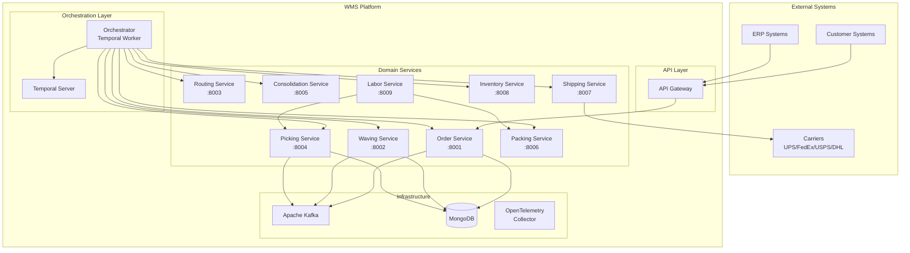

# Architecture Overview

The WMS Platform follows a microservices architecture with event-driven communication and workflow orchestration. This document provides a high-level overview of the system design.

## High-Level Architecture

## Architectural Principles

### 1. Domain-Driven Design
Each service represents a bounded context with:
- **Aggregate Root** - Single point of consistency
- **Domain Events** - State changes communicated via events
- **Repository Pattern** - Data access abstraction

### 2. Event-Driven Architecture
- **CloudEvents 1.0** specification for all events
- **Transactional Outbox Pattern** for reliable event publishing
- **11 Kafka Topics** organizing events by domain

### 3. Workflow Orchestration
- **Temporal** for durable workflow execution
- **Saga Pattern** with automatic compensation
- **Child Workflows** for complex sub-processes

### 4. Resilience Patterns
- **Circuit Breakers** for external calls
- **Retries with Exponential Backoff**
- **Bulkhead Isolation** between services

## Communication Patterns

### Synchronous Communication
- **Orchestrator → Services**: REST API calls for workflow activities
- **Service → Service**: Limited, only for critical operations

### Asynchronous Communication
- **Event Publishing**: Services publish domain events to Kafka
- **Event Consumption**: Services subscribe to relevant topics
- **Guaranteed Delivery**: Outbox pattern ensures events are published

### Workflow Signals
- **Wave Assignment**: Signal to workflow when order is assigned to wave
- **Pick Completion**: Signal when picking is complete

## Data Architecture

### Database per Service
Each service owns its database:
- **Order Service** → `orders_db`
- **Waving Service** → `waves_db`
- **Routing Service** → `routing_db`
- **Picking Service** → `picking_db`
- **Consolidation Service** → `consolidation_db`
- **Packing Service** → `packing_db`
- **Shipping Service** → `shipping_db`
- **Inventory Service** → `inventory_db`
- **Labor Service** → `labor_db`

### Event Store
Kafka serves as the event store for:
- Domain event history
- Event replay capabilities
- Cross-service integration

## Service Layers

Each microservice follows a layered architecture:

### Layer Responsibilities

| Layer | Responsibility |
|-------|---------------|
| **API** | HTTP handlers, request/response mapping, validation |
| **Application** | Use cases, command/query handlers, transaction management |
| **Domain** | Business logic, aggregates, domain events, value objects |
| **Infrastructure** | Database access, message publishing, external APIs |

## Deployment Architecture

## Key Design Decisions

### Why Temporal for Orchestration?
- **Durability**: Workflow state survives process crashes
- **Visibility**: Built-in monitoring and debugging
- **Retries**: Automatic retry with configurable policies
- **Signals**: External events can influence workflow execution

### Why Event-Driven?
- **Loose Coupling**: Services don't need to know about each other
- **Scalability**: Independent scaling of producers and consumers
- **Audit Trail**: Complete history of domain events
- **Flexibility**: Easy to add new consumers

### Why MongoDB?
- **Flexible Schema**: Aggregate storage with nested documents
- **JSON Documents**: Natural fit for domain aggregates
- **Horizontal Scaling**: Sharding for large datasets
- **MongoDB Transactions**: ACID guarantees for aggregate consistency

## Related Documentation

- [C4 Diagrams](/architecture/c4-diagrams/context) - Detailed architectural views
- [Bounded Contexts](/domain-driven-design/bounded-contexts) - Domain decomposition
- [Infrastructure](/infrastructure/overview) - Deployment details
