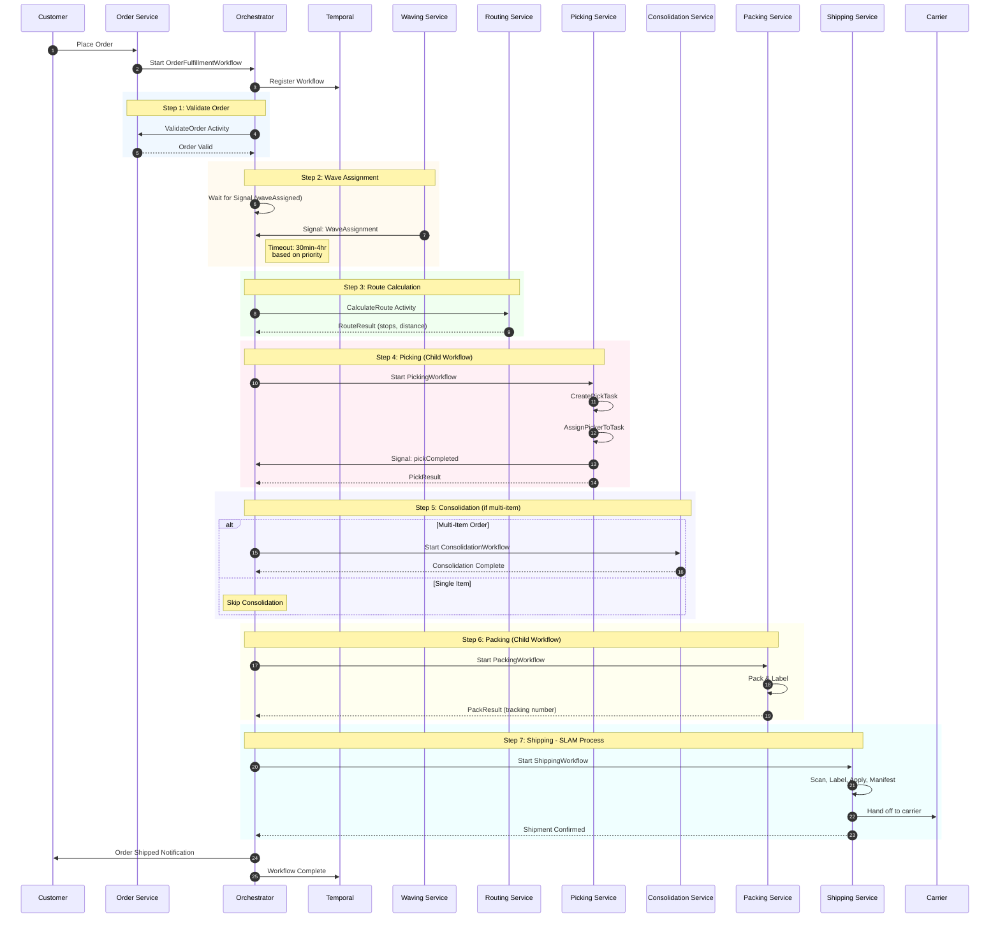
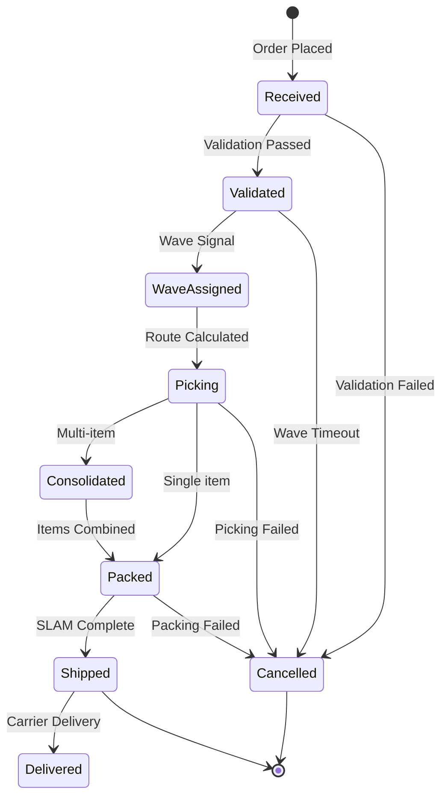
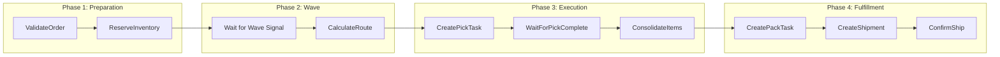
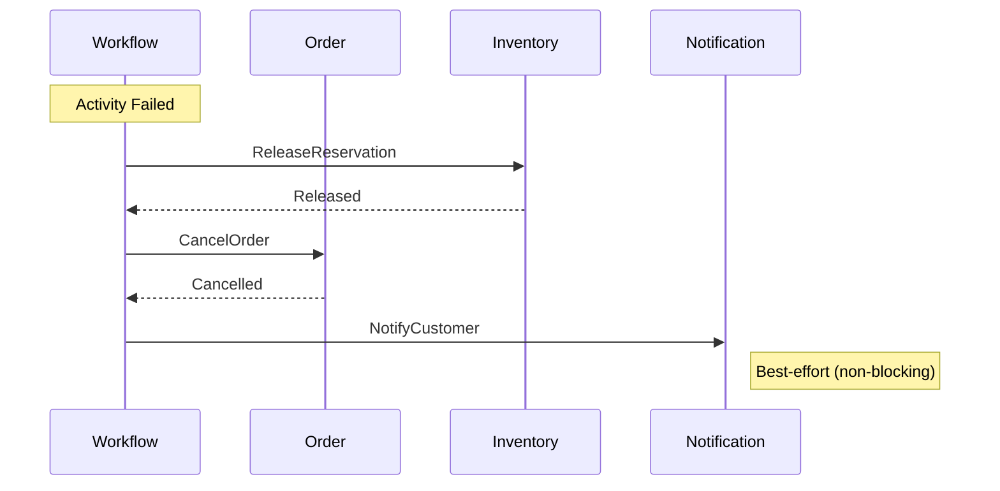

# Order Fulfillment Workflow

This diagram shows the complete end-to-end order fulfillment saga, from order receipt to shipment confirmation.

## High-Level Flow

## Workflow States

## Priority-Based Timeouts

| Priority | Wave Timeout | Description |
|----------|--------------|-------------|
| same_day | 30 minutes | Same-day delivery orders |
| next_day | 2 hours | Next-day delivery orders |
| standard | 4 hours | Standard delivery orders |

## Activity Sequence

## Temporal Workflow Details

### Workflow Configuration

| Setting | Value |
|---------|-------|
| **TaskQueue** | orchestrator-queue |
| **WorkflowExecutionTimeout** | 24 hours |
| **WorkflowTaskTimeout** | 10 seconds |
| **RetryPolicy.MaximumAttempts** | 3 |

### Child Workflows

| Workflow | Purpose | Task Queue |
|----------|---------|------------|
| PickingWorkflow | Coordinate picking operations | picking-queue |
| ConsolidationWorkflow | Combine multi-item orders | consolidation-queue |
| PackingWorkflow | Package preparation | packing-queue |
| ShippingWorkflow | SLAM process | shipping-queue |

## Error Handling and Compensation

When any step fails, the workflow triggers compensation:

### Compensation Actions

| Failure Point | Compensation |
|---------------|--------------|
| Validation Failed | Cancel order, refund payment |
| Wave Timeout | Release reservation, cancel order |
| Picking Failed | Release reservation, cancel order |
| Packing Failed | Return items to stock, cancel order |
| Shipping Failed | Reschedule or cancel |

## Related Diagrams

- [Order Cancellation](./order-cancellation) - Compensation pattern
- [Picking Workflow](./picking-workflow) - Detailed picking flow
- [Packing Workflow](./packing-workflow) - Detailed packing flow
- [Shipping Workflow](./shipping-workflow) - SLAM process
