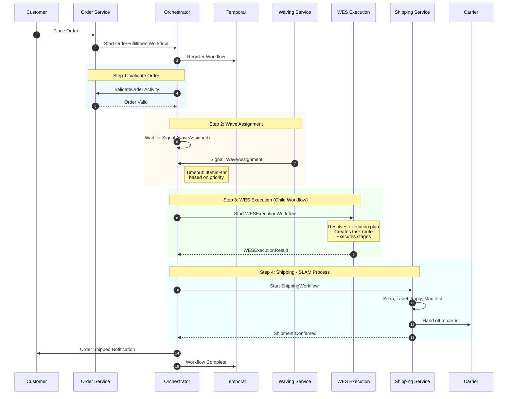
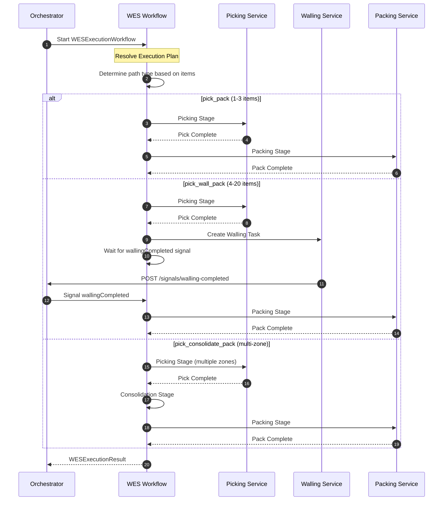
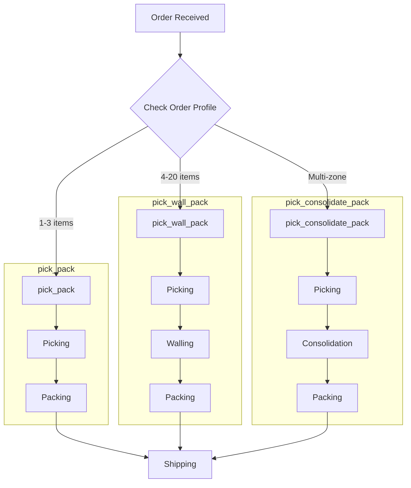
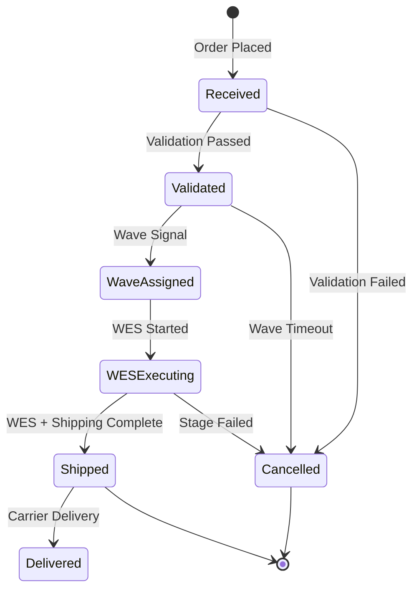
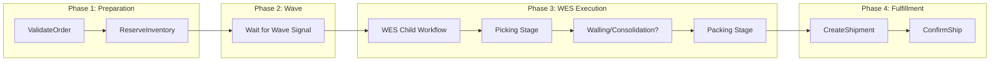
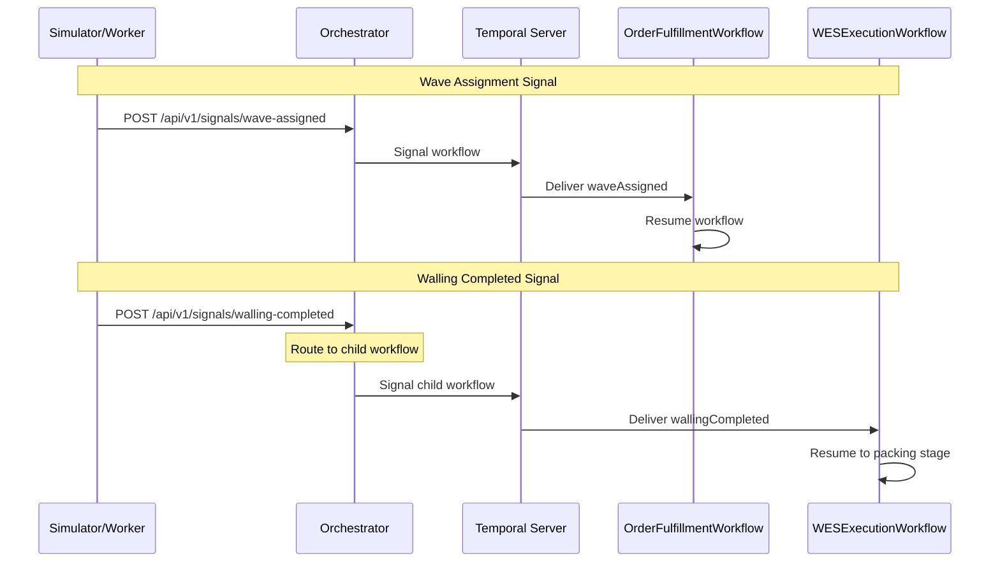
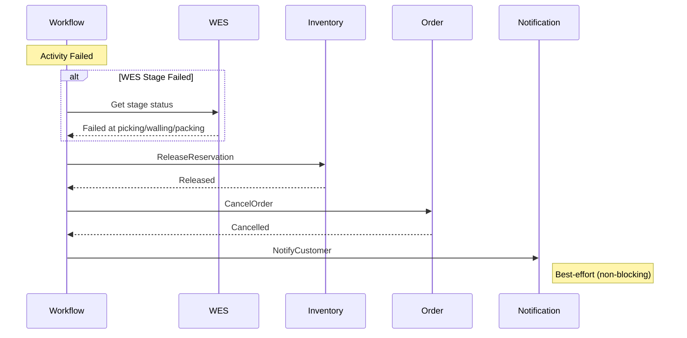

# Order Fulfillment Workflow

This diagram shows the complete end-to-end order fulfillment saga, from order receipt to shipment confirmation using the WES (Warehouse Execution System) as the central execution engine.

## High-Level Flow

## WES Execution Detail

The WES workflow handles all warehouse execution internally based on the order profile:

## Process Path Selection

## Workflow States

## Priority-Based Timeouts

| Priority | Wave Timeout | WES Timeout | Description |
|----------|--------------|-------------|-------------|
| same_day | 30 minutes | 2 hours | Same-day delivery orders |
| next_day | 2 hours | 3 hours | Next-day delivery orders |
| standard | 4 hours | 4 hours | Standard delivery orders |

## Activity Sequence

## Temporal Workflow Details

### Workflow Configuration

| Setting | Value |
|---------|-------|
| **TaskQueue** | orchestrator-queue |
| **WorkflowExecutionTimeout** | 24 hours |
| **WorkflowTaskTimeout** | 10 seconds |
| **RetryPolicy.MaximumAttempts** | 3 |

### Child Workflows

| Workflow | Purpose | Task Queue |
|----------|---------|------------|
| WESExecutionWorkflow | Coordinate picking → walling? → packing | wes-queue |
| ShippingWorkflow | SLAM process | orchestrator-queue |

## Signal Flow

The orchestrator routes signals to the appropriate workflows:

## Error Handling and Compensation

When any step fails, the workflow triggers compensation:

### Compensation Actions

| Failure Point | Compensation |
|---------------|--------------|
| Validation Failed | Cancel order, refund payment |
| Wave Timeout | Release reservation, cancel order |
| WES Picking Failed | Release reservation, cancel order |
| WES Walling Timeout | Release reservation, cancel order |
| WES Packing Failed | Return items to stock, cancel order |
| Shipping Failed | Reschedule or cancel |

## Related Diagrams

- [Order Cancellation](./order-cancellation) - Compensation pattern
- [WES Execution](./wes-execution) - WES workflow details
- [Walling Workflow](./walling-workflow) - Put-wall sorting process
- [Shipping Workflow](./shipping-workflow) - SLAM process
