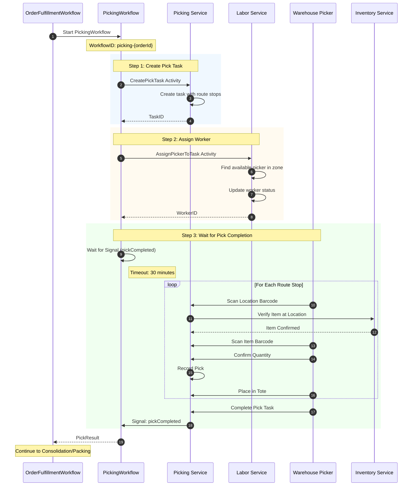
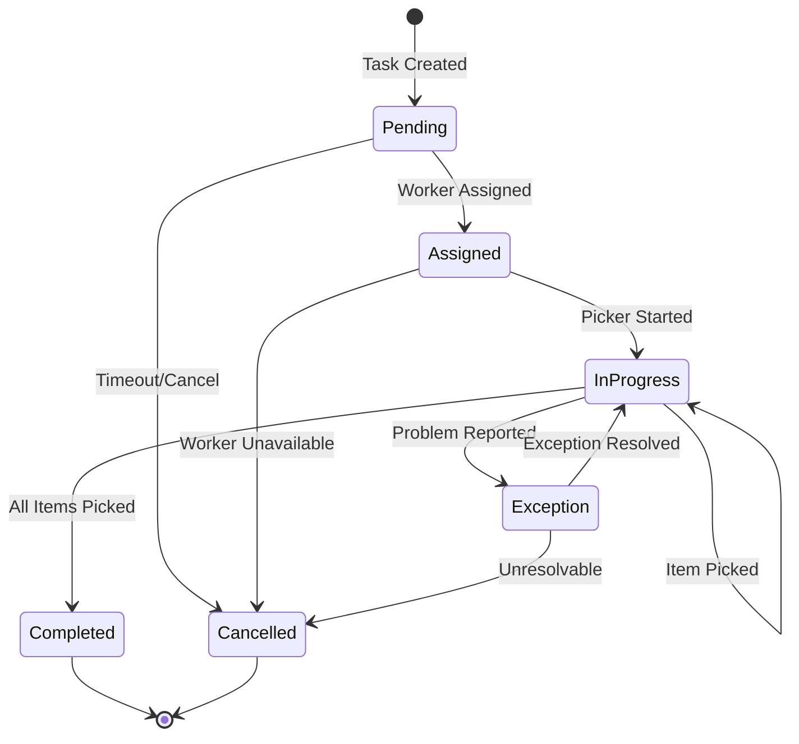
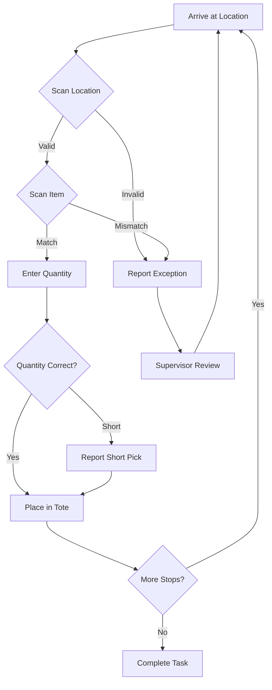
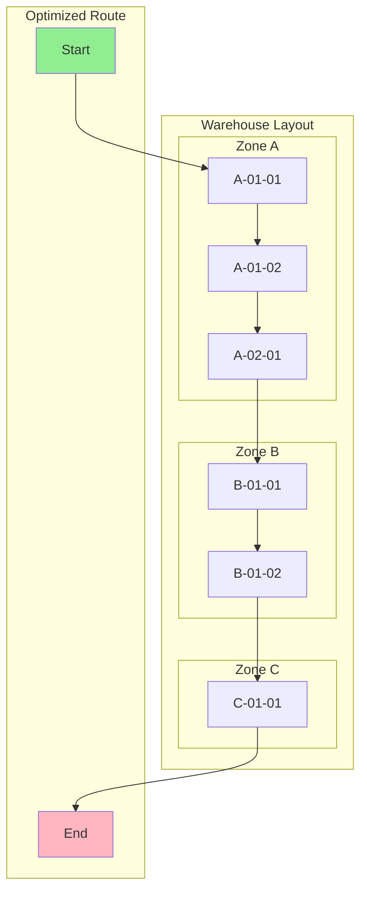
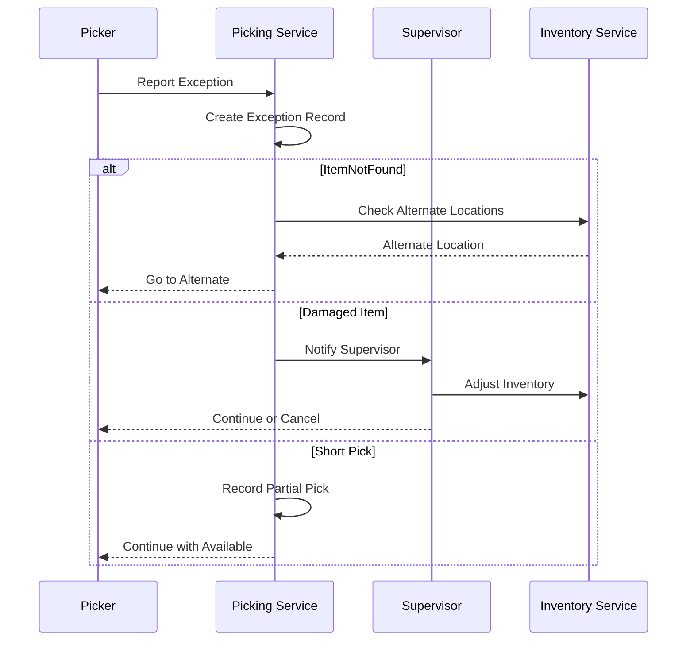

# Picking Workflow

This diagram shows the detailed picking child workflow, including task creation, worker assignment, and pick completion signaling.

## Picking Sequence Diagram

## Pick Task State Machine

## Pick Item Flow

## Route Optimization

## Data Structures

### PickTask

| Field | Type | Description |
|-------|------|-------------|
| TaskID | string | Unique task identifier |
| OrderID | string | Associated order |
| WaveID | string | Wave assignment |
| RouteID | string | Optimized pick route |
| WorkerID | string | Assigned picker |
| Status | string | Current status |
| Items | []PickItem | Items to pick |
| ToteID | string | Output container |

### PickItem

| Field | Type | Description |
|-------|------|-------------|
| ID | string | Item identifier |
| SKU | string | Product SKU |
| ProductName | string | Product name |
| Quantity | int | Quantity to pick |
| PickedQuantity | int | Quantity picked |
| Location | Location | Pick location |
| Status | string | Item status |

### PickResult

| Field | Type | Description |
|-------|------|-------------|
| TaskID | string | Completed task ID |
| PickedItems | []PickedItem | Successfully picked items |
| Success | bool | Completion status |
| Duration | Duration | Time to complete |

## Exception Types

| Exception | Cause | Resolution |
|-----------|-------|------------|
| ItemNotFound | Item not at location | Check alternate location |
| Damaged | Item damaged | Report for adjustment |
| QuantityMismatch | Less than expected | Short pick or recount |
| WrongItem | SKU mismatch | Find correct item |
| LocationEmpty | Location is empty | Check inventory system |

## Exception Handling Flow

## Performance Metrics

| Metric | Description | Target |
|--------|-------------|--------|
| Pick Rate | Items picked per hour | 60-100 items/hr |
| Pick Accuracy | Correct picks / Total picks | > 99.5% |
| Travel Time | Time between picks | Minimize |
| Exception Rate | Exceptions / Total picks | < 1% |

## Events Published

| Event | Topic | Trigger |
|-------|-------|---------|
| PickTaskCreatedEvent | wms.picking.events | Task created |
| PickTaskAssignedEvent | wms.picking.events | Worker assigned |
| ItemPickedEvent | wms.picking.events | Each item picked |
| PickExceptionEvent | wms.picking.events | Exception reported |
| PickTaskCompletedEvent | wms.picking.events | All items picked |

## Related Diagrams

- [Order Fulfillment](./order-fulfillment) - Parent workflow
- [Packing Workflow](./packing-workflow) - Next step (single item)
- [PickTask Aggregate](/domain-driven-design/aggregates/pick-task) - Domain model
