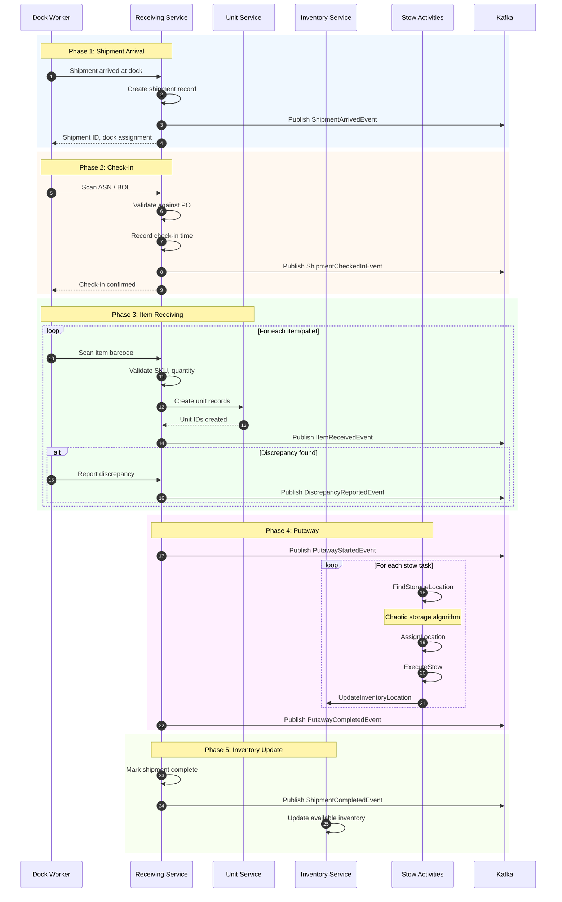
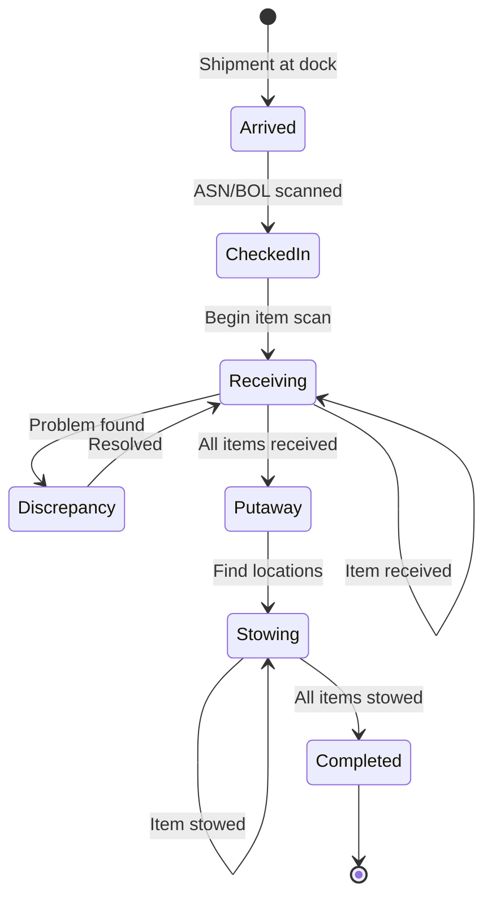
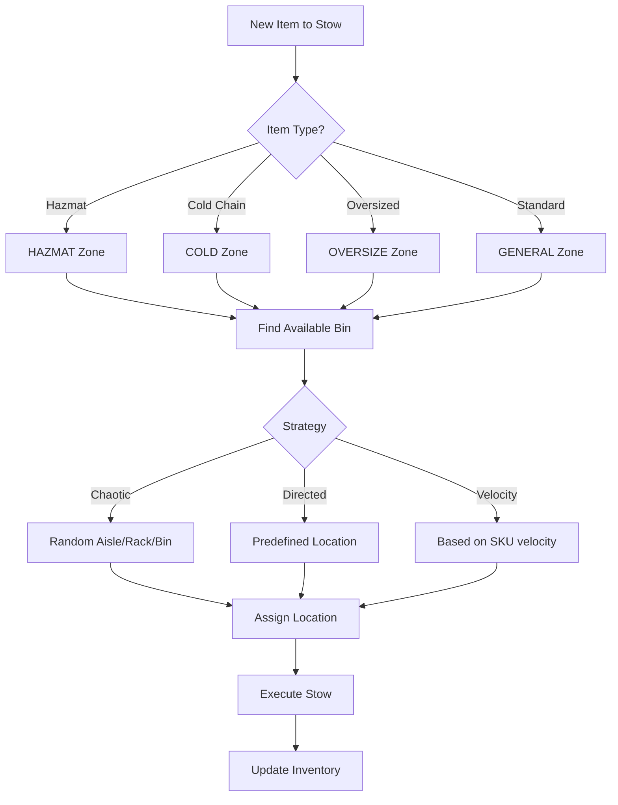
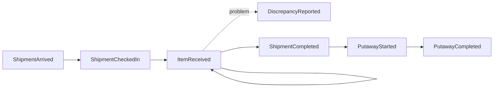

# Receiving Workflow

This document describes the inbound receiving flow for processing incoming shipments, from dock arrival through putaway to storage locations.

## Overview

The receiving workflow handles the processing of inbound shipments from suppliers, including check-in, item verification, quality control, and putaway to storage locations using chaotic storage strategies.

## Complete Receiving Flow



## Receiving State Machine



## Chaotic Storage Algorithm



## Storage Location Format

```
ZONE-AISLE-RACK-LEVEL-BIN

Example: GENERAL-A-05-3-B02
         ^^^^^^^ ^ ^^ ^ ^^^
         Zone    | |  | Bin
                 | |  Level
                 | Rack
                 Aisle
```

## Discrepancy Types

| Type | Description | Resolution |
|------|-------------|------------|
| `quantity_over` | More items than expected | Verify count, update PO |
| `quantity_short` | Fewer items than expected | Create discrepancy report |
| `damaged` | Items damaged in transit | Quarantine, create claim |
| `wrong_item` | Different SKU received | Return or reclassify |
| `quality_issue` | Quality below standard | QC review, quarantine |

## Receiving Events



### Event Payloads

#### ShipmentArrivedEvent

```json
{
  "type": "wms.receiving.shipment-arrived",
  "data": {
    "shipmentId": "SHIP-IN-001",
    "carrierId": "UPS",
    "dockId": "DOCK-01",
    "expectedItems": 50,
    "purchaseOrderIds": ["PO-001", "PO-002"],
    "arrivedAt": "2024-01-15T08:00:00Z"
  }
}
```

#### ItemReceivedEvent

```json
{
  "type": "wms.receiving.item-received",
  "data": {
    "shipmentId": "SHIP-IN-001",
    "sku": "SKU-001",
    "quantity": 100,
    "lotNumber": "LOT-2024-001",
    "expirationDate": "2025-01-15",
    "receivingLocationId": "RECV-DOCK-01",
    "receivedBy": "WORKER-001",
    "receivedAt": "2024-01-15T08:30:00Z"
  }
}
```

## Stow Activities

| Activity | Purpose |
|----------|---------|
| `FindStorageLocation` | Find available bin using storage strategy |
| `AssignLocation` | Assign location to stow task |
| `ExecuteStow` | Move item from tote to storage |
| `UpdateInventoryLocation` | Update inventory with new location |

## API Endpoints

### Receiving Service

| Method | Endpoint | Purpose |
|--------|----------|---------|
| POST | `/shipments` | Register incoming shipment |
| PUT | `/shipments/{id}/check-in` | Check in shipment |
| POST | `/shipments/{id}/items` | Receive item |
| POST | `/shipments/{id}/discrepancy` | Report discrepancy |
| PUT | `/shipments/{id}/complete` | Mark shipment complete |

### Stow Service

| Method | Endpoint | Purpose |
|--------|----------|---------|
| POST | `/stow/tasks` | Create stow task |
| GET | `/stow/tasks/{id}/location` | Get assigned location |
| PUT | `/stow/tasks/{id}/complete` | Complete stow task |

## Related Documentation

- [Receiving Service](/services/receiving-service) - Service documentation
- [Stow Activities](/temporal/activities/stow-activities) - Temporal activities
- [Receiving Events](/domain-driven-design/domain-events#receiving-events) - Domain events
- [Inbound Fulfillment Workflow](/temporal/workflows/inbound-fulfillment) - Parent workflow
