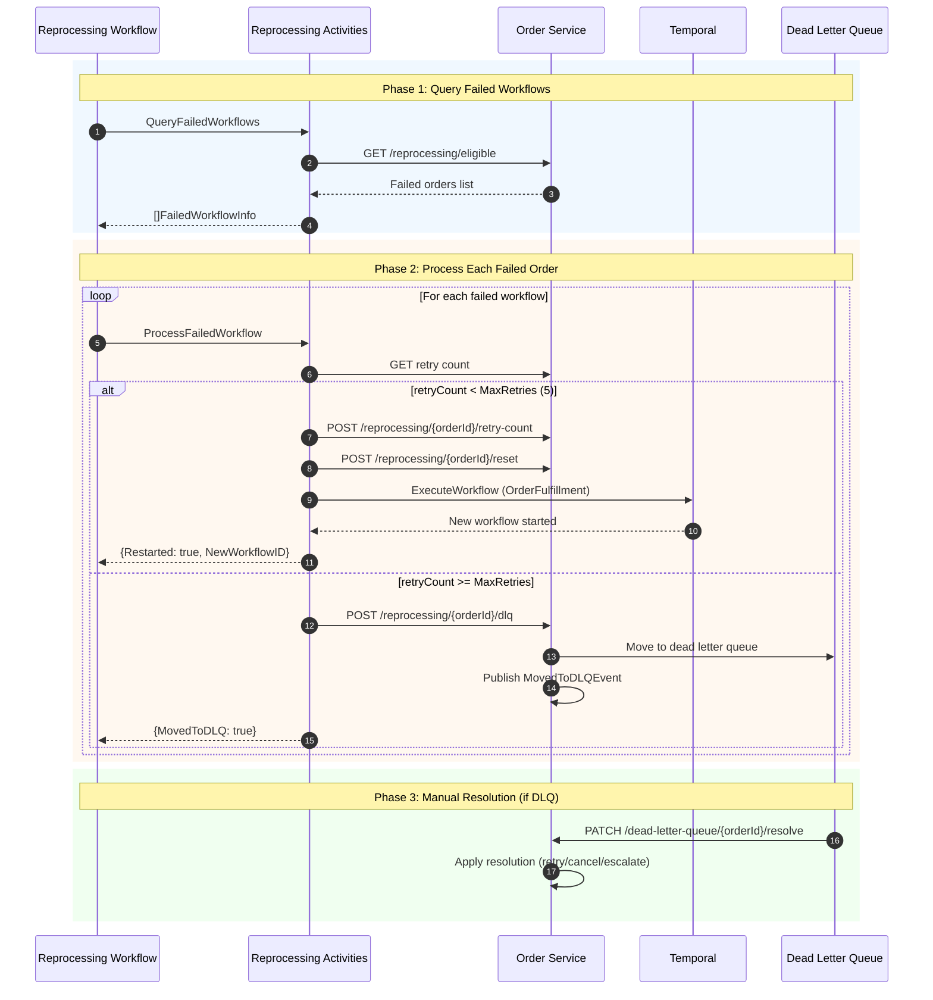
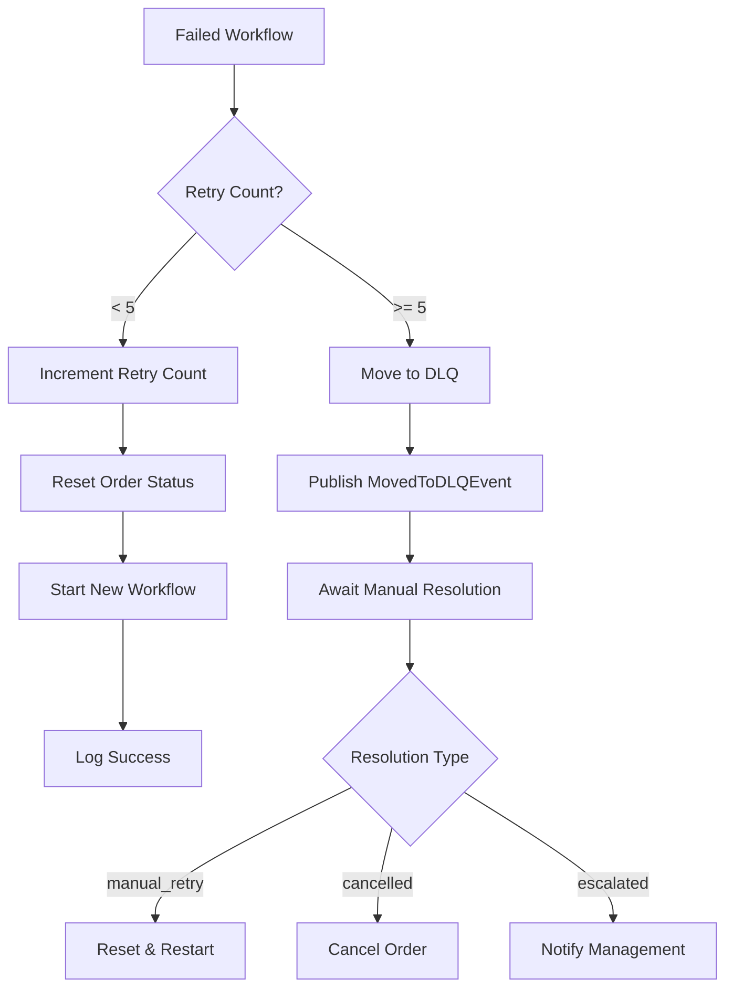
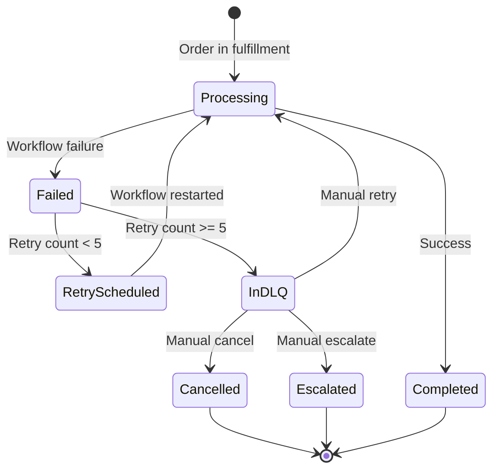
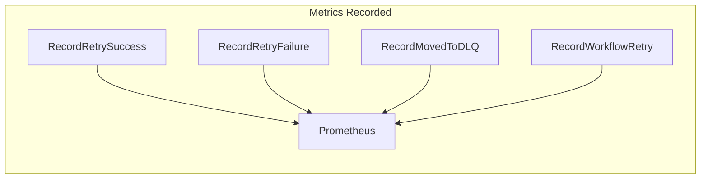

# Reprocessing Workflow

This document describes the order reprocessing flow for handling failed workflow executions, including retry logic and dead letter queue management.

## Overview

The reprocessing workflow handles orders that have failed during fulfillment. It implements an automatic retry mechanism with exponential backoff and moves orders to a dead letter queue (DLQ) when retries are exhausted.

## Reprocessing Flow

## Retry Decision Logic

## Order State Transitions

## Failure Metrics

## DLQ Resolution Types

| Resolution | Action | Next State |
|------------|--------|------------|
| `manual_retry` | Reset order, start new workflow | Processing |
| `cancelled` | Cancel order, notify customer | Cancelled |
| `escalated` | Create ticket, notify management | Escalated |

## API Endpoints Used

### Reprocessing Endpoints

| Method | Endpoint | Purpose |
|--------|----------|---------|
| GET | `/reprocessing/eligible` | Query failed workflows |
| GET | `/reprocessing/orders/{id}/retry-count` | Get retry metadata |
| POST | `/reprocessing/orders/{id}/retry-count` | Increment retry count |
| POST | `/reprocessing/orders/{id}/reset` | Reset order for retry |
| POST | `/reprocessing/orders/{id}/dlq` | Move to DLQ |

### Dead Letter Queue Endpoints

| Method | Endpoint | Purpose |
|--------|----------|---------|
| GET | `/dead-letter-queue` | List DLQ entries |
| GET | `/dead-letter-queue/stats` | DLQ statistics |
| PATCH | `/dead-letter-queue/{id}/resolve` | Resolve DLQ entry |

## Configuration

| Setting | Default | Description |
|---------|---------|-------------|
| MaxReprocessingRetries | 5 | Maximum retry attempts |
| ReprocessingInterval | 5 minutes | Time between reprocessing runs |
| RetryBackoff | Exponential | Backoff strategy |

## Related Documentation

- [Order Service - Reprocessing API](/services/order-service#reprocessing-api)
- [Order Service - Dead Letter Queue](/services/order-service#dead-letter-queue-api)
- [Reprocessing Activities](/temporal/activities/reprocessing-activities)
- [Domain Events](/domain-driven-design/domain-events#order-events)
