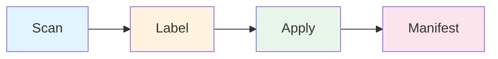
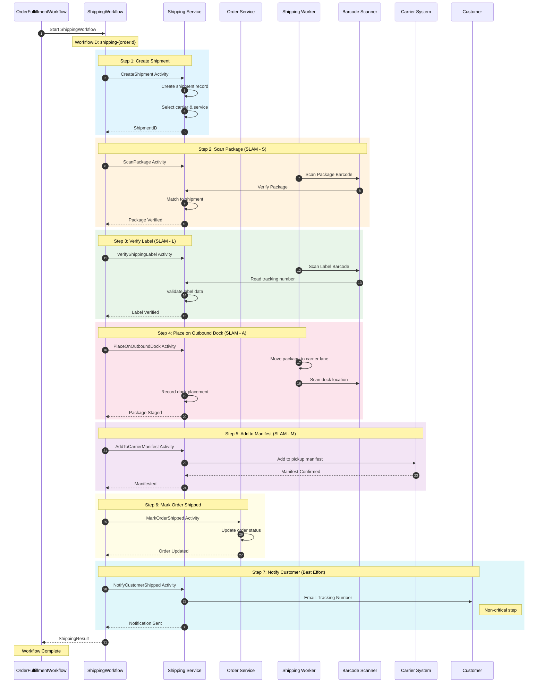
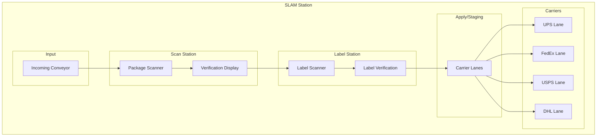
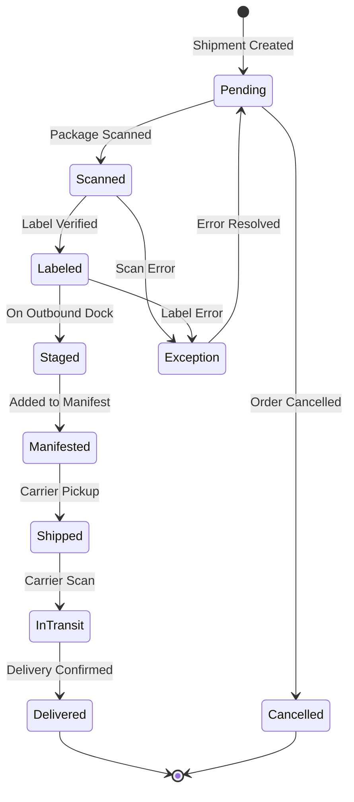
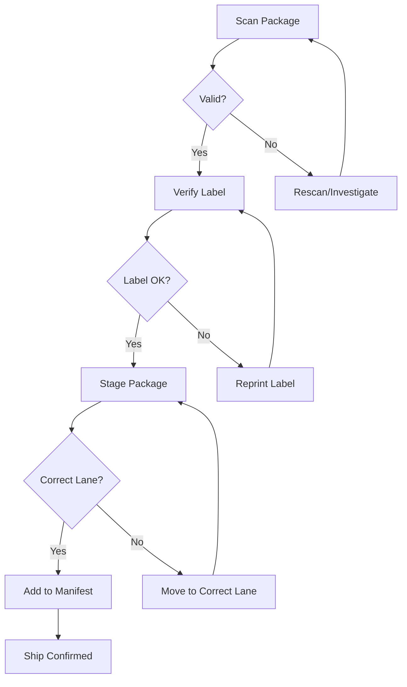
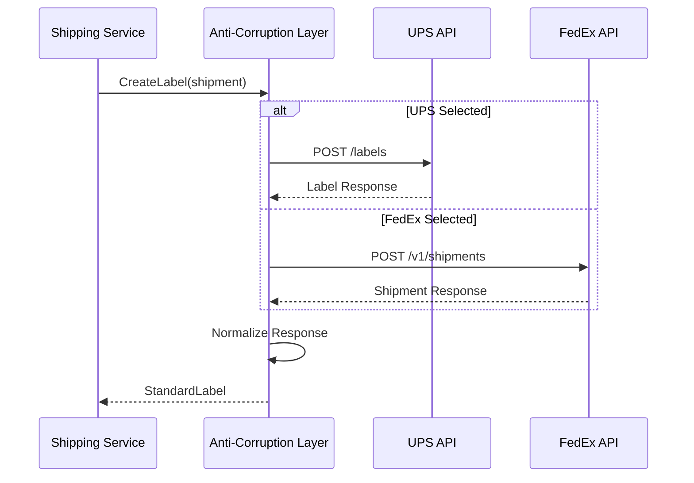

# Shipping Workflow (SLAM Process)

This diagram shows the shipping child workflow implementing the SLAM process: Scan, Label, Apply, Manifest.

## SLAM Process Overview

**SLAM** stands for:
- **S**can - Verify package identity
- **L**abel - Verify shipping label
- **A**pply - Place on carrier lane
- **M**anifest - Add to carrier pickup manifest

## Shipping Sequence Diagram

## SLAM Station Layout

## Shipment State Machine

## Data Structures

### Shipment

| Field | Type | Description |
|-------|------|-------------|
| ShipmentID | string | Unique identifier |
| OrderID | string | Associated order |
| PackageID | string | Package being shipped |
| Carrier | string | UPS/FedEx/USPS/DHL |
| Service | string | Service level |
| TrackingNumber | string | Tracking number |
| Status | string | Current status |
| Weight | float64 | Package weight |
| Dimensions | Dimensions | Package dimensions |
| ShippingAddress | Address | Destination |
| Label | ShippingLabel | Label info |

### Carrier Options

| Carrier | Services | Features |
|---------|----------|----------|
| UPS | Ground, 2-Day, Next Day | Full tracking, pickup |
| FedEx | Ground, Express, Priority | Real-time tracking |
| USPS | Priority, First Class | Residential delivery |
| DHL | Express, eCommerce | International |

### Manifest

| Field | Type | Description |
|-------|------|-------------|
| ManifestID | string | Unique identifier |
| Carrier | string | Carrier code |
| PickupDate | date | Scheduled pickup |
| Shipments | []string | Shipment IDs |
| Status | string | open/closed/picked_up |
| TotalPackages | int | Package count |
| TotalWeight | float64 | Combined weight |

## Error Handling

## Carrier Integration

## Events Published

| Event | Topic | Trigger |
|-------|-------|---------|
| ShipmentCreatedEvent | wms.shipping.events | Shipment created |
| LabelGeneratedEvent | wms.shipping.events | Label printed |
| ShipmentManifestedEvent | wms.shipping.events | Added to manifest |
| ShipConfirmedEvent | wms.shipping.events | Carrier pickup |
| DeliveryConfirmedEvent | wms.shipping.events | Delivered |

## Performance Metrics

| Metric | Description | Target |
|--------|-------------|--------|
| SLAM Rate | Packages per hour | 200+ packages/hr |
| On-Time Ship | Shipped same day | > 99% |
| Manifest Accuracy | Correct manifests | > 99.9% |
| Carrier Performance | On-time delivery | Track by carrier |

## Related Diagrams

- [Packing Workflow](./packing-workflow) - Previous step
- [Order Fulfillment](./order-fulfillment) - Parent workflow
- [Shipment Aggregate](/domain-driven-design/aggregates/shipment) - Domain model
