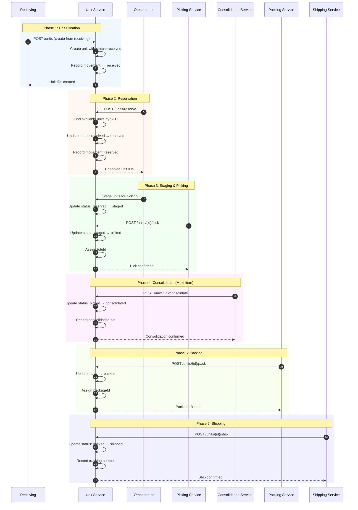
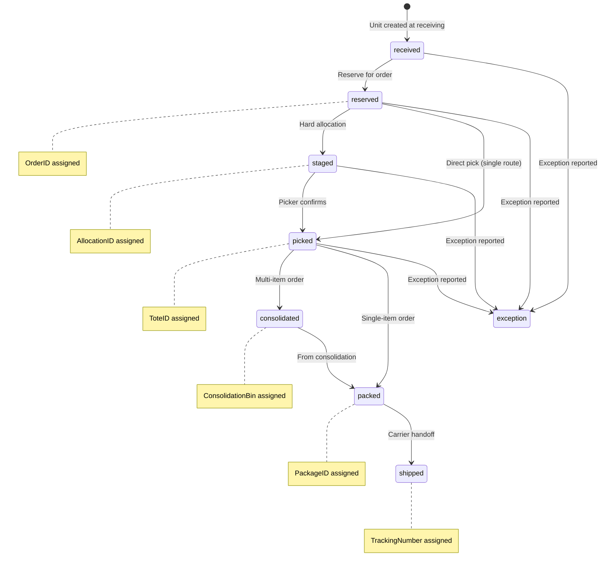
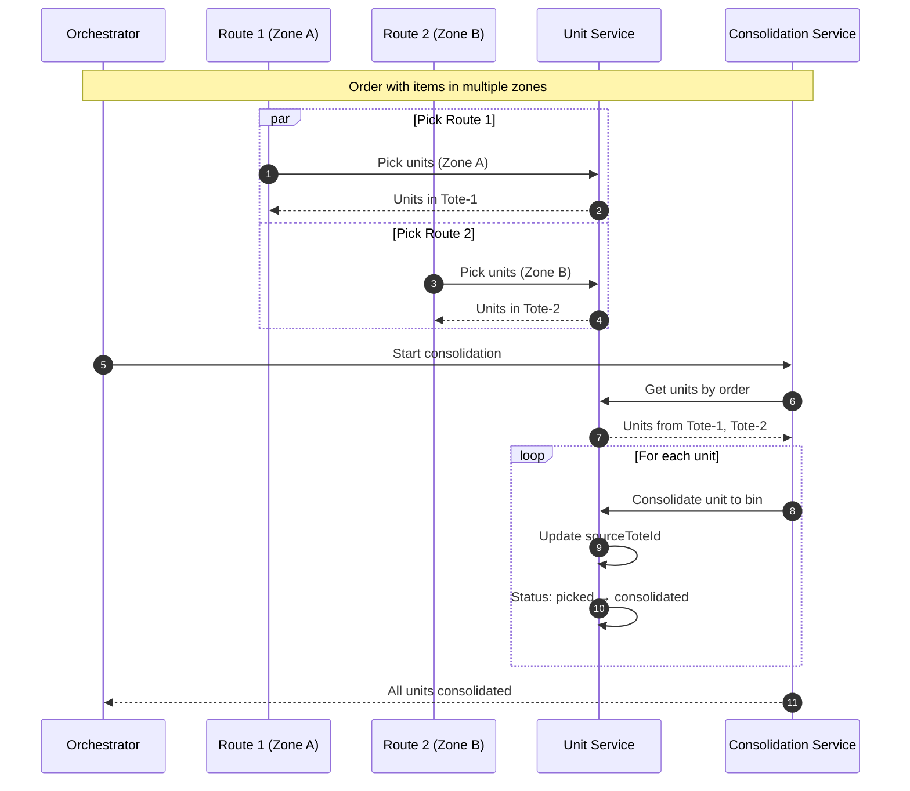
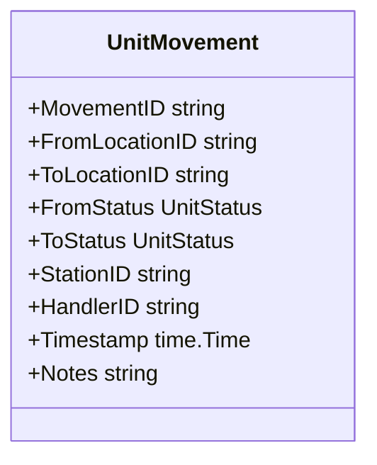
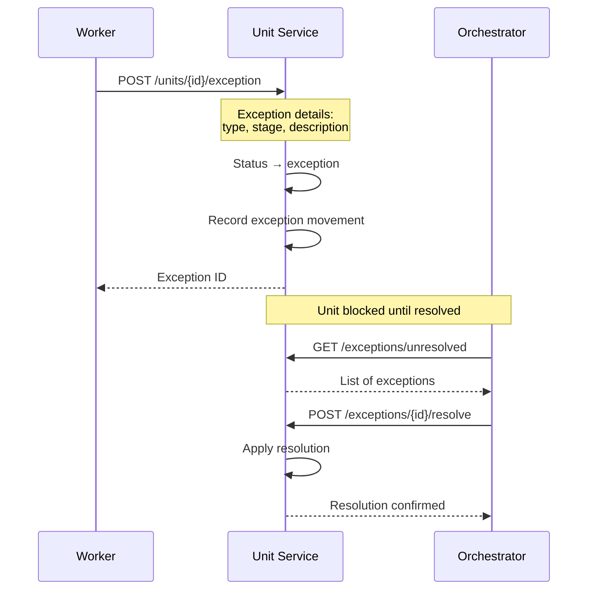

# Unit Tracking Flow

This document describes the unit-level tracking throughout the warehouse fulfillment process, from receiving to shipping.

## Overview

Unit tracking provides granular visibility into each physical item's journey through the warehouse. Every status change creates an audit record, enabling complete traceability and exception handling at the unit level.

## Complete Unit Lifecycle



## Unit State Machine



## Multi-Route Consolidation



## Movement Audit Trail

Each status transition creates a movement record:



### Example Audit Trail

```json
{
  "unitId": "unit-abc-123",
  "movements": [
    {
      "movementId": "mov-001",
      "fromLocationId": "",
      "toLocationId": "RECV-DOCK-01",
      "fromStatus": "",
      "toStatus": "received",
      "handlerId": "WORKER-001",
      "timestamp": "2024-01-15T08:00:00Z",
      "notes": "Unit created at receiving"
    },
    {
      "movementId": "mov-002",
      "fromStatus": "received",
      "toStatus": "reserved",
      "handlerId": "SYSTEM",
      "timestamp": "2024-01-15T08:30:00Z",
      "notes": "Reserved for order ORD-12345"
    },
    {
      "movementId": "mov-003",
      "fromLocationId": "RECV-DOCK-01",
      "toLocationId": "A-01-02",
      "fromStatus": "reserved",
      "toStatus": "picked",
      "handlerId": "PICKER-001",
      "timestamp": "2024-01-15T09:15:00Z",
      "notes": "Picked to TOTE-001"
    }
  ]
}
```

## Exception Handling



## API Endpoints

| Method | Endpoint | Purpose |
|--------|----------|---------|
| POST | `/units` | Create units at receiving |
| POST | `/units/reserve` | Reserve units for order |
| GET | `/units/{id}` | Get unit details |
| GET | `/units/order/{orderId}` | Get units for order |
| GET | `/units/{id}/audit` | Get unit movement history |
| POST | `/units/{id}/pick` | Confirm pick |
| POST | `/units/{id}/consolidate` | Confirm consolidation |
| POST | `/units/{id}/pack` | Confirm pack |
| POST | `/units/{id}/ship` | Confirm ship |
| POST | `/units/{id}/exception` | Report exception |
| POST | `/exceptions/{id}/resolve` | Resolve exception |

## Related Documentation

- [Unit Service](/services/unit-service) - Service documentation
- [Unit Aggregate](/domain-driven-design/aggregates/unit) - Domain model
- [Unit Activities](/temporal/activities/unit-activities) - Temporal activities
- [Order Fulfillment Workflow](/temporal/workflows/order-fulfillment) - Parent workflow
