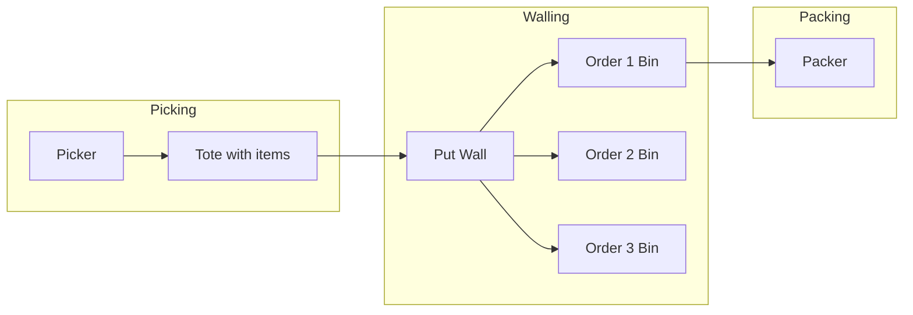
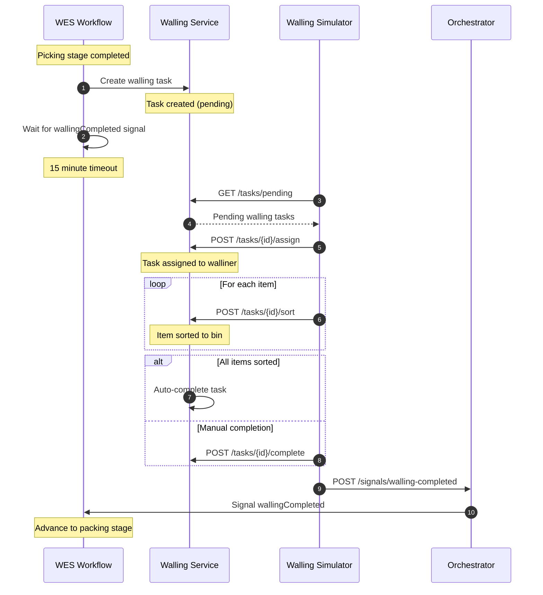
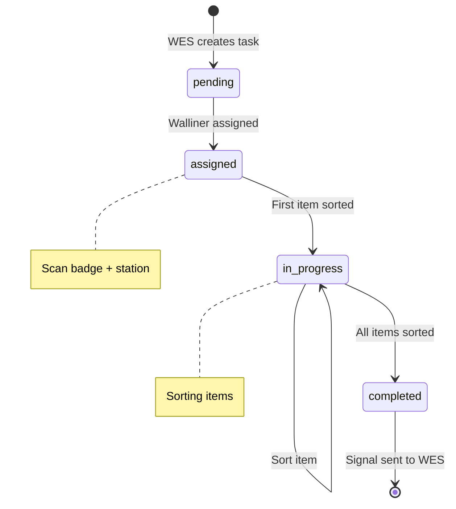
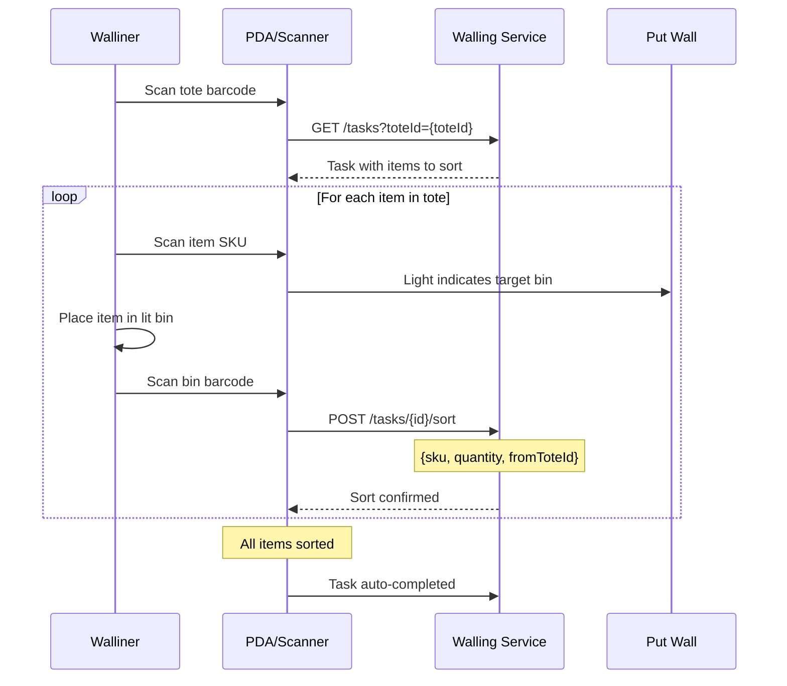
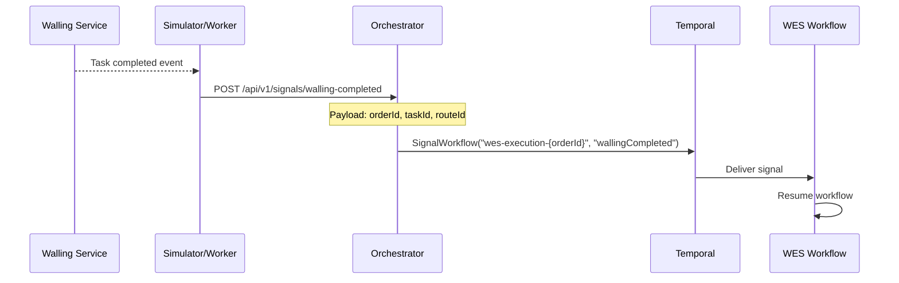
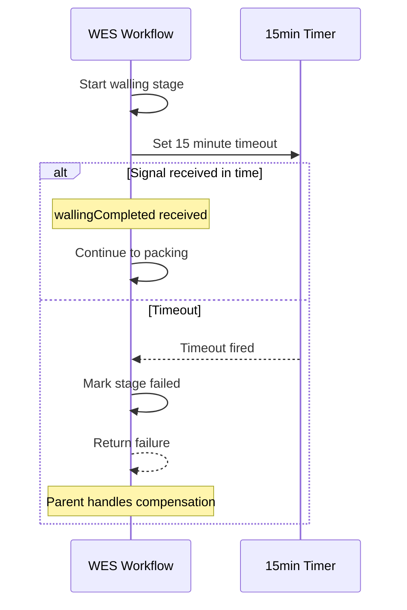
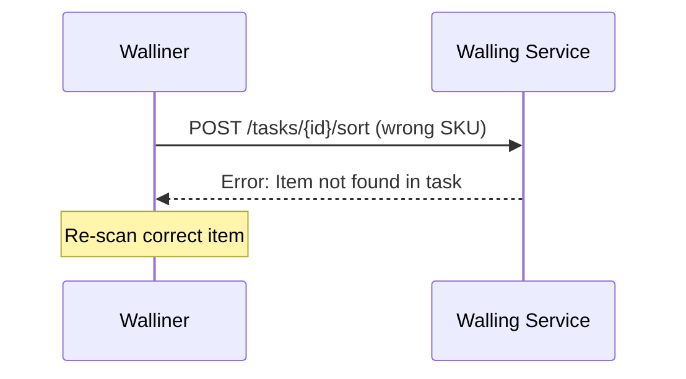
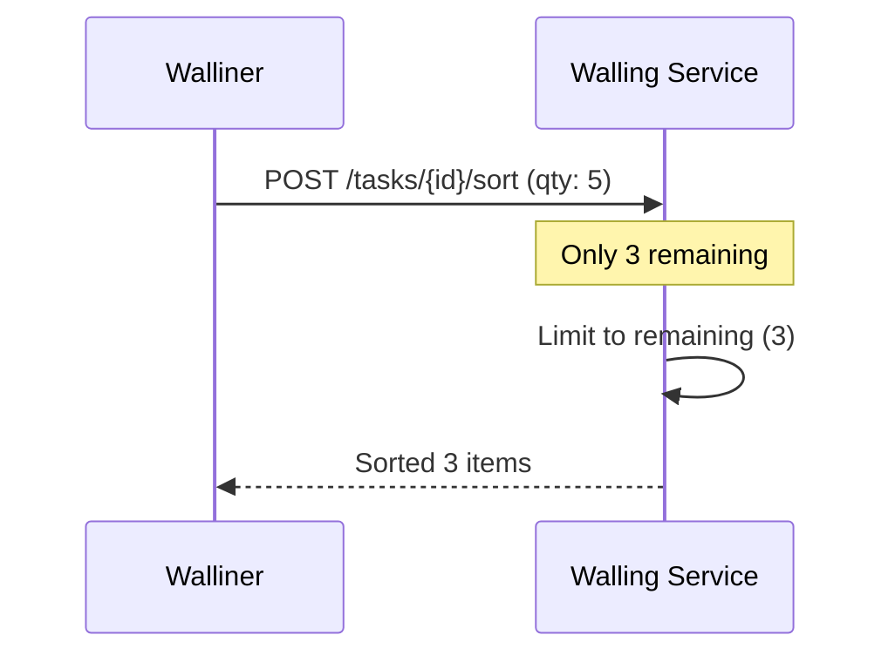

# Walling Workflow

The Walling Workflow handles the put-wall sorting process where walliners (workers) sort picked items from totes into order-specific bins before packing.

## Overview

Walling is used in the `pick_wall_pack` process path for medium-sized orders (4-20 items). It improves packing efficiency by pre-sorting items.



## Complete Flow



## Task Lifecycle



## Sorting Process Detail



## Signal Bridge

The signal from Walling Service to WES Workflow goes through the Orchestrator:



### Signal Payload

```json
{
  "orderId": "ORD-12345",
  "taskId": "WT-a1b2c3d4",
  "routeId": "RT-xyz",
  "sortedItems": [
    {"sku": "SKU-001", "quantity": 2, "slotId": "BIN-A1"},
    {"sku": "SKU-002", "quantity": 1, "slotId": "BIN-A1"}
  ]
}
```

## Timeout Handling



## Put Wall Configuration

A typical put wall has multiple slots, each assigned to an order:

```
+-------+-------+-------+-------+
| BIN-1 | BIN-2 | BIN-3 | BIN-4 |
| ORD-A | ORD-B | ORD-C | ORD-D |
+-------+-------+-------+-------+
| BIN-5 | BIN-6 | BIN-7 | BIN-8 |
| ORD-E | ORD-F | ORD-G | ORD-H |
+-------+-------+-------+-------+
```

## Error Scenarios

### Item Not Found


### Wrong Quantity


## Related Documentation

- [Walling Service](/services/walling-service) - Service documentation
- [WES Execution](/architecture/sequence-diagrams/wes-execution) - Parent workflow
- [WallingTask Aggregate](/domain-driven-design/aggregates/walling-task) - Domain model
