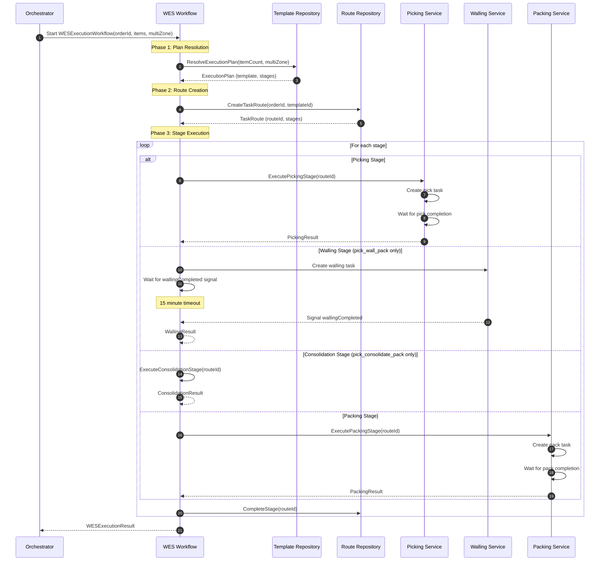
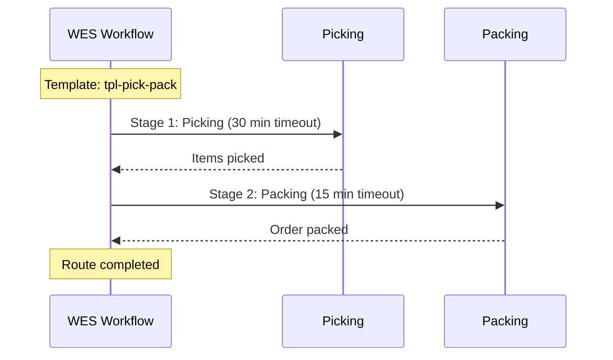
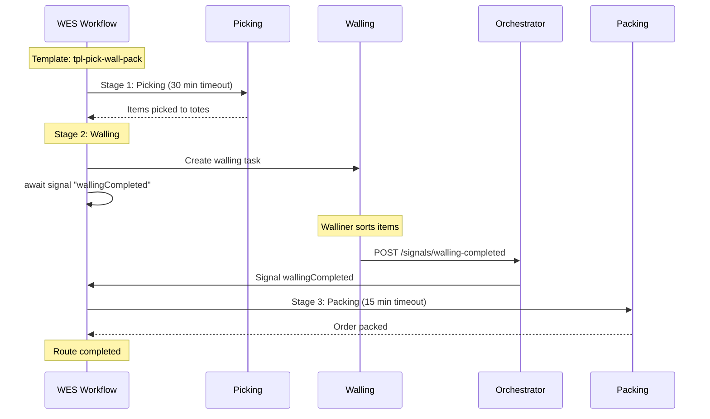
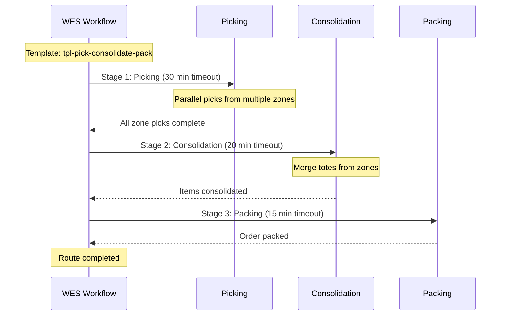
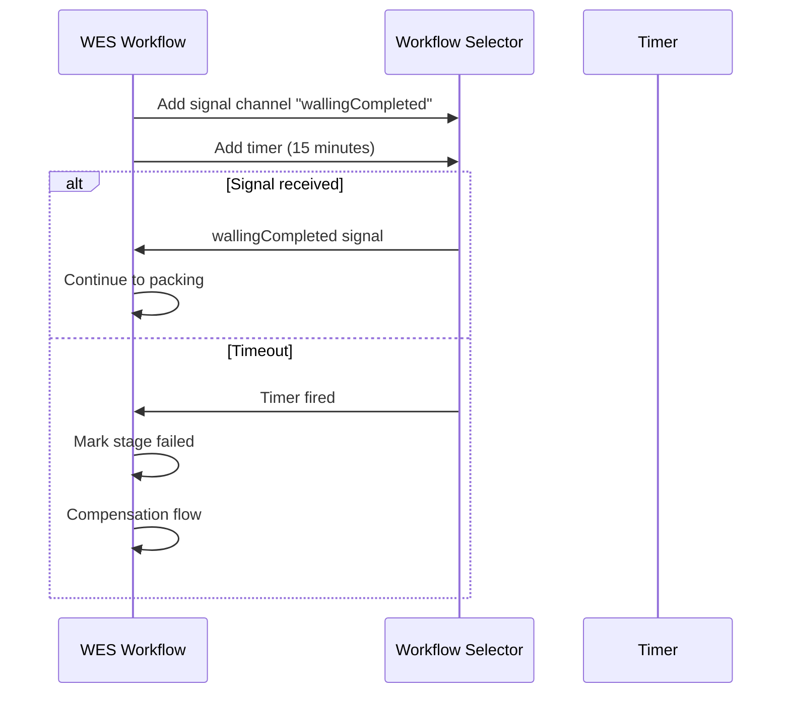
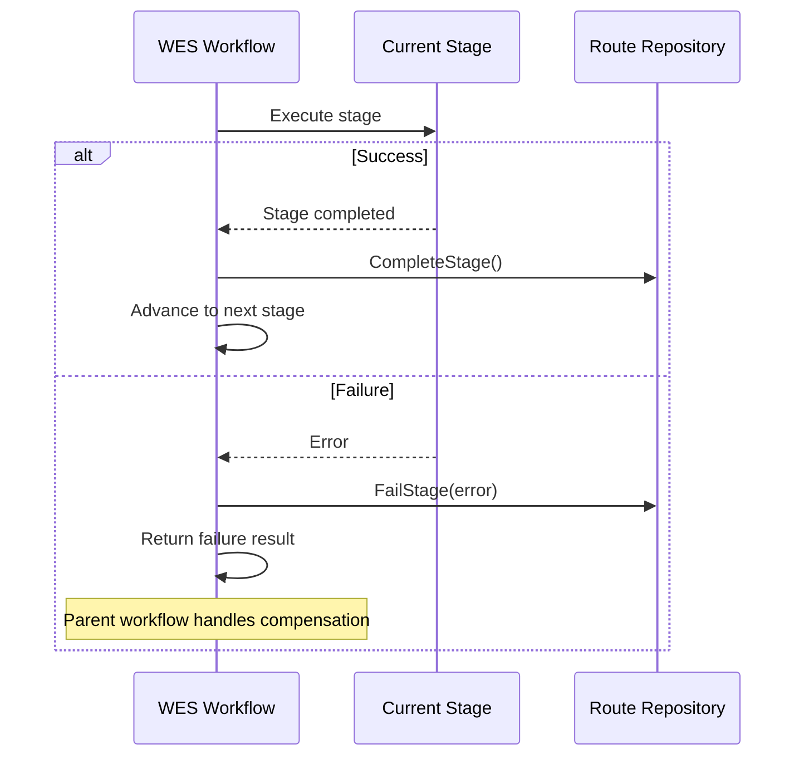

# WES Execution Workflow

The WES (Warehouse Execution System) Execution Workflow orchestrates order execution through configurable process paths. It is the central execution engine started by the Orchestrator after wave assignment.

## Overview

WES execution follows one of three process paths based on order characteristics:

| Path Type | Stages | Criteria |
|-----------|--------|----------|
| `pick_pack` | Picking → Packing | 1-3 items |
| `pick_wall_pack` | Picking → Walling → Packing | 4-20 items |
| `pick_consolidate_pack` | Picking → Consolidation → Packing | Multi-zone orders |

## Complete Flow Diagram



## pick_pack Path (Simple Orders)

For small orders (1-3 items), the flow is streamlined:



## pick_wall_pack Path (Medium Orders)

For medium orders (4-20 items), items go through a put-wall for sorting:



## pick_consolidate_pack Path (Multi-Zone Orders)

For orders spanning multiple warehouse zones:



## Signal Handling

The walling stage uses a signal-based pattern for external completion:



## Error Handling



## Workflow Input/Output

### Input
```json
{
  "orderId": "ORD-12345",
  "waveId": "WAVE-001",
  "items": [
    {"sku": "SKU-001", "quantity": 2, "locationId": "LOC-A1", "zone": "A"},
    {"sku": "SKU-002", "quantity": 1, "locationId": "LOC-B2", "zone": "B"}
  ],
  "multiZone": true,
  "processPathId": "PATH-001",
  "specialHandling": ["fragile"]
}
```

### Output
```json
{
  "routeId": "RT-a1b2c3d4",
  "orderId": "ORD-12345",
  "status": "completed",
  "pathType": "pick_consolidate_pack",
  "stagesCompleted": 3,
  "totalStages": 3,
  "pickResult": {
    "stageType": "picking",
    "taskId": "PT-001",
    "success": true
  },
  "packingResult": {
    "stageType": "packing",
    "taskId": "PK-001",
    "success": true
  },
  "completedAt": 1705326000000
}
```

## Related Documentation

- [WES Service](/services/wes-service) - Service documentation
- [Orchestrator](/services/orchestrator) - Parent workflow
- [TaskRoute Aggregate](/domain-driven-design/aggregates/task-route) - Domain model
- [Walling Workflow](/architecture/sequence-diagrams/walling-workflow) - Walling details
