# Data Flow Diagrams

This document describes the data flows within the WMS Platform, including synchronous API calls and asynchronous event flows.

## Order Data Flow

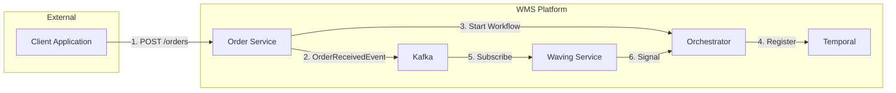

## Event Flow Architecture

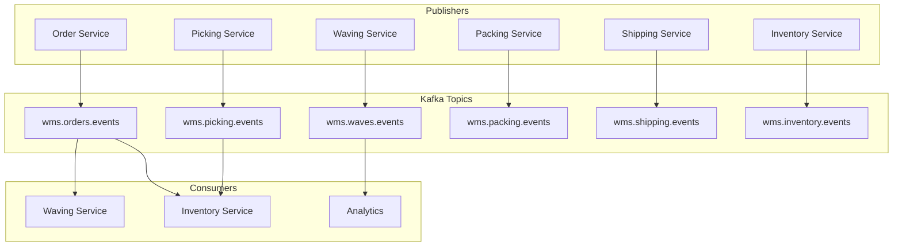

## Transactional Outbox Pattern

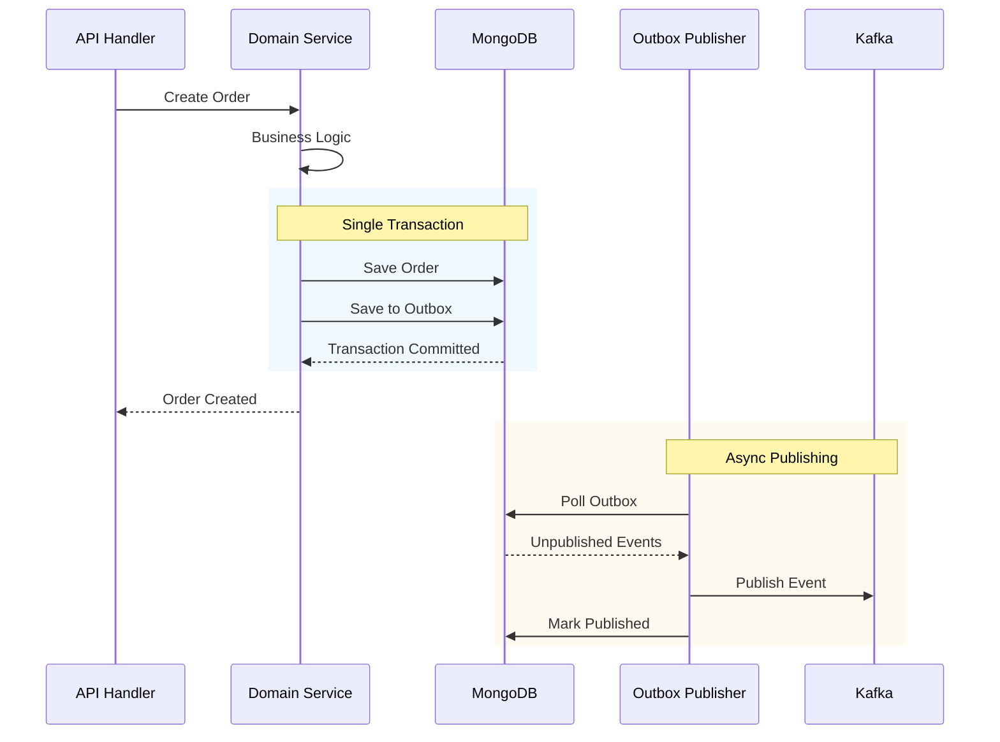

## Database Data Flow

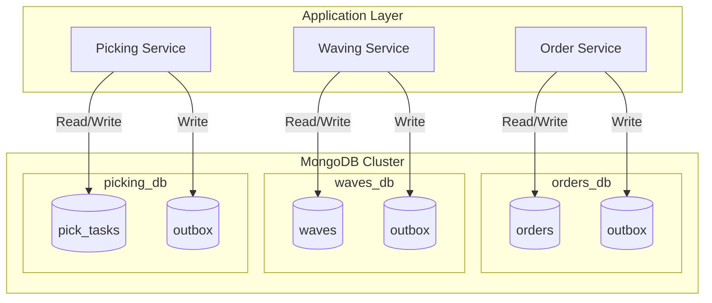

## Workflow Data Flow

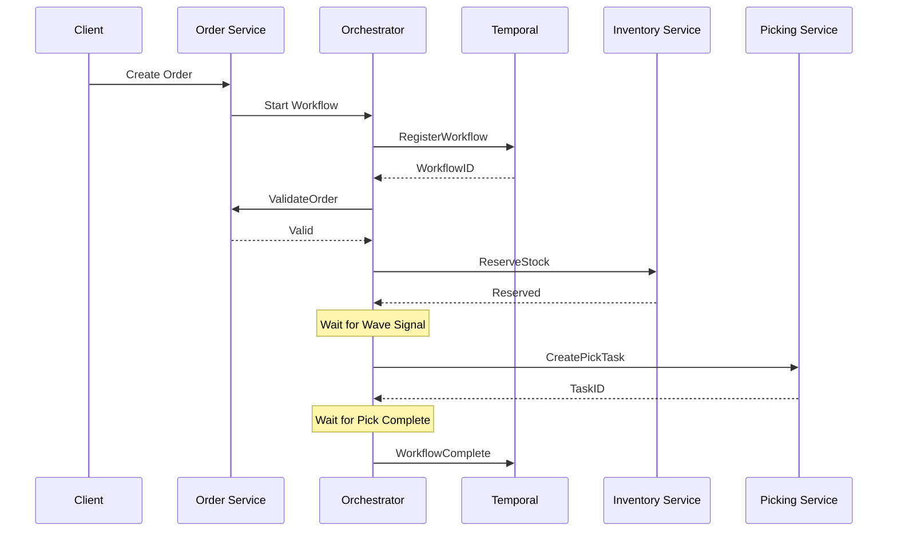

## Read vs Write Paths

### Write Path

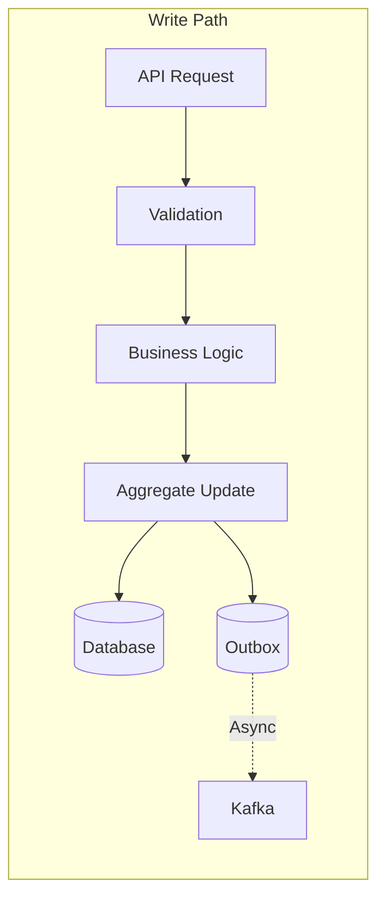

### Read Path

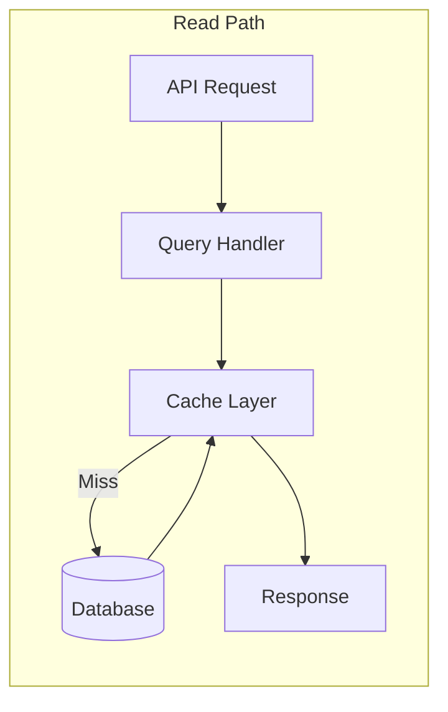

## Event Sourcing (Domain Events)

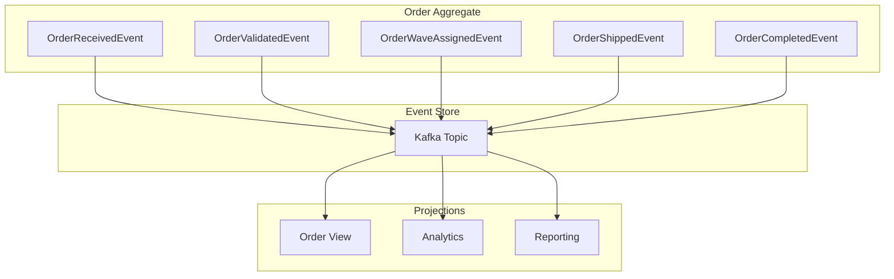

## Cross-Service Data Flow

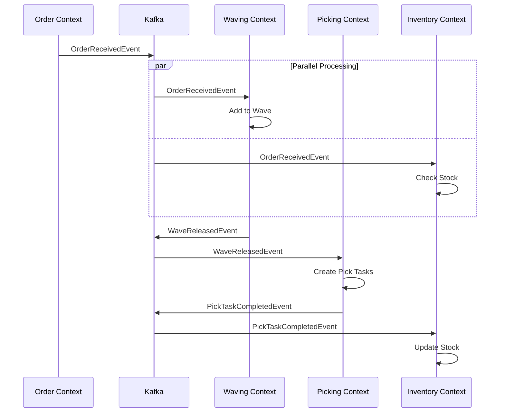

## Data Consistency

### Saga Pattern

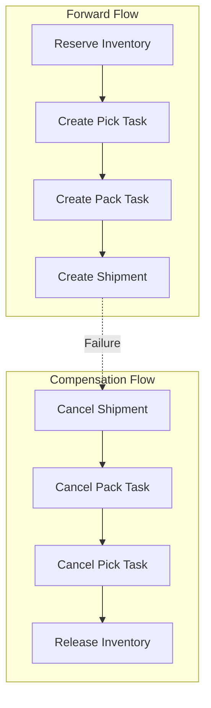

### Eventual Consistency

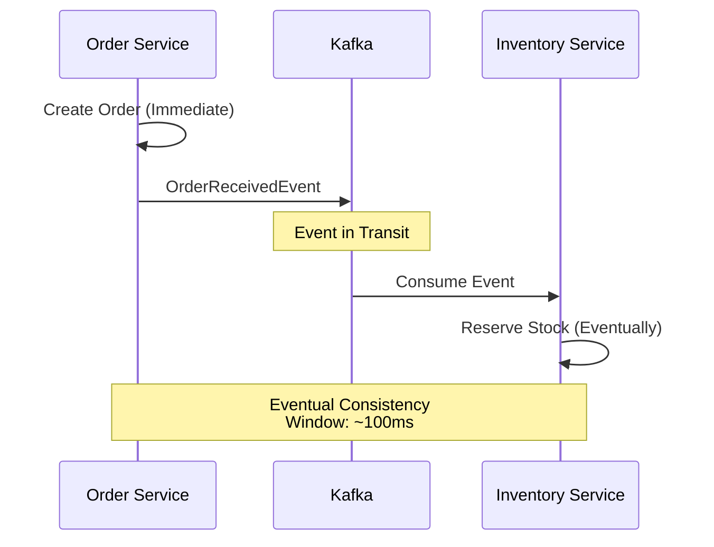

## Data Retention

| Data Type | Retention Period | Storage |
|-----------|-----------------|---------|
| Orders | 7 years | MongoDB + Archive |
| Events | 30 days | Kafka |
| Traces | 7 days | Tempo |
| Logs | 14 days | Loki |
| Metrics | 15 days | Prometheus |

## Related Diagrams

- [Infrastructure](./infrastructure) - System topology
- [Deployment](./deployment) - Kubernetes resources
- [Domain Events](/domain-driven-design/domain-events) - Event catalog
