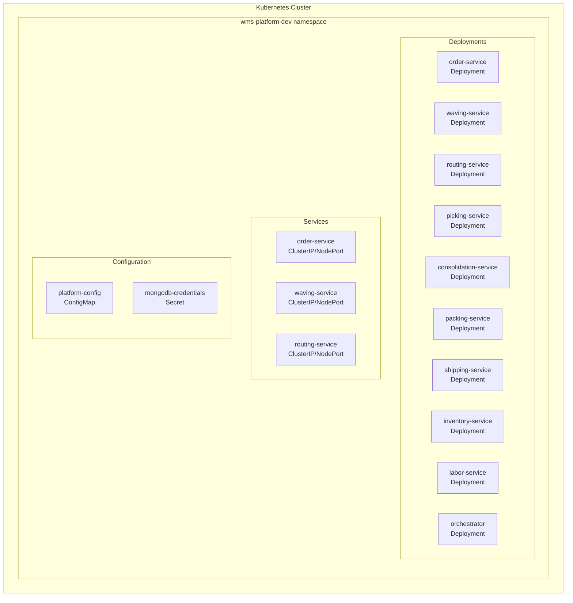
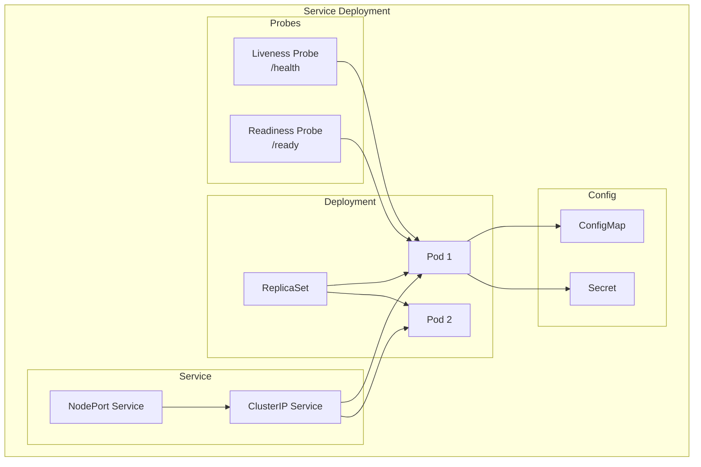
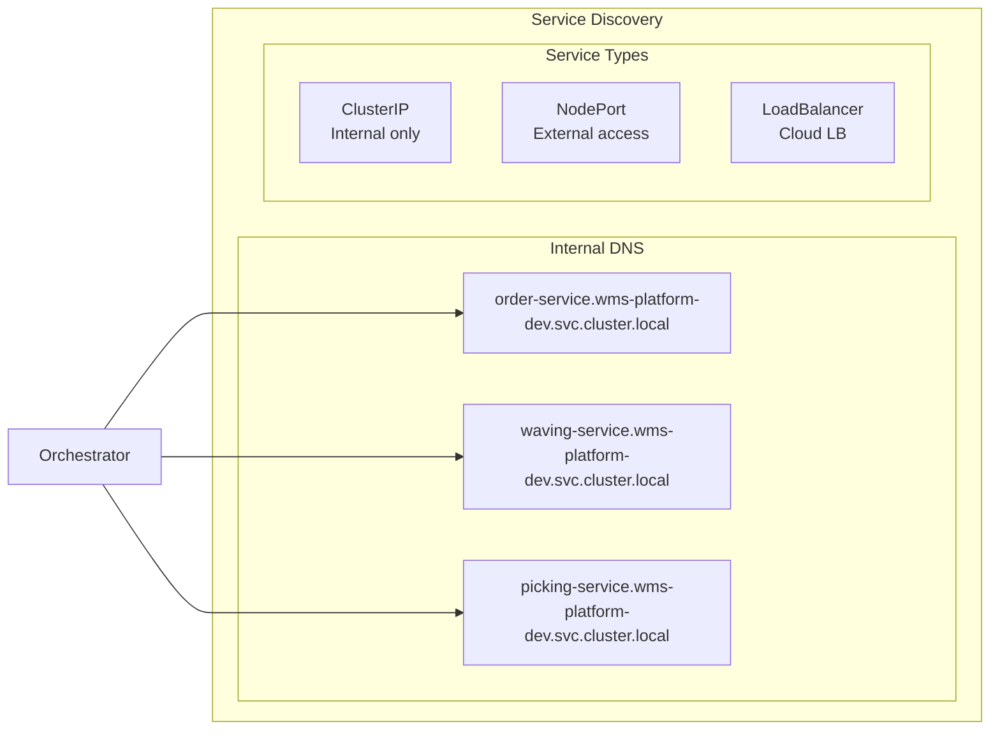
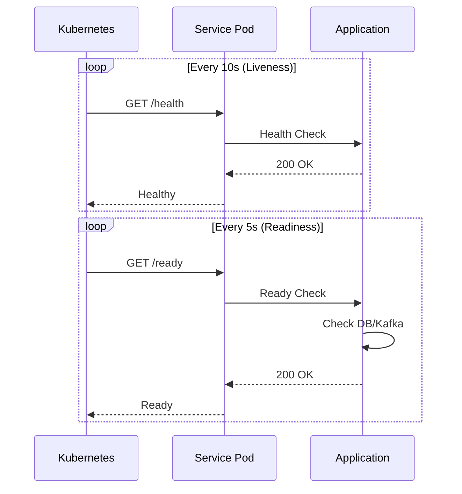

# Kubernetes Deployment

This document describes the Kubernetes deployment architecture for the WMS Platform.

## Deployment Overview



## Namespace Structure

| Namespace | Purpose | Components |
|-----------|---------|------------|
| wms-platform-dev | Application services | All 10 services |
| temporal | Workflow engine | Temporal server + UI |
| kafka | Message broker | Strimzi Kafka + Zookeeper |
| mongodb | Database | MongoDB ReplicaSet |
| observability | Monitoring | Prometheus, Grafana, Tempo, Loki |

## Service Deployment Pattern



## Deployment Manifest Example

```yaml
apiVersion: apps/v1
kind: Deployment
metadata:
  name: order-service
  namespace: wms-platform-dev
spec:
  replicas: 2
  selector:
    matchLabels:
      app: order-service
  template:
    metadata:
      labels:
        app: order-service
      annotations:
        prometheus.io/scrape: "true"
        prometheus.io/port: "8001"
    spec:
      containers:
        - name: order-service
          image: order-service:latest
          ports:
            - containerPort: 8001
          envFrom:
            - configMapRef:
                name: platform-config
          env:
            - name: MONGODB_URI
              valueFrom:
                secretKeyRef:
                  name: mongodb-credentials
                  key: uri
          livenessProbe:
            httpGet:
              path: /health
              port: 8001
            initialDelaySeconds: 10
            periodSeconds: 10
          readinessProbe:
            httpGet:
              path: /ready
              port: 8001
            initialDelaySeconds: 5
            periodSeconds: 5
          resources:
            requests:
              memory: "128Mi"
              cpu: "100m"
            limits:
              memory: "512Mi"
              cpu: "500m"
```

## ConfigMap Configuration

```yaml
apiVersion: v1
kind: ConfigMap
metadata:
  name: platform-config
  namespace: wms-platform-dev
data:
  # Kafka Configuration
  KAFKA_BROKERS: "wms-kafka-kafka-bootstrap.kafka.svc.cluster.local:9092"
  KAFKA_CONSUMER_GROUP_PREFIX: "wms-platform"

  # Temporal Configuration
  TEMPORAL_HOST: "temporal-frontend.temporal.svc.cluster.local:7233"
  TEMPORAL_NAMESPACE: "wms"

  # Observability Configuration
  OTEL_EXPORTER_OTLP_ENDPOINT: "tempo.observability.svc.cluster.local:4317"
  TRACING_ENABLED: "true"
  METRICS_ENABLED: "true"

  # Logging Configuration
  LOG_LEVEL: "info"
  LOG_FORMAT: "json"
```

## Service Discovery



## Port Mapping

| Service | Container Port | NodePort | Description |
|---------|---------------|----------|-------------|
| order-service | 8001 | 30001 | Order management API |
| waving-service | 8002 | 30002 | Wave management API |
| routing-service | 8003 | 30003 | Route optimization API |
| picking-service | 8004 | 30004 | Picking operations API |
| consolidation-service | 8005 | 30005 | Consolidation API |
| packing-service | 8006 | 30006 | Packing operations API |
| shipping-service | 8007 | 30007 | Shipping & SLAM API |
| inventory-service | 8008 | 30008 | Inventory management API |
| labor-service | 8009 | 30009 | Workforce management API |
| orchestrator | 8080 | - | Metrics only (internal) |

## Scaling Configuration

### Horizontal Pod Autoscaler

```yaml
apiVersion: autoscaling/v2
kind: HorizontalPodAutoscaler
metadata:
  name: order-service-hpa
spec:
  scaleTargetRef:
    apiVersion: apps/v1
    kind: Deployment
    name: order-service
  minReplicas: 2
  maxReplicas: 10
  metrics:
    - type: Resource
      resource:
        name: cpu
        target:
          type: Utilization
          averageUtilization: 70
    - type: Resource
      resource:
        name: memory
        target:
          type: Utilization
          averageUtilization: 80
```

### Pod Disruption Budget

```yaml
apiVersion: policy/v1
kind: PodDisruptionBudget
metadata:
  name: order-service-pdb
spec:
  minAvailable: 1
  selector:
    matchLabels:
      app: order-service
```

## Helm Chart Structure

```
helm/wms-platform/
├── Chart.yaml
├── values.yaml
├── values-kind.yaml
├── templates/
│   ├── _helpers.tpl
│   ├── configmap.yaml
│   ├── secret.yaml
│   ├── deployment.yaml
│   ├── service.yaml
│   ├── hpa.yaml
│   ├── pdb.yaml
│   └── serviceaccount.yaml
└── charts/
```

## Deployment Commands

```bash
# Deploy to Kind cluster
helm upgrade --install wms-platform ./helm/wms-platform \
  -f ./helm/wms-platform/values-kind.yaml \
  -n wms-platform-dev --create-namespace

# Check deployment status
kubectl get pods -n wms-platform-dev

# View service endpoints
kubectl get svc -n wms-platform-dev

# Check logs
kubectl logs -l app=order-service -n wms-platform-dev -f
```

## Health Checks



## Related Diagrams

- [Infrastructure](./infrastructure) - Component topology
- [Data Flow](./data-flow) - Data movement
- [Observability](/infrastructure/observability) - Monitoring
