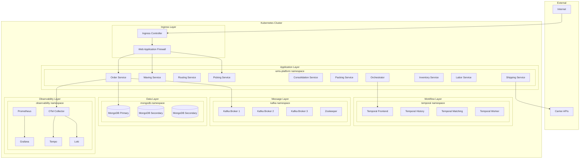
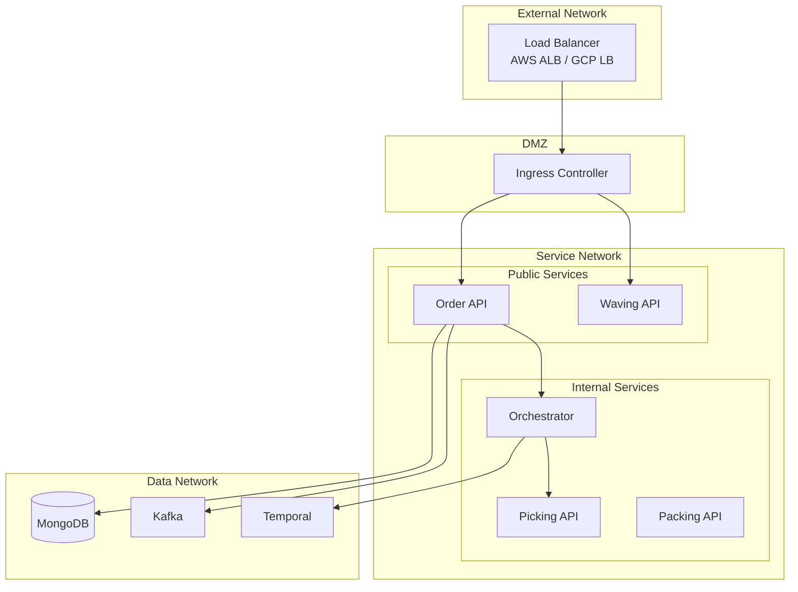
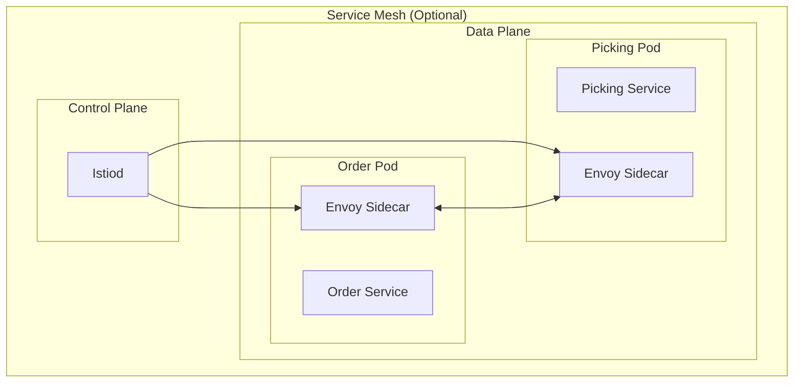
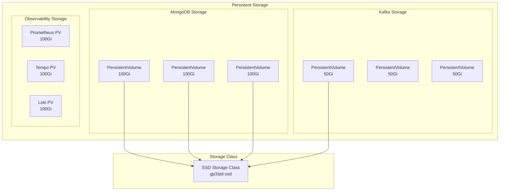
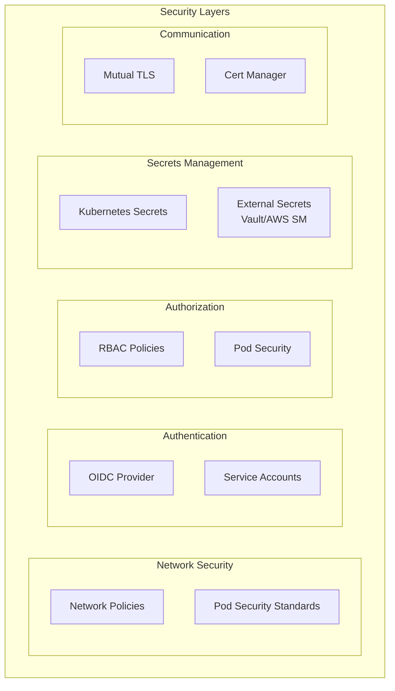
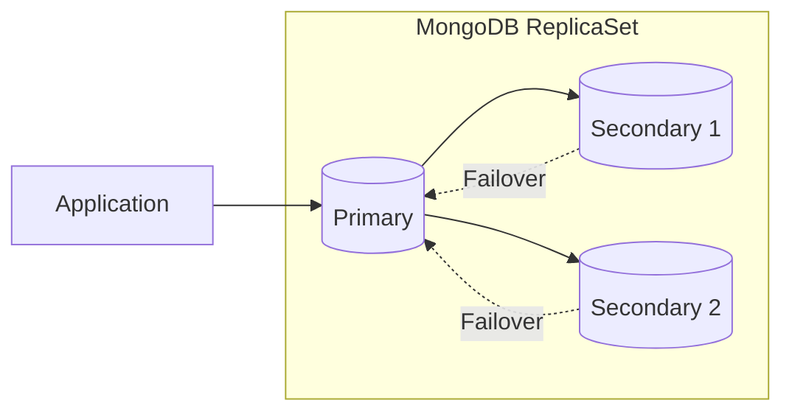
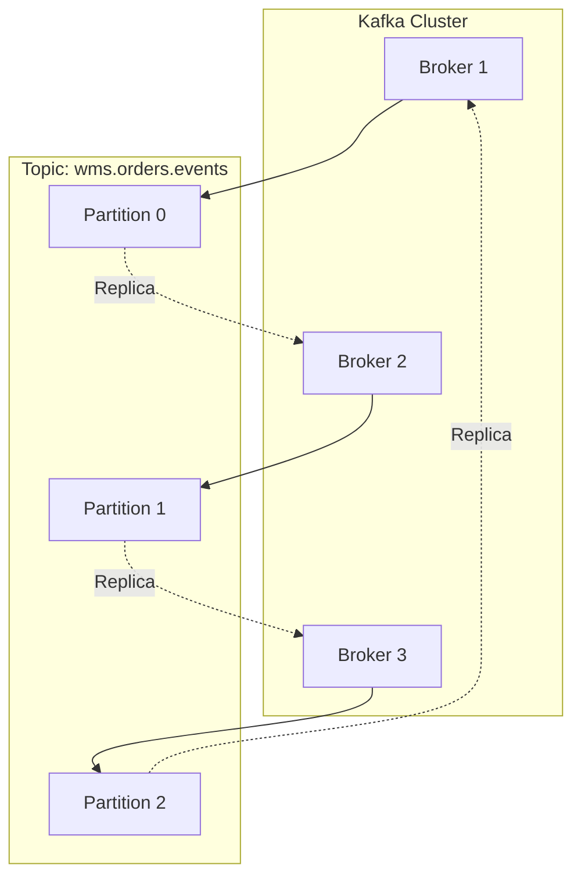

# Infrastructure Topology

This document describes the infrastructure topology of the WMS Platform, including all components and their interactions.

## Infrastructure Overview

## Network Architecture

## Component Specifications

### Application Services

| Service | Replicas | CPU Request | Memory Request | CPU Limit | Memory Limit |
|---------|----------|-------------|----------------|-----------|--------------|
| Order Service | 2 | 100m | 128Mi | 500m | 512Mi |
| Waving Service | 2 | 100m | 128Mi | 500m | 512Mi |
| Routing Service | 2 | 100m | 128Mi | 500m | 512Mi |
| Picking Service | 2 | 100m | 128Mi | 500m | 512Mi |
| Consolidation Service | 2 | 100m | 128Mi | 500m | 512Mi |
| Packing Service | 2 | 100m | 128Mi | 500m | 512Mi |
| Shipping Service | 2 | 100m | 128Mi | 500m | 512Mi |
| Inventory Service | 2 | 100m | 128Mi | 500m | 512Mi |
| Labor Service | 2 | 100m | 128Mi | 500m | 512Mi |
| Orchestrator | 3 | 200m | 256Mi | 1000m | 1Gi |

### Infrastructure Components

| Component | Configuration | Storage | High Availability |
|-----------|--------------|---------|-------------------|
| MongoDB | 3-node ReplicaSet | 100Gi SSD | Primary + 2 Secondary |
| Kafka | 3 brokers | 50Gi SSD each | Replication factor 3 |
| Zookeeper | 3 nodes | 10Gi SSD | Quorum-based |
| Temporal | 4 services | 20Gi SSD | Multi-replica |
| Prometheus | 1 replica | 100Gi | N/A (stateful) |
| Tempo | 1 replica | 100Gi | N/A (stateful) |

## Service Mesh

## Storage Architecture

## Security Architecture

## High Availability

### MongoDB ReplicaSet

### Kafka Cluster

## Disaster Recovery

| Component | RPO | RTO | Backup Strategy |
|-----------|-----|-----|-----------------|
| MongoDB | 1 hour | 15 min | Continuous backup + Snapshots |
| Kafka | 0 (replication) | 5 min | Multi-broker replication |
| Temporal | 1 hour | 15 min | Database backup |
| Configuration | Real-time | 5 min | GitOps |

## Related Diagrams

- [Deployment](./deployment) - Kubernetes resources
- [Data Flow](./data-flow) - Data movement
- [Observability](/infrastructure/observability) - Monitoring stack
