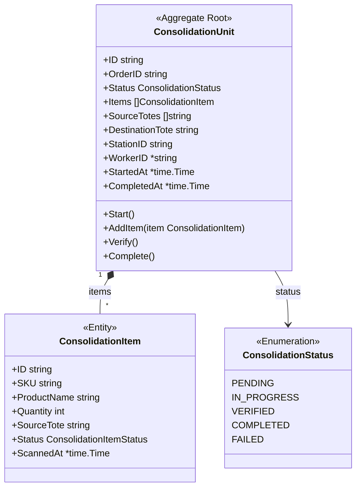
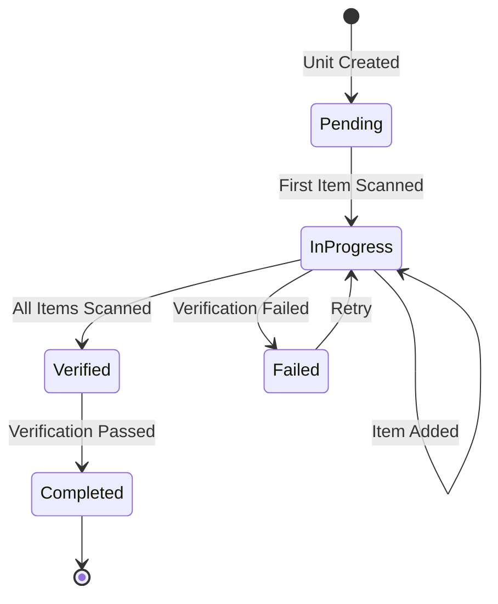
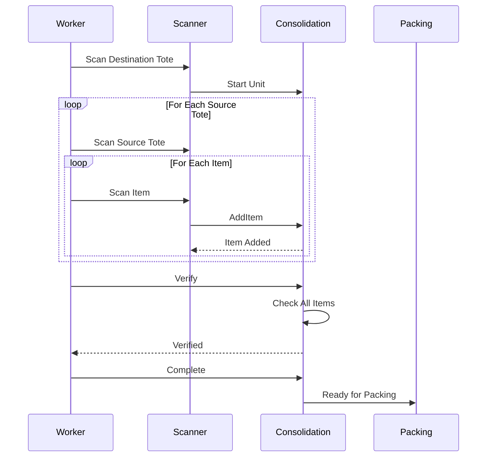
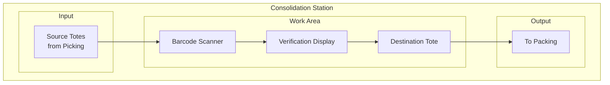

# ConsolidationUnit Aggregate

The ConsolidationUnit aggregate manages the process of combining picked items for multi-item orders.

## Aggregate Structure



## State Machine



## Consolidation Process



## Invariants

| Invariant | Description |
|-----------|-------------|
| Order Match | All items must belong to the same order |
| Quantity Match | Scanned quantity must match expected |
| Complete Set | All expected items must be present |
| Single Destination | One destination tote per unit |

## Commands

### CreateConsolidationUnit

```go
func NewConsolidationUnit(orderID string, expectedItems []ConsolidationItem) *ConsolidationUnit {
    return &ConsolidationUnit{
        ID:              uuid.New().String(),
        OrderID:         orderID,
        Status:          ConsolidationStatusPending,
        Items:           expectedItems,
        SourceTotes:     make([]string, 0),
        DestinationTote: generateToteID(),
        CreatedAt:       time.Now(),
    }
}
```

### AddItem

```go
func (cu *ConsolidationUnit) AddItem(sku string, quantity int, sourceTote string) error {
    if cu.Status != ConsolidationStatusPending && cu.Status != ConsolidationStatusInProgress {
        return ErrInvalidStatusTransition
    }

    item := cu.findItemBySKU(sku)
    if item == nil {
        return ErrUnexpectedItem
    }

    if item.Quantity < quantity {
        return ErrQuantityExceeded
    }

    item.Status = ConsolidationItemStatusScanned
    item.ScannedAt = timePtr(time.Now())

    if !contains(cu.SourceTotes, sourceTote) {
        cu.SourceTotes = append(cu.SourceTotes, sourceTote)
    }

    if cu.Status == ConsolidationStatusPending {
        cu.Status = ConsolidationStatusInProgress
        cu.StartedAt = timePtr(time.Now())
    }

    cu.addEvent(NewItemConsolidatedEvent(cu, item))
    return nil
}
```

### Verify

```go
func (cu *ConsolidationUnit) Verify() error {
    if cu.Status != ConsolidationStatusInProgress {
        return ErrInvalidStatusTransition
    }

    for _, item := range cu.Items {
        if item.Status != ConsolidationItemStatusScanned {
            return ErrMissingItems
        }
    }

    cu.Status = ConsolidationStatusVerified
    return nil
}
```

### Complete

```go
func (cu *ConsolidationUnit) Complete() error {
    if cu.Status != ConsolidationStatusVerified {
        return ErrInvalidStatusTransition
    }

    now := time.Now()
    cu.Status = ConsolidationStatusCompleted
    cu.CompletedAt = &now
    cu.addEvent(NewConsolidationCompletedEvent(cu))
    return nil
}
```

## Domain Events

| Event | Trigger | Data |
|-------|---------|------|
| ConsolidationStartedEvent | First item scanned | Unit ID, order ID |
| ItemConsolidatedEvent | Item added | Unit ID, item details |
| ConsolidationCompletedEvent | All items verified | Unit ID, duration |

## Consolidation Station Layout



## Repository Interface

```go
type ConsolidationUnitRepository interface {
    Save(ctx context.Context, unit *ConsolidationUnit) error
    FindByID(ctx context.Context, id string) (*ConsolidationUnit, error)
    FindByOrderID(ctx context.Context, orderID string) (*ConsolidationUnit, error)
    FindPending(ctx context.Context) ([]*ConsolidationUnit, error)
    Update(ctx context.Context, unit *ConsolidationUnit) error
}
```

## Related Documentation

- [Consolidation Service](/services/consolidation-service) - Service documentation
- [PickTask Aggregate](./pick-task) - Source of items
- [PackTask Aggregate](./pack-task) - Next step
