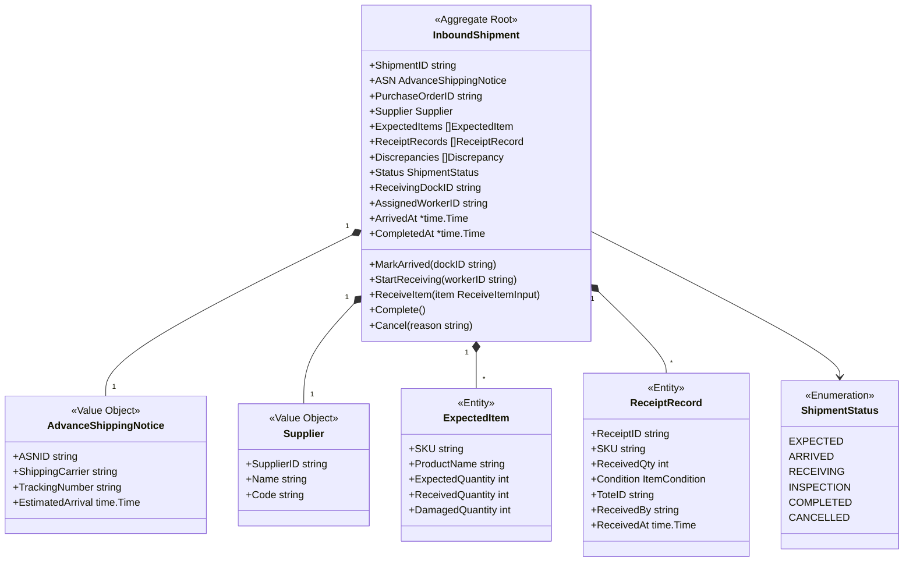
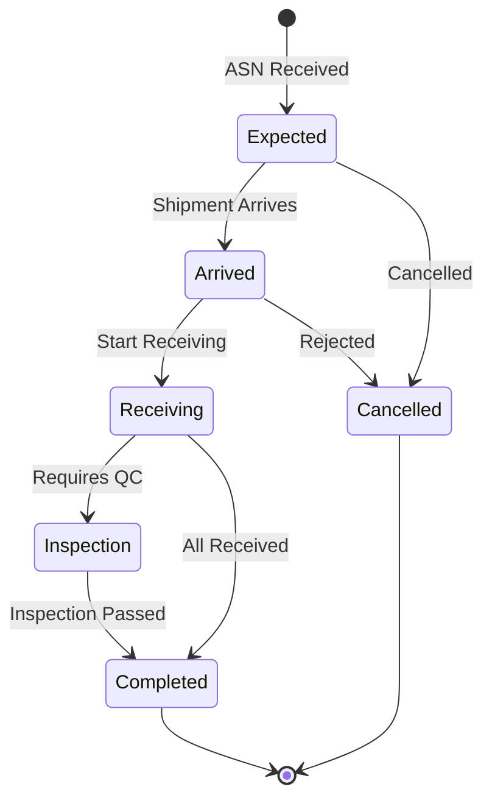

# InboundShipment Aggregate

The InboundShipment aggregate is the root of the Receiving bounded context, managing the lifecycle of inbound shipments from suppliers.

## Aggregate Structure



## State Machine



## Invariants

| Invariant | Description |
|-----------|-------------|
| Valid ASN | Shipment must have valid ASN with tracking |
| Supplier Required | Shipment must have supplier information |
| Expected Items | Cannot receive without expected items list |
| Valid Status | Status transitions must follow state machine |
| Received &lt;= Expected | Cannot receive more than expected (overage is discrepancy) |
| Condition Required | Every received item must have condition |

## Commands

### CreateShipment

```go
type CreateShipmentCommand struct {
    PurchaseOrderID string
    ASN             AdvanceShippingNotice
    Supplier        Supplier
    ExpectedItems   []ExpectedItem
}

func (s *ReceivingService) CreateShipment(ctx context.Context, cmd CreateShipmentCommand) (*InboundShipment, error) {
    shipment := NewInboundShipment(cmd.PurchaseOrderID, cmd.ASN, cmd.Supplier, cmd.ExpectedItems)

    if err := s.repo.Save(ctx, shipment); err != nil {
        return nil, err
    }

    s.publisher.Publish(shipment.Events())
    return shipment, nil
}
```

### ReceiveItem

```go
func (s *InboundShipment) ReceiveItem(input ReceiveItemInput) error {
    if s.Status != ShipmentStatusReceiving {
        return ErrInvalidStatusTransition
    }

    // Find expected item
    item := s.findExpectedItem(input.SKU)
    if item == nil {
        s.addDiscrepancy(DiscrepancyTypeWrongItem, input.SKU, 0, input.Quantity)
        return nil
    }

    // Record receipt
    record := &ReceiptRecord{
        ReceiptID:  generateReceiptID(),
        SKU:        input.SKU,
        ReceivedQty: input.Quantity,
        Condition:  input.Condition,
        ToteID:     input.ToteID,
        ReceivedBy: input.WorkerID,
        ReceivedAt: time.Now(),
    }
    s.ReceiptRecords = append(s.ReceiptRecords, record)

    // Update expected item
    if input.Condition == ConditionGood {
        item.ReceivedQuantity += input.Quantity
    } else {
        item.DamagedQuantity += input.Quantity
    }

    s.addEvent(NewItemReceivedEvent(s, record))
    return nil
}
```

## Domain Events

| Event | Trigger | Data |
|-------|---------|------|
| ShipmentExpectedEvent | Shipment created | Shipment details, expected items |
| ShipmentArrivedEvent | Arrives at dock | Shipment ID, dock ID, arrived at |
| ItemReceivedEvent | Item scanned | SKU, quantity, condition, tote |
| ReceivingCompletedEvent | Receiving done | Total received, damaged count |
| ReceivingDiscrepancyEvent | Discrepancy found | Type, SKU, expected vs actual |
| PutawayTaskCreatedEvent | Putaway triggered | Task ID, SKU, quantity, tote |

## Repository Interface

```go
type InboundShipmentRepository interface {
    Save(ctx context.Context, shipment *InboundShipment) error
    FindByID(ctx context.Context, id string) (*InboundShipment, error)
    FindByStatus(ctx context.Context, status ShipmentStatus) ([]*InboundShipment, error)
    FindExpectedArrivals(ctx context.Context, date time.Time) ([]*InboundShipment, error)
    FindBySupplier(ctx context.Context, supplierID string) ([]*InboundShipment, error)
    Update(ctx context.Context, shipment *InboundShipment) error
}
```

## API Endpoints

| Method | Endpoint | Description |
|--------|----------|-------------|
| POST | /api/v1/shipments | Create shipment |
| GET | /api/v1/shipments/{id} | Get shipment |
| POST | /api/v1/shipments/{id}/arrive | Mark arrived |
| POST | /api/v1/shipments/{id}/start | Start receiving |
| POST | /api/v1/shipments/{id}/receive | Receive item |
| POST | /api/v1/shipments/{id}/complete | Complete |

## Related Documentation

- [Receiving Service](/services/receiving-service) - Service documentation
- [PutawayTask Aggregate](./putaway-task) - Created after receiving
