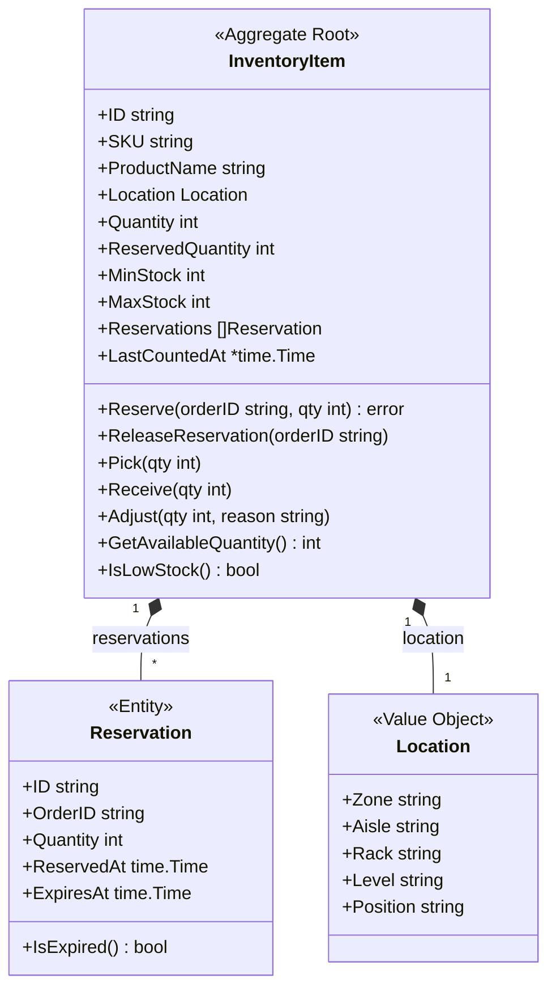
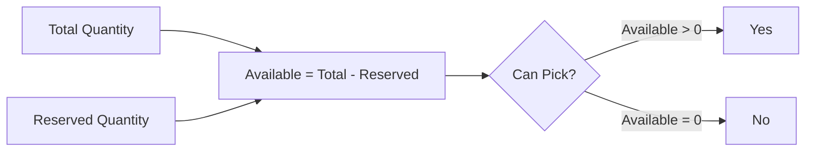
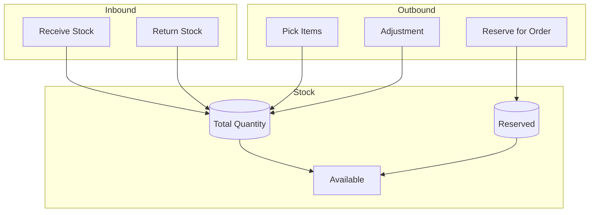

# InventoryItem Aggregate

The InventoryItem aggregate manages stock levels, locations, and reservations.

## Aggregate Structure



## Stock Calculation



## Invariants

| Invariant | Description |
|-----------|-------------|
| Non-Negative Stock | Quantity cannot go below zero |
| Reserved ≤ Quantity | Reserved quantity cannot exceed total |
| Valid Reservation | Reservations must have valid order ID |
| Location Required | Every item must have a location |

## Commands

### Reserve

```go
func (i *InventoryItem) Reserve(orderID string, quantity int) error {
    available := i.GetAvailableQuantity()
    if quantity > available {
        return ErrInsufficientStock
    }

    reservation := Reservation{
        ID:         uuid.New().String(),
        OrderID:    orderID,
        Quantity:   quantity,
        ReservedAt: time.Now(),
        ExpiresAt:  time.Now().Add(24 * time.Hour),
    }

    i.Reservations = append(i.Reservations, reservation)
    i.ReservedQuantity += quantity

    i.addEvent(NewInventoryReservedEvent(i, orderID, quantity))
    return nil
}
```

### ReleaseReservation

```go
func (i *InventoryItem) ReleaseReservation(orderID string) error {
    idx := -1
    var reservation *Reservation
    for j, r := range i.Reservations {
        if r.OrderID == orderID {
            idx = j
            reservation = &r
            break
        }
    }

    if idx == -1 {
        return ErrReservationNotFound
    }

    i.Reservations = append(i.Reservations[:idx], i.Reservations[idx+1:]...)
    i.ReservedQuantity -= reservation.Quantity

    i.addEvent(NewReservationReleasedEvent(i, orderID))
    return nil
}
```

### Pick

```go
func (i *InventoryItem) Pick(quantity int) error {
    if quantity > i.Quantity {
        return ErrInsufficientStock
    }

    i.Quantity -= quantity

    // Check for low stock
    if i.IsLowStock() {
        i.addEvent(NewLowStockAlertEvent(i))
    }

    i.addEvent(NewInventoryPickedEvent(i, quantity))
    return nil
}
```

### Receive

```go
func (i *InventoryItem) Receive(quantity int) error {
    i.Quantity += quantity
    i.addEvent(NewInventoryReceivedEvent(i, quantity))
    return nil
}
```

### Adjust

```go
func (i *InventoryItem) Adjust(quantity int, reason string) error {
    newQuantity := i.Quantity + quantity
    if newQuantity < 0 {
        return ErrNegativeStock
    }

    i.Quantity = newQuantity
    i.addEvent(NewInventoryAdjustedEvent(i, quantity, reason))
    return nil
}
```

## Helper Methods

```go
func (i *InventoryItem) GetAvailableQuantity() int {
    return i.Quantity - i.ReservedQuantity
}

func (i *InventoryItem) IsLowStock() bool {
    return i.Quantity <= i.MinStock
}

func (i *InventoryItem) CleanExpiredReservations() {
    now := time.Now()
    active := make([]Reservation, 0)
    released := 0

    for _, r := range i.Reservations {
        if r.ExpiresAt.After(now) {
            active = append(active, r)
        } else {
            released += r.Quantity
        }
    }

    i.Reservations = active
    i.ReservedQuantity -= released
}
```

## Domain Events

| Event | Trigger | Data |
|-------|---------|------|
| InventoryReceivedEvent | Stock received | Item ID, quantity |
| InventoryReservedEvent | Stock reserved | Item ID, order ID, quantity |
| ReservationReleasedEvent | Reservation cancelled | Item ID, order ID |
| InventoryPickedEvent | Stock picked | Item ID, quantity |
| InventoryAdjustedEvent | Manual adjustment | Item ID, quantity, reason |
| LowStockAlertEvent | Below threshold | Item ID, current quantity |

## Stock Flow Diagram



## Repository Interface

```go
type InventoryItemRepository interface {
    Save(ctx context.Context, item *InventoryItem) error
    FindByID(ctx context.Context, id string) (*InventoryItem, error)
    FindBySKU(ctx context.Context, sku string) ([]*InventoryItem, error)
    FindByLocation(ctx context.Context, location Location) (*InventoryItem, error)
    FindLowStock(ctx context.Context) ([]*InventoryItem, error)
    Update(ctx context.Context, item *InventoryItem) error
}
```

## API Endpoints

| Method | Endpoint | Description |
|--------|----------|-------------|
| POST | /api/v1/inventory | Create inventory item |
| GET | /api/v1/inventory/{id} | Get by ID |
| GET | /api/v1/inventory/sku/{sku} | Get by SKU |
| POST | /api/v1/inventory/{id}/reserve | Reserve stock |
| POST | /api/v1/inventory/{id}/release | Release reservation |
| POST | /api/v1/inventory/{id}/pick | Pick stock |
| POST | /api/v1/inventory/{id}/receive | Receive stock |
| POST | /api/v1/inventory/{id}/adjust | Adjust stock |

## Related Documentation

- [Inventory Service](/services/inventory-service) - Service documentation
- [Location Value Object](../value-objects#location) - Warehouse locations
