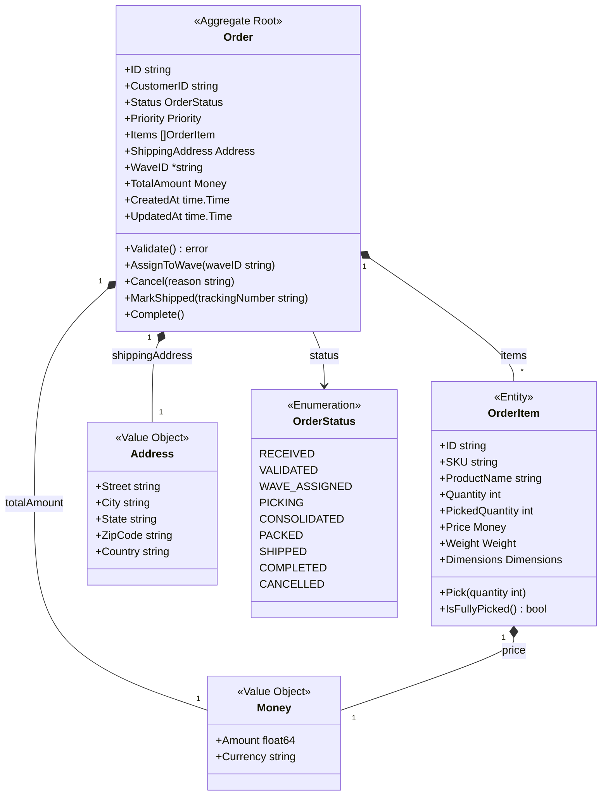
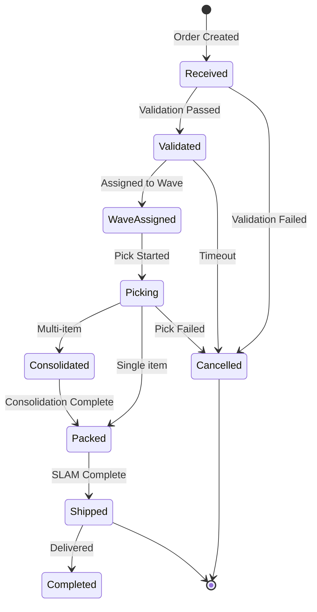

# Order Aggregate

The Order aggregate is the root of the Order bounded context, managing the lifecycle of customer orders.

## Aggregate Structure



## State Machine



## Invariants

| Invariant | Description |
|-----------|-------------|
| Valid Address | Shipping address must be complete and valid |
| Items Required | Order must have at least one item |
| Positive Quantities | All item quantities must be positive |
| Valid Status Transitions | Status can only transition to valid next states |
| Immutable After Ship | Order cannot be modified after shipping |

## Commands

### CreateOrder

```go
type CreateOrderCommand struct {
    CustomerID      string
    Priority        Priority
    Items           []OrderItemInput
    ShippingAddress Address
}

func (s *OrderService) CreateOrder(ctx context.Context, cmd CreateOrderCommand) (*Order, error) {
    order, err := NewOrder(cmd.CustomerID, cmd.Priority, cmd.Items, cmd.ShippingAddress)
    if err != nil {
        return nil, err
    }

    if err := s.repo.Save(ctx, order); err != nil {
        return nil, err
    }

    s.publisher.Publish(order.Events())
    return order, nil
}
```

### ValidateOrder

```go
func (o *Order) Validate() error {
    if o.Status != OrderStatusReceived {
        return ErrInvalidStatusTransition
    }

    // Validate address
    if err := o.ShippingAddress.Validate(); err != nil {
        return err
    }

    // Validate items
    for _, item := range o.Items {
        if item.Quantity <= 0 {
            return ErrInvalidQuantity
        }
    }

    o.Status = OrderStatusValidated
    o.addEvent(NewOrderValidatedEvent(o))
    return nil
}
```

### AssignToWave

```go
func (o *Order) AssignToWave(waveID string) error {
    if o.Status != OrderStatusValidated {
        return ErrInvalidStatusTransition
    }

    o.WaveID = &waveID
    o.Status = OrderStatusWaveAssigned
    o.addEvent(NewOrderWaveAssignedEvent(o, waveID))
    return nil
}
```

### CancelOrder

```go
func (o *Order) Cancel(reason string) error {
    if !o.CanCancel() {
        return ErrCannotCancel
    }

    o.Status = OrderStatusCancelled
    o.addEvent(NewOrderCancelledEvent(o, reason))
    return nil
}

func (o *Order) CanCancel() bool {
    nonCancellableStates := []OrderStatus{
        OrderStatusShipped,
        OrderStatusCompleted,
        OrderStatusCancelled,
    }
    return !contains(nonCancellableStates, o.Status)
}
```

## Domain Events

| Event | Trigger | Data |
|-------|---------|------|
| OrderReceivedEvent | Order created | Full order details |
| OrderValidatedEvent | Validation passed | Order ID, validated at |
| OrderWaveAssignedEvent | Assigned to wave | Order ID, wave ID |
| OrderShippedEvent | Shipped to carrier | Order ID, tracking number |
| OrderCancelledEvent | Order cancelled | Order ID, reason |
| OrderCompletedEvent | Delivery confirmed | Order ID, completed at |

## Repository Interface

```go
type OrderRepository interface {
    Save(ctx context.Context, order *Order) error
    FindByID(ctx context.Context, id string) (*Order, error)
    FindByCustomerID(ctx context.Context, customerID string) ([]*Order, error)
    FindByStatus(ctx context.Context, status OrderStatus) ([]*Order, error)
    FindPendingForWaving(ctx context.Context) ([]*Order, error)
    Update(ctx context.Context, order *Order) error
}
```

## API Endpoints

| Method | Endpoint | Description |
|--------|----------|-------------|
| POST | /api/v1/orders | Create order |
| GET | /api/v1/orders/\{id\} | Get order by ID |
| GET | /api/v1/orders | List orders |
| PUT | /api/v1/orders/\{id\}/validate | Validate order |
| PUT | /api/v1/orders/\{id\}/cancel | Cancel order |

## Related Documentation

- [Order Service](/services/order-service) - Service documentation
- [Domain Events](../domain-events) - Event catalog
- [Value Objects](../value-objects) - Address, Money types
