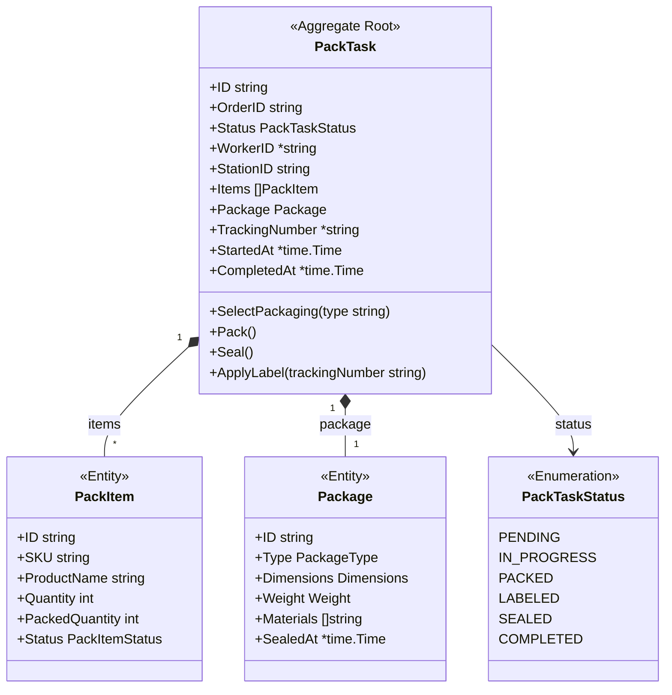
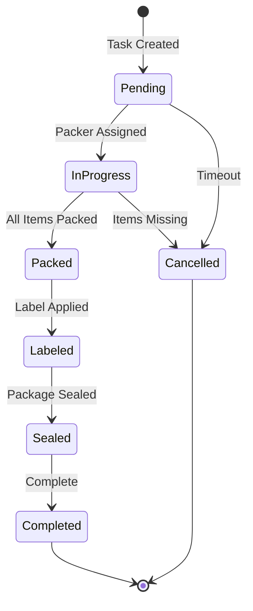
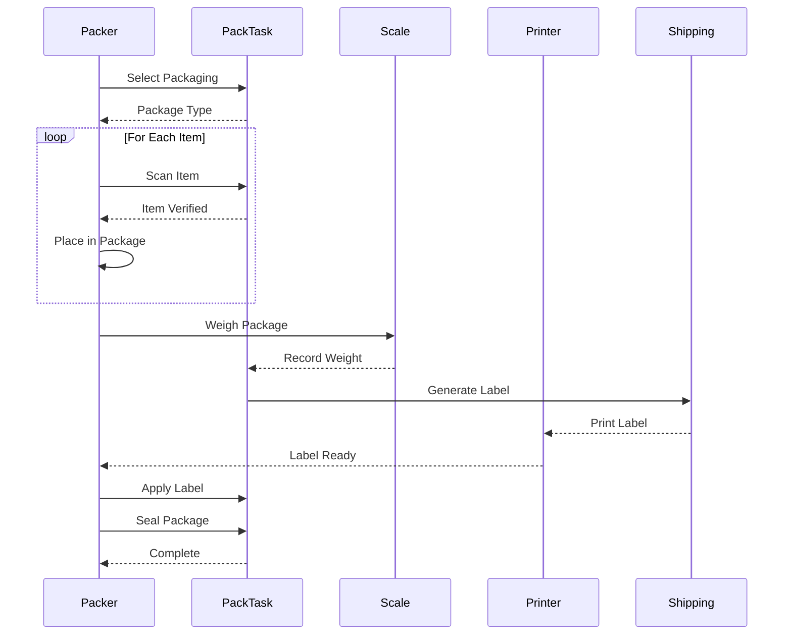
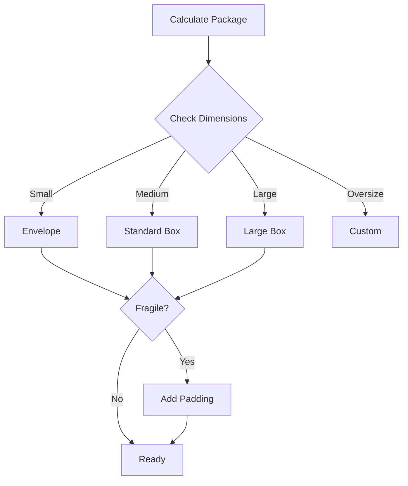

# PackTask Aggregate

The PackTask aggregate manages the packing process for orders.

## Aggregate Structure



## State Machine



## Packing Process



## Invariants

| Invariant | Description |
|-----------|-------------|
| All Items Packed | All order items must be packed |
| Weight Recorded | Package must be weighed before labeling |
| Label Required | Tracking number required before sealing |
| Package Selected | Package type must be selected before packing |

## Commands

### CreatePackTask

```go
func NewPackTask(orderID string, items []PackItem, stationID string) *PackTask {
    return &PackTask{
        ID:        uuid.New().String(),
        OrderID:   orderID,
        Status:    PackTaskStatusPending,
        StationID: stationID,
        Items:     items,
        CreatedAt: time.Now(),
    }
}
```

### SelectPackaging

```go
func (pt *PackTask) SelectPackaging(packageType PackageType, dimensions Dimensions) error {
    if pt.Status != PackTaskStatusInProgress {
        return ErrInvalidStatusTransition
    }

    pt.Package = &Package{
        ID:         uuid.New().String(),
        Type:       packageType,
        Dimensions: dimensions,
        Materials:  getMaterialsForType(packageType),
    }

    pt.addEvent(NewPackagingSuggestedEvent(pt))
    return nil
}
```

### PackItem

```go
func (pt *PackTask) PackItem(itemID string, quantity int) error {
    if pt.Status != PackTaskStatusInProgress {
        return ErrInvalidStatusTransition
    }

    item := pt.findItem(itemID)
    if item == nil {
        return ErrItemNotFound
    }

    if quantity > item.Quantity-item.PackedQuantity {
        return ErrQuantityExceeded
    }

    item.PackedQuantity += quantity
    if item.PackedQuantity == item.Quantity {
        item.Status = PackItemStatusPacked
    }

    // Check if all items are packed
    if pt.allItemsPacked() {
        pt.Status = PackTaskStatusPacked
    }

    return nil
}
```

### RecordWeight

```go
func (pt *PackTask) RecordWeight(weight Weight) error {
    if pt.Package == nil {
        return ErrNoPackage
    }

    pt.Package.Weight = weight
    return nil
}
```

### ApplyLabel

```go
func (pt *PackTask) ApplyLabel(trackingNumber string) error {
    if pt.Status != PackTaskStatusPacked {
        return ErrInvalidStatusTransition
    }

    pt.TrackingNumber = &trackingNumber
    pt.Status = PackTaskStatusLabeled
    pt.addEvent(NewLabelAppliedEvent(pt))
    return nil
}
```

### Seal

```go
func (pt *PackTask) Seal() error {
    if pt.Status != PackTaskStatusLabeled {
        return ErrInvalidStatusTransition
    }

    now := time.Now()
    pt.Package.SealedAt = &now
    pt.Status = PackTaskStatusSealed
    pt.addEvent(NewPackageSealedEvent(pt))
    return nil
}
```

## Domain Events

| Event | Trigger | Data |
|-------|---------|------|
| PackTaskCreatedEvent | Task created | Task ID, order ID |
| PackagingSuggestedEvent | Package selected | Task ID, package type |
| PackageSealedEvent | Package sealed | Task ID, tracking number |
| LabelAppliedEvent | Label affixed | Task ID, tracking number |
| PackTaskCompletedEvent | Task complete | Task ID, duration |

## Package Type Selection



## Repository Interface

```go
type PackTaskRepository interface {
    Save(ctx context.Context, task *PackTask) error
    FindByID(ctx context.Context, id string) (*PackTask, error)
    FindByOrderID(ctx context.Context, orderID string) (*PackTask, error)
    FindByStationID(ctx context.Context, stationID string) ([]*PackTask, error)
    FindPending(ctx context.Context) ([]*PackTask, error)
    Update(ctx context.Context, task *PackTask) error
}
```

## Related Documentation

- [Packing Service](/services/packing-service) - Service documentation
- [Packing Workflow](/architecture/sequence-diagrams/packing-workflow) - Workflow details
- [Shipment Aggregate](./shipment) - Next step
