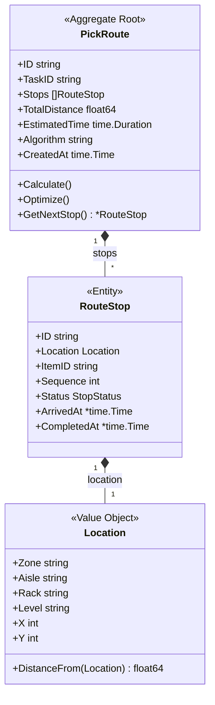
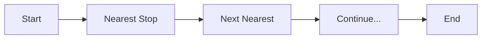
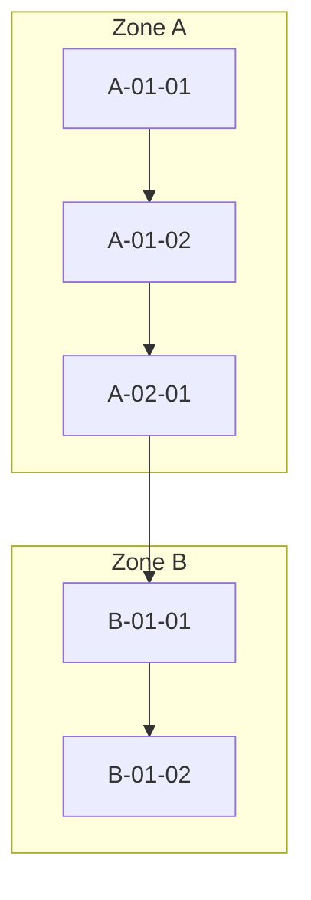
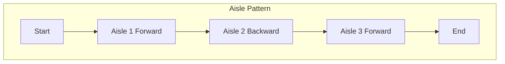

# PickRoute Aggregate

The PickRoute aggregate manages optimized picking paths through the warehouse.

## Aggregate Structure



## Route Optimization Algorithms

### Nearest Neighbor

Simple greedy algorithm for quick calculations:



### Zone-Based Routing

Optimizes within zones to minimize travel:



### S-Pattern (Serpentine)

Follows warehouse aisle pattern:



## Commands

### CalculateRoute

```go
func (s *RoutingService) CalculateRoute(ctx context.Context, items []PickItem) (*PickRoute, error) {
    route := &PickRoute{
        ID:        uuid.New().String(),
        Algorithm: s.defaultAlgorithm,
        CreatedAt: time.Now(),
    }

    // Convert items to stops
    stops := make([]RouteStop, len(items))
    for i, item := range items {
        stops[i] = RouteStop{
            ID:       uuid.New().String(),
            Location: item.Location,
            ItemID:   item.ID,
            Status:   StopStatusPending,
        }
    }

    // Optimize based on algorithm
    switch s.defaultAlgorithm {
    case "nearest_neighbor":
        stops = s.optimizeNearestNeighbor(stops)
    case "zone_based":
        stops = s.optimizeZoneBased(stops)
    case "serpentine":
        stops = s.optimizeSerpentine(stops)
    }

    // Assign sequence numbers
    for i := range stops {
        stops[i].Sequence = i + 1
    }

    route.Stops = stops
    route.TotalDistance = s.calculateTotalDistance(stops)
    route.EstimatedTime = s.estimateTime(route.TotalDistance)

    route.addEvent(NewRouteCalculatedEvent(route))
    return route, nil
}
```

### OptimizeNearestNeighbor

```go
func (s *RoutingService) optimizeNearestNeighbor(stops []RouteStop) []RouteStop {
    if len(stops) <= 1 {
        return stops
    }

    optimized := make([]RouteStop, 0, len(stops))
    remaining := make([]RouteStop, len(stops))
    copy(remaining, stops)

    // Start from warehouse entrance
    current := Location{Zone: "START", X: 0, Y: 0}

    for len(remaining) > 0 {
        nearestIdx := 0
        nearestDist := current.DistanceFrom(remaining[0].Location)

        for i, stop := range remaining {
            dist := current.DistanceFrom(stop.Location)
            if dist < nearestDist {
                nearestIdx = i
                nearestDist = dist
            }
        }

        optimized = append(optimized, remaining[nearestIdx])
        current = remaining[nearestIdx].Location
        remaining = append(remaining[:nearestIdx], remaining[nearestIdx+1:]...)
    }

    return optimized
}
```

## Domain Events

| Event | Trigger | Data |
|-------|---------|------|
| RouteCalculatedEvent | Route created | Route ID, stops, distance |
| RouteStartedEvent | First stop arrived | Route ID, started at |
| StopCompletedEvent | Stop picked | Route ID, stop ID |
| RouteCompletedEvent | All stops done | Route ID, duration |

## Performance Metrics

| Metric | Description | Target |
|--------|-------------|--------|
| Route Efficiency | Actual vs optimal distance | > 90% |
| Travel Time | Time between picks | Minimize |
| Zone Transitions | Cross-zone movements | Minimize |

## Repository Interface

```go
type PickRouteRepository interface {
    Save(ctx context.Context, route *PickRoute) error
    FindByID(ctx context.Context, id string) (*PickRoute, error)
    FindByTaskID(ctx context.Context, taskID string) (*PickRoute, error)
}
```

## API Endpoints

| Method | Endpoint | Description |
|--------|----------|-------------|
| POST | /api/v1/routes/calculate | Calculate optimal route |
| GET | /api/v1/routes/{id} | Get route by ID |

## Related Documentation

- [Routing Service](/services/routing-service) - Service documentation
- [PickTask Aggregate](./pick-task) - Task using routes
- [Location Value Object](../value-objects#location) - Shared kernel
