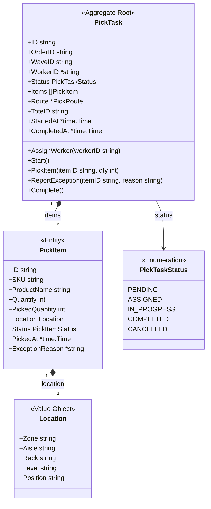
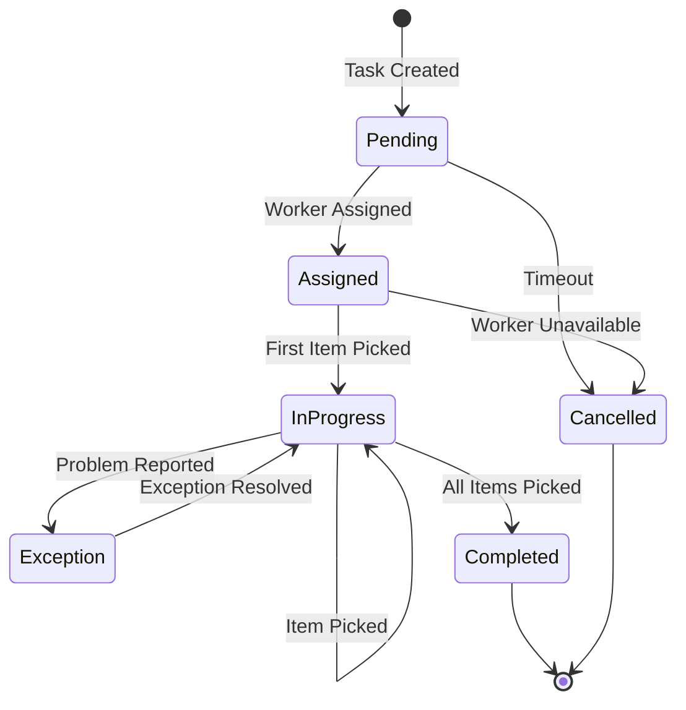
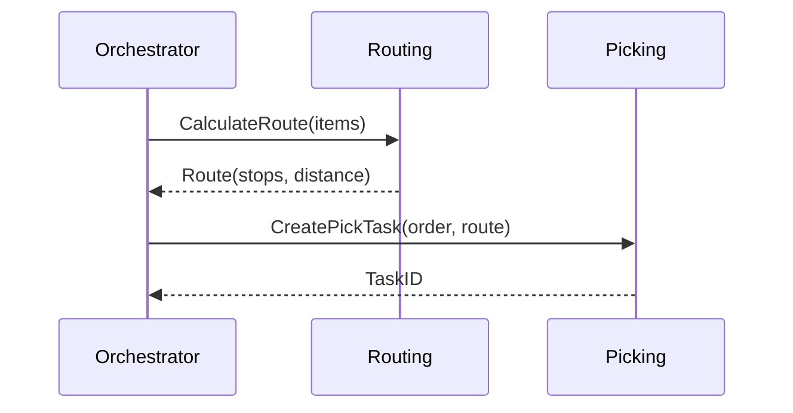

# PickTask Aggregate

The PickTask aggregate manages warehouse picking operations for orders.

## Aggregate Structure



## State Machine



## Invariants

| Invariant | Description |
|-----------|-------------|
| Valid Location | All items must have valid warehouse locations |
| Quantity Limits | Cannot pick more than requested quantity |
| Worker Required | Must have assigned worker before starting |
| Complete All Items | All items must be picked or have exceptions |

## Commands

### CreatePickTask

```go
func NewPickTask(orderID, waveID string, items []PickItem) *PickTask {
    return &PickTask{
        ID:      uuid.New().String(),
        OrderID: orderID,
        WaveID:  waveID,
        Status:  PickTaskStatusPending,
        Items:   items,
        ToteID:  generateToteID(),
    }
}
```

### AssignWorker

```go
func (pt *PickTask) AssignWorker(workerID string) error {
    if pt.Status != PickTaskStatusPending {
        return ErrInvalidStatusTransition
    }

    pt.WorkerID = &workerID
    pt.Status = PickTaskStatusAssigned
    pt.addEvent(NewPickTaskAssignedEvent(pt, workerID))
    return nil
}
```

### PickItem

```go
func (pt *PickTask) PickItem(itemID string, quantity int, location Location) error {
    if pt.Status != PickTaskStatusAssigned && pt.Status != PickTaskStatusInProgress {
        return ErrInvalidStatusTransition
    }

    item := pt.findItem(itemID)
    if item == nil {
        return ErrItemNotFound
    }

    if quantity > item.Quantity-item.PickedQuantity {
        return ErrQuantityExceeded
    }

    item.PickedQuantity += quantity
    item.PickedAt = timePtr(time.Now())

    if pt.Status == PickTaskStatusAssigned {
        pt.Status = PickTaskStatusInProgress
        pt.StartedAt = timePtr(time.Now())
    }

    pt.addEvent(NewItemPickedEvent(pt, item, quantity))
    return nil
}
```

### ReportException

```go
func (pt *PickTask) ReportException(itemID, reason string) error {
    item := pt.findItem(itemID)
    if item == nil {
        return ErrItemNotFound
    }

    item.Status = PickItemStatusException
    item.ExceptionReason = &reason

    pt.addEvent(NewPickExceptionEvent(pt, item, reason))
    return nil
}
```

### Complete

```go
func (pt *PickTask) Complete() error {
    if pt.Status != PickTaskStatusInProgress {
        return ErrInvalidStatusTransition
    }

    // Check all items are picked or have exceptions
    for _, item := range pt.Items {
        if !item.IsComplete() && item.Status != PickItemStatusException {
            return ErrIncompleteTask
        }
    }

    now := time.Now()
    pt.Status = PickTaskStatusCompleted
    pt.CompletedAt = &now
    pt.addEvent(NewPickTaskCompletedEvent(pt))
    return nil
}
```

## Domain Events

| Event | Trigger | Data |
|-------|---------|------|
| PickTaskCreatedEvent | Task created | Task ID, order ID, items |
| PickTaskAssignedEvent | Worker assigned | Task ID, worker ID |
| ItemPickedEvent | Item picked | Task ID, item ID, quantity |
| PickExceptionEvent | Exception reported | Task ID, item ID, reason |
| PickTaskCompletedEvent | Task completed | Task ID, duration, items picked |

## Pick Route Integration

The PickTask works with the Routing service for optimal paths:



## Repository Interface

```go
type PickTaskRepository interface {
    Save(ctx context.Context, task *PickTask) error
    FindByID(ctx context.Context, id string) (*PickTask, error)
    FindByOrderID(ctx context.Context, orderID string) (*PickTask, error)
    FindByWaveID(ctx context.Context, waveID string) ([]*PickTask, error)
    FindByWorkerID(ctx context.Context, workerID string) ([]*PickTask, error)
    FindPending(ctx context.Context) ([]*PickTask, error)
    Update(ctx context.Context, task *PickTask) error
}
```

## Related Documentation

- [Picking Service](/services/picking-service) - Service documentation
- [Picking Workflow](/architecture/sequence-diagrams/picking-workflow) - Workflow details
- [PickRoute Aggregate](./pick-route) - Route optimization
