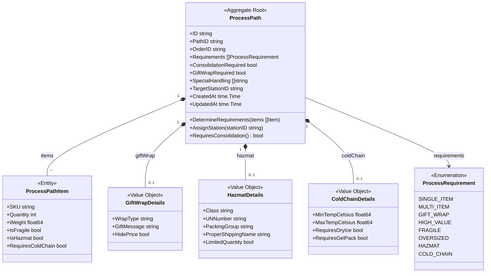
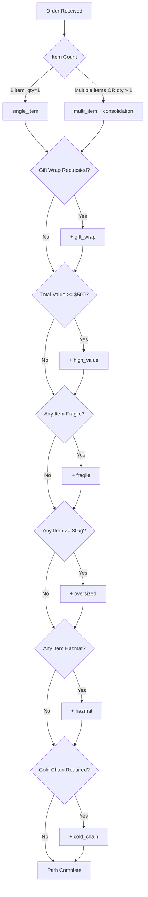
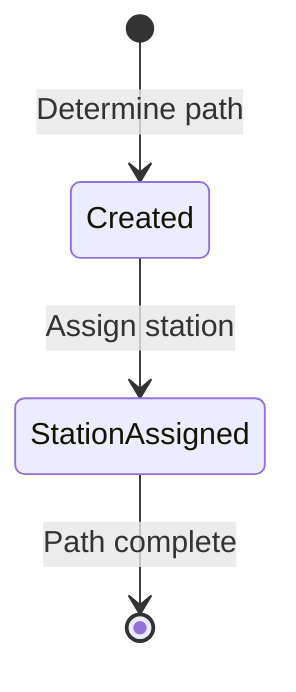
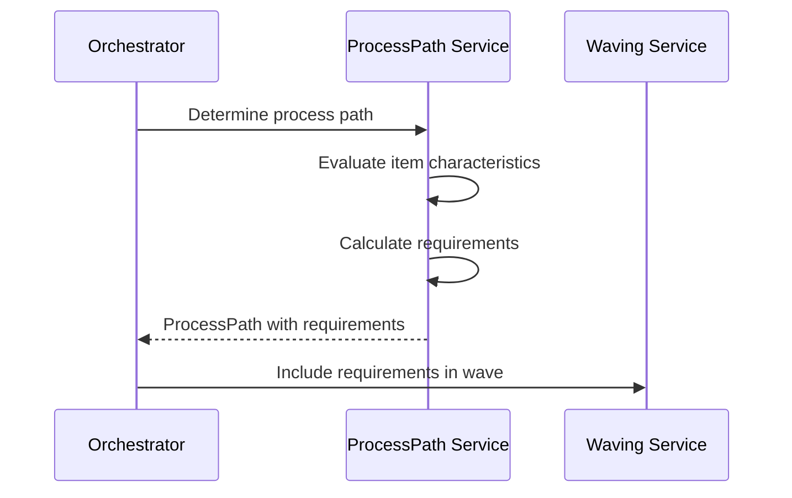

# ProcessPath Aggregate

The ProcessPath aggregate determines the optimal fulfillment process path for orders based on item characteristics and special handling requirements.

## Aggregate Structure



## How Process Path is Determined

When an order enters the fulfillment system, the Process Path Service evaluates item characteristics to determine the optimal fulfillment route. The following flowchart illustrates the decision process:



## Domain Rules

### Requirement Determination with Business Context

Each requirement triggers specific special handling procedures. The thresholds are configured based on operational needs:

| Requirement | Trigger Condition | Special Handling | Business Reason |
|-------------|------------------|------------------|-----------------|
| `single_item` | Single item with quantity 1 | Direct pick-pack | Fastest fulfillment path - no consolidation needed, item goes directly from pick to pack station |
| `multi_item` | Multiple items OR quantity > 1 | `consolidation_required` | Items must be gathered at a wall/consolidation station before packing to ensure complete orders |
| `gift_wrap` | Gift wrap requested on order | Gift wrap station routing | Customer experience - requires professional gift presentation, special materials, and trained staff |
| `high_value` | Total order value >= $500 | `high_value_verification` | Loss prevention - dual verification required, secure handling, photo documentation before shipping |
| `fragile` | Any item has `IsFragile: true` | `fragile_packing` | Damage prevention - bubble wrap, corner protectors, "FRAGILE" labels, specialized packing materials |
| `oversized` | Any item weight >= 30kg | `oversized_handling` | Safety compliance - requires equipment (forklifts, pallet jacks), multiple workers, special packaging |
| `hazmat` | Any item has `IsHazmat: true` | `hazmat_compliance` | Regulatory requirement - OSHA/DOT certified handlers only, proper labeling, documentation for shipping |
| `cold_chain` | Any item has `RequiresColdChain: true` | `cold_chain_packaging` | Product integrity - maintain temperature range, gel packs or dry ice, insulated packaging, time-sensitive processing |

### Configuration Thresholds

The following thresholds are defined in the system and can be adjusted based on business needs:

| Threshold | Value | Configurable |
|-----------|-------|--------------|
| High Value Threshold | $500.00 USD | Yes |
| Oversized Weight Threshold | 30.0 kg | Yes |

### Consolidation Logic

```go
func (pp *ProcessPath) RequiresConsolidation() bool {
    return pp.hasRequirement(MultiItem) ||
           len(pp.Requirements) > 1
}
```

An order requires consolidation when:
- Multiple items need to be picked
- Items are in different warehouse zones
- Special handling applies to subset of items

## Invariants

1. **Order ID Required**: Every ProcessPath must be associated with an order
2. **Valid Requirements**: Requirements must be valid enum values
3. **Consistent State**: ConsolidationRequired must be true if multi-item requirement exists
4. **Station Assignment**: TargetStationID can only be set once

## State Diagram



## Domain Events

| Event | Triggered When |
|-------|---------------|
| `ProcessPathDetermined` | Process path calculated for order |
| `StationAssigned` | Target station assigned to path |

## Go Implementation

```go
type ProcessPath struct {
    ID                    string              `bson:"_id"`
    PathID                string              `bson:"pathId"`
    OrderID               string              `bson:"orderId"`
    Requirements          []ProcessRequirement `bson:"requirements"`
    ConsolidationRequired bool                `bson:"consolidationRequired"`
    GiftWrapRequired      bool                `bson:"giftWrapRequired"`
    SpecialHandling       []string            `bson:"specialHandling"`
    TargetStationID       string              `bson:"targetStationId,omitempty"`
    CreatedAt             time.Time           `bson:"createdAt"`
    UpdatedAt             time.Time           `bson:"updatedAt"`
}

type ProcessRequirement string

const (
    SingleItem ProcessRequirement = "single_item"
    MultiItem  ProcessRequirement = "multi_item"
    GiftWrap   ProcessRequirement = "gift_wrap"
    HighValue  ProcessRequirement = "high_value"
    Fragile    ProcessRequirement = "fragile"
    Oversized  ProcessRequirement = "oversized"
    Hazmat     ProcessRequirement = "hazmat"
    ColdChain  ProcessRequirement = "cold_chain"
)
```

## Usage in Workflow



## Realistic Examples

The following examples demonstrate how process path determination works for different order scenarios:

### Example 1: Simple Single-Item Order

A customer orders a single HDMI cable - the simplest fulfillment path.

**Input:**
```json
{
  "orderId": "ORD-2026-0108-001",
  "items": [{
    "sku": "ELEC-HDMI-CBL-6FT",
    "productName": "HDMI Cable 6ft",
    "quantity": 1,
    "price": 12.99,
    "weight": 0.15,
    "isFragile": false,
    "isHazmat": false,
    "requiresColdChain": false
  }],
  "totalValue": 12.99,
  "giftWrap": false
}
```

**Output:**
```json
{
  "pathId": "PP-a1b2c3d4-e5f6-7890-abcd-ef1234567890",
  "orderId": "ORD-2026-0108-001",
  "requirements": ["single_item"],
  "consolidationRequired": false,
  "giftWrapRequired": false,
  "specialHandling": [],
  "createdAt": "2026-01-08T10:30:00Z"
}
```

**Why:** Single item with quantity 1, low value, no special handling flags. Goes directly from pick to pack.

---

### Example 2: Multi-Item Order with Consolidation

A customer orders multiple apparel items that need to be consolidated before packing.

**Input:**
```json
{
  "orderId": "ORD-2026-0108-002",
  "items": [
    {
      "sku": "APPAREL-TSHIRT-BLK-M",
      "productName": "Classic T-Shirt Black Medium",
      "quantity": 2,
      "price": 24.99,
      "weight": 0.25
    },
    {
      "sku": "APPAREL-JEANS-BLU-32",
      "productName": "Slim Fit Jeans Blue 32x30",
      "quantity": 1,
      "price": 49.99,
      "weight": 0.6
    }
  ],
  "totalValue": 99.97,
  "giftWrap": false
}
```

**Output:**
```json
{
  "pathId": "PP-b2c3d4e5-f6a7-8901-bcde-f23456789012",
  "orderId": "ORD-2026-0108-002",
  "requirements": ["multi_item"],
  "consolidationRequired": true,
  "giftWrapRequired": false,
  "specialHandling": [],
  "createdAt": "2026-01-08T10:35:00Z"
}
```

**Why:** Multiple items require consolidation at a wall station before packing. Items may be picked from different zones.

---

### Example 3: High-Value Fragile Electronics

A customer orders an expensive OLED TV that requires both high-value verification and fragile handling.

**Input:**
```json
{
  "orderId": "ORD-2026-0108-003",
  "items": [{
    "sku": "ELEC-TV-65IN-OLED",
    "productName": "65-inch OLED Smart TV 4K",
    "quantity": 1,
    "price": 1499.99,
    "weight": 22.0,
    "isFragile": true,
    "isHazmat": false,
    "requiresColdChain": false
  }],
  "totalValue": 1499.99,
  "giftWrap": false
}
```

**Output:**
```json
{
  "pathId": "PP-c3d4e5f6-a7b8-9012-cdef-345678901234",
  "orderId": "ORD-2026-0108-003",
  "requirements": ["single_item", "high_value", "fragile"],
  "consolidationRequired": false,
  "giftWrapRequired": false,
  "specialHandling": ["high_value_verification", "fragile_packing"],
  "createdAt": "2026-01-08T10:40:00Z"
}
```

**Why:** Value exceeds $500 threshold (loss prevention) and item is marked fragile (damage prevention). Requires dual verification and specialized packing materials.

---

### Example 4: Hazmat Shipment (Car Battery)

A customer orders a car battery that requires hazmat compliance handling.

**Input:**
```json
{
  "orderId": "ORD-2026-0108-004",
  "items": [{
    "sku": "AUTO-BATT-12V-750CCA",
    "productName": "Car Battery 12V 750 CCA",
    "quantity": 1,
    "price": 149.99,
    "weight": 18.5,
    "isFragile": false,
    "isHazmat": true,
    "hazmatDetails": {
      "class": "8",
      "unNumber": "UN2794",
      "packingGroup": "III",
      "properShippingName": "Batteries, wet, filled with acid",
      "limitedQuantity": false
    },
    "requiresColdChain": false
  }],
  "totalValue": 149.99,
  "giftWrap": false
}
```

**Output:**
```json
{
  "pathId": "PP-d4e5f6a7-b8c9-0123-def4-567890123456",
  "orderId": "ORD-2026-0108-004",
  "requirements": ["single_item", "hazmat"],
  "consolidationRequired": false,
  "giftWrapRequired": false,
  "specialHandling": ["hazmat_compliance"],
  "createdAt": "2026-01-08T10:45:00Z"
}
```

**Why:** Item is classified as hazmat (Class 8 corrosive). Requires DOT-certified handlers, proper hazmat labels, and shipping documentation. Only certain carriers can transport.

---

### Example 5: Cold Chain Gift Order (Premium Food)

A customer orders premium frozen food items as a gift, triggering multiple requirements.

**Input:**
```json
{
  "orderId": "ORD-2026-0108-005",
  "items": [
    {
      "sku": "FOOD-STEAK-WAGYU-8OZ",
      "productName": "Premium Wagyu Beef Steak 8oz",
      "quantity": 4,
      "price": 89.99,
      "weight": 0.25,
      "isFragile": false,
      "isHazmat": false,
      "requiresColdChain": true,
      "coldChainDetails": {
        "minTempCelsius": -18.0,
        "maxTempCelsius": -12.0,
        "requiresDryIce": true,
        "requiresGelPack": false
      }
    },
    {
      "sku": "FOOD-LOBSTER-TAIL-2PK",
      "productName": "Maine Lobster Tails (2-pack)",
      "quantity": 2,
      "price": 79.99,
      "weight": 0.5,
      "isFragile": false,
      "isHazmat": false,
      "requiresColdChain": true,
      "coldChainDetails": {
        "minTempCelsius": -18.0,
        "maxTempCelsius": -12.0,
        "requiresDryIce": true,
        "requiresGelPack": false
      }
    }
  ],
  "totalValue": 519.94,
  "giftWrap": true,
  "giftWrapDetails": {
    "wrapType": "premium",
    "giftMessage": "Happy Birthday! Enjoy this special dinner.",
    "hidePrice": true
  }
}
```

**Output:**
```json
{
  "pathId": "PP-e5f6a7b8-c9d0-1234-ef56-789012345678",
  "orderId": "ORD-2026-0108-005",
  "requirements": ["multi_item", "gift_wrap", "high_value", "cold_chain"],
  "consolidationRequired": true,
  "giftWrapRequired": true,
  "specialHandling": ["high_value_verification", "cold_chain_packaging"],
  "createdAt": "2026-01-08T10:50:00Z"
}
```

**Why:** Complex order with multiple requirements:
- **multi_item**: 6 total items (4 steaks + 2 lobster packs) require consolidation
- **gift_wrap**: Customer requested gift presentation
- **high_value**: Total exceeds $500 threshold ($519.94)
- **cold_chain**: Frozen items require temperature-controlled processing, dry ice, insulated packaging, and time-sensitive fulfillment

This order would be routed to a refrigerated picking zone, consolidated at a temperature-controlled wall, and packed with dry ice before gift wrapping.

---

## Related Documentation

- [Process Path Service](/services/process-path-service) - Service documentation
- [Planning Workflow](/temporal/workflows/planning) - Uses process path
- [Order Fulfillment](/temporal/workflows/order-fulfillment) - Parent workflow
