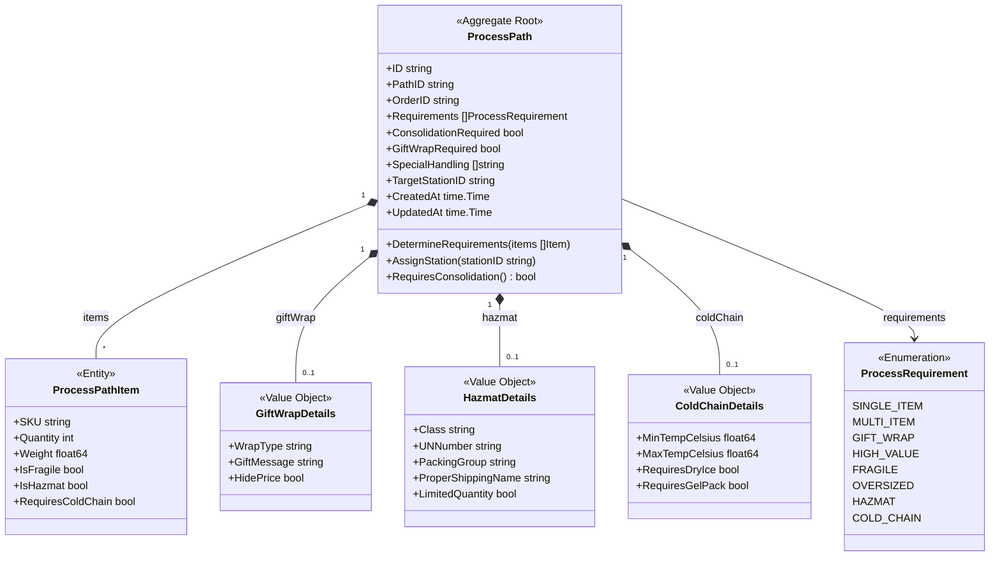
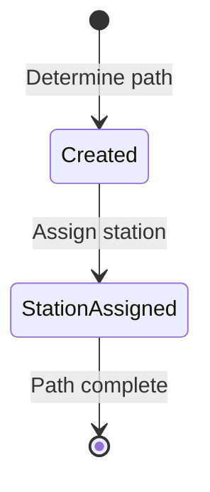
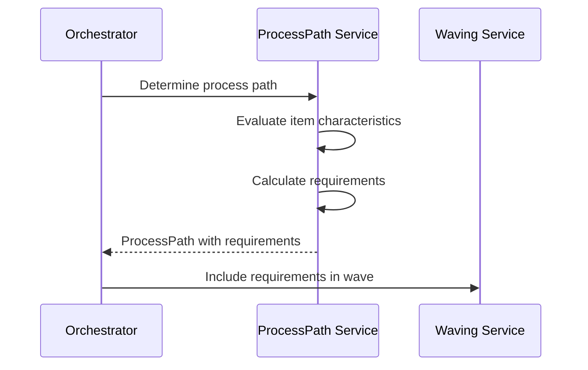

# ProcessPath Aggregate

The ProcessPath aggregate determines the optimal fulfillment process path for orders based on item characteristics and special handling requirements.

## Aggregate Structure



## Domain Rules

### Requirement Determination

| Requirement | Trigger Condition |
|-------------|------------------|
| `single_item` | Single item with quantity 1 |
| `multi_item` | Multiple items OR quantity > 1 |
| `gift_wrap` | Gift wrap requested on order |
| `high_value` | Total order value >= $500 |
| `fragile` | Any item has `IsFragile: true` |
| `oversized` | Any item weight >= 30kg |
| `hazmat` | Any item has `IsHazmat: true` |
| `cold_chain` | Any item has `RequiresColdChain: true` |

### Consolidation Logic

```go
func (pp *ProcessPath) RequiresConsolidation() bool {
    return pp.hasRequirement(MultiItem) ||
           len(pp.Requirements) > 1
}
```

An order requires consolidation when:
- Multiple items need to be picked
- Items are in different warehouse zones
- Special handling applies to subset of items

## Invariants

1. **Order ID Required**: Every ProcessPath must be associated with an order
2. **Valid Requirements**: Requirements must be valid enum values
3. **Consistent State**: ConsolidationRequired must be true if multi-item requirement exists
4. **Station Assignment**: TargetStationID can only be set once

## State Diagram



## Domain Events

| Event | Triggered When |
|-------|---------------|
| `ProcessPathDetermined` | Process path calculated for order |
| `StationAssigned` | Target station assigned to path |

## Go Implementation

```go
type ProcessPath struct {
    ID                    string              `bson:"_id"`
    PathID                string              `bson:"pathId"`
    OrderID               string              `bson:"orderId"`
    Requirements          []ProcessRequirement `bson:"requirements"`
    ConsolidationRequired bool                `bson:"consolidationRequired"`
    GiftWrapRequired      bool                `bson:"giftWrapRequired"`
    SpecialHandling       []string            `bson:"specialHandling"`
    TargetStationID       string              `bson:"targetStationId,omitempty"`
    CreatedAt             time.Time           `bson:"createdAt"`
    UpdatedAt             time.Time           `bson:"updatedAt"`
}

type ProcessRequirement string

const (
    SingleItem ProcessRequirement = "single_item"
    MultiItem  ProcessRequirement = "multi_item"
    GiftWrap   ProcessRequirement = "gift_wrap"
    HighValue  ProcessRequirement = "high_value"
    Fragile    ProcessRequirement = "fragile"
    Oversized  ProcessRequirement = "oversized"
    Hazmat     ProcessRequirement = "hazmat"
    ColdChain  ProcessRequirement = "cold_chain"
)
```

## Usage in Workflow



## Related Documentation

- [Process Path Service](/services/process-path-service) - Service documentation
- [Planning Workflow](/temporal/workflows/planning) - Uses process path
- [Order Fulfillment](/temporal/workflows/order-fulfillment) - Parent workflow
