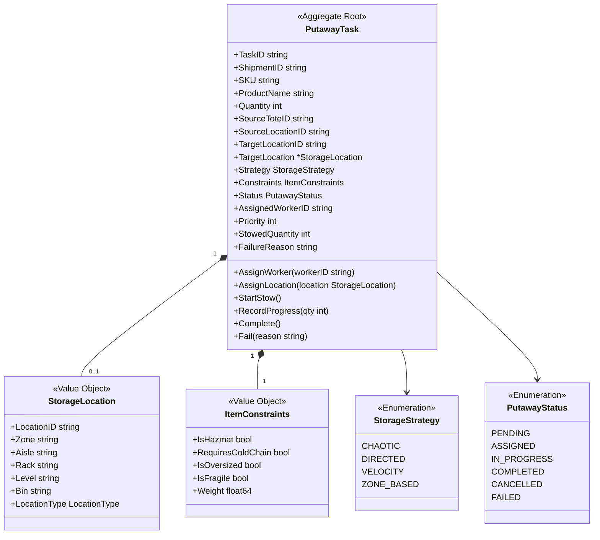
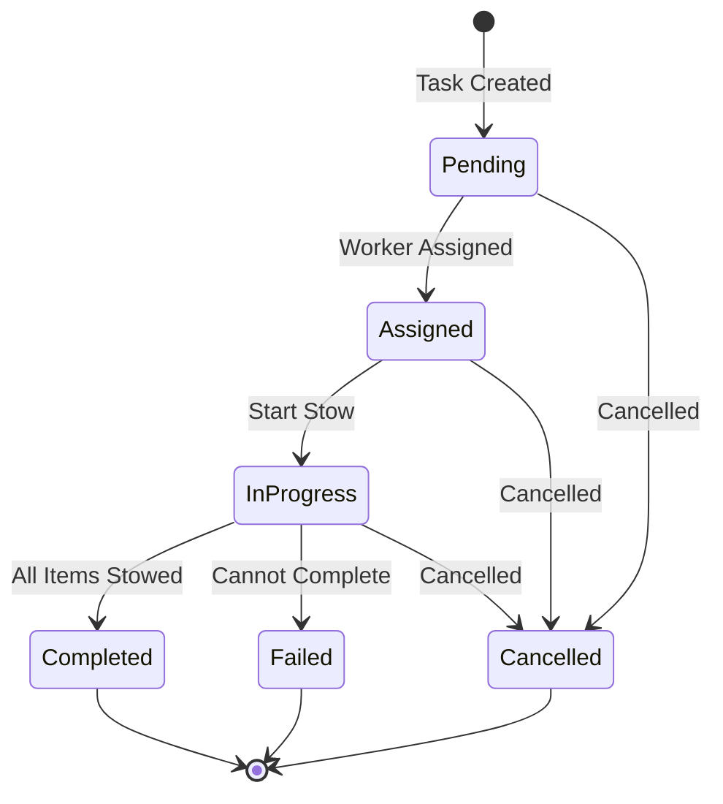

# PutawayTask Aggregate

The PutawayTask aggregate is the root of the Stow bounded context, managing the lifecycle of putaway operations using various storage strategies.

## Aggregate Structure



## State Machine



## Invariants

| Invariant | Description |
|-----------|-------------|
| Valid SKU | Task must have valid SKU and quantity |
| Positive Quantity | Quantity must be greater than 0 |
| Valid Strategy | Strategy must be valid enum value |
| Location Constraints | Target location must support item constraints |
| Stowed &lt;= Total | Stowed quantity cannot exceed total quantity |
| Status Transitions | Status can only follow valid state machine |

## Storage Strategies

| Strategy | Algorithm |
|----------|-----------|
| Chaotic | Random available location - maximizes utilization |
| Directed | System-assigned based on predefined rules |
| Velocity | High-velocity near pick zones, slow in reserve |
| Zone-Based | Products grouped by category in zones |

## Commands

### CreatePutawayTask

```go
type CreatePutawayTaskCommand struct {
    ShipmentID       string
    SKU              string
    ProductName      string
    Quantity         int
    SourceToteID     string
    SourceLocationID string
    Strategy         StorageStrategy
    Constraints      ItemConstraints
    Priority         int
}

func (s *StowService) CreateTask(ctx context.Context, cmd CreatePutawayTaskCommand) (*PutawayTask, error) {
    task := NewPutawayTask(cmd)

    if err := s.repo.Save(ctx, task); err != nil {
        return nil, err
    }

    s.publisher.Publish(task.Events())
    return task, nil
}
```

### AssignLocation

```go
func (t *PutawayTask) AssignLocation(location StorageLocation) error {
    // Validate location supports constraints
    if t.Constraints.IsHazmat && location.LocationType != LocationTypeHazmatZone {
        return ErrLocationConstraintMismatch
    }
    if t.Constraints.RequiresColdChain && location.LocationType != LocationTypeColdStorage {
        return ErrLocationConstraintMismatch
    }

    t.TargetLocation = &location
    t.TargetLocationID = location.LocationID
    t.addEvent(NewLocationAssignedEvent(t, location))
    return nil
}
```

### RecordProgress

```go
func (t *PutawayTask) RecordProgress(quantity int, locationID string) error {
    if t.Status != PutawayStatusInProgress {
        return ErrInvalidStatusTransition
    }

    if t.StowedQuantity + quantity > t.Quantity {
        return ErrExceedsQuantity
    }

    t.StowedQuantity += quantity
    t.addEvent(NewItemStowedEvent(t, quantity, locationID))

    if t.StowedQuantity >= t.Quantity {
        t.Status = PutawayStatusCompleted
        t.addEvent(NewPutawayTaskCompletedEvent(t))
    }

    return nil
}
```

## Domain Events

| Event | Trigger | Data |
|-------|---------|------|
| PutawayTaskCreatedEvent | Task created | Task details, strategy, constraints |
| PutawayTaskAssignedEvent | Worker assigned | Task ID, worker ID |
| LocationAssignedEvent | Location determined | Task ID, location, zone, strategy |
| ItemStowedEvent | Items stowed | Task ID, SKU, quantity, location |
| PutawayTaskCompletedEvent | All items stowed | Task ID, total stowed, locations |
| PutawayTaskFailedEvent | Task failed | Task ID, reason |

## Repository Interface

```go
type PutawayTaskRepository interface {
    Save(ctx context.Context, task *PutawayTask) error
    FindByID(ctx context.Context, id string) (*PutawayTask, error)
    FindByStatus(ctx context.Context, status PutawayStatus) ([]*PutawayTask, error)
    FindByWorker(ctx context.Context, workerID string) ([]*PutawayTask, error)
    FindByShipment(ctx context.Context, shipmentID string) ([]*PutawayTask, error)
    FindPending(ctx context.Context, limit int) ([]*PutawayTask, error)
    Update(ctx context.Context, task *PutawayTask) error
}
```

## API Endpoints

| Method | Endpoint | Description |
|--------|----------|-------------|
| POST | /api/v1/tasks | Create task |
| GET | /api/v1/tasks/\{id\} | Get task |
| POST | /api/v1/tasks/\{id\}/assign | Assign worker |
| POST | /api/v1/tasks/\{id\}/start | Start stow |
| POST | /api/v1/tasks/\{id\}/stow | Record progress |
| POST | /api/v1/tasks/\{id\}/complete | Complete task |
| POST | /api/v1/tasks/\{id\}/fail | Mark failed |

## Related Documentation

- [Stow Service](/services/stow-service) - Service documentation
- [InboundShipment Aggregate](./inbound-shipment) - Creates putaway tasks
