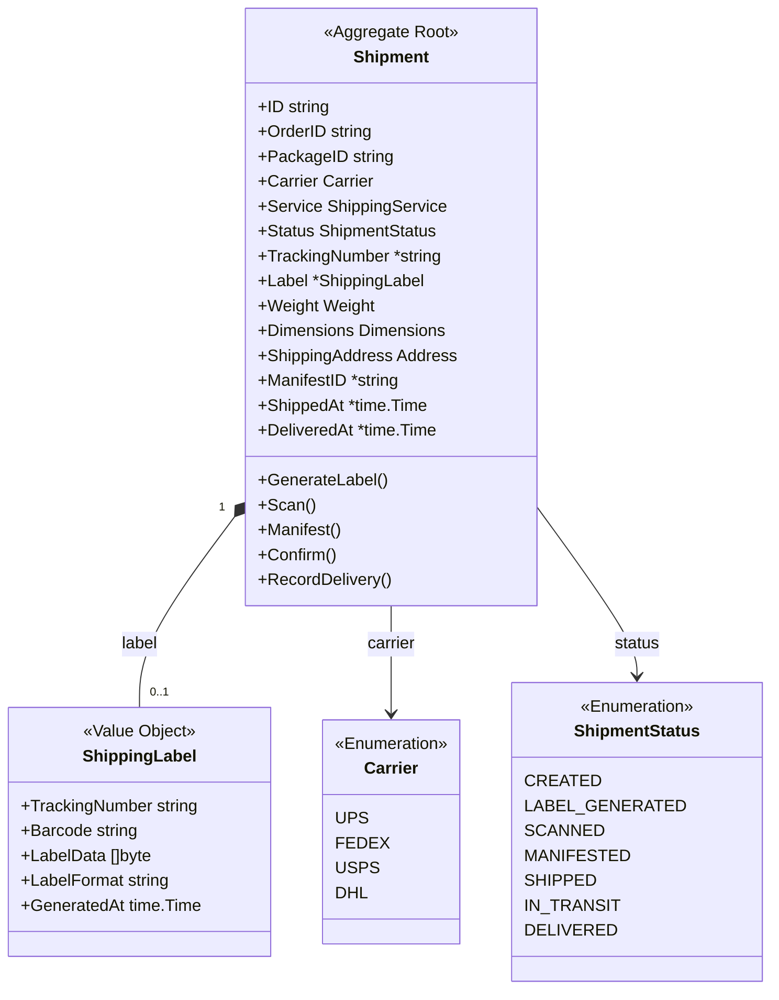
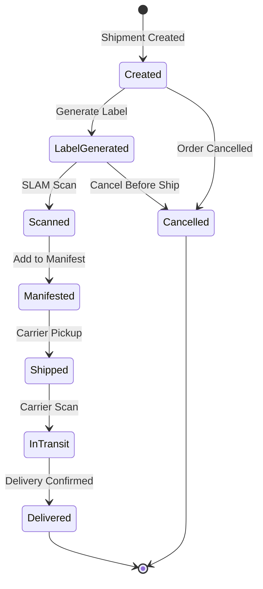
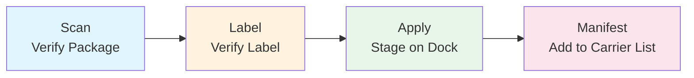
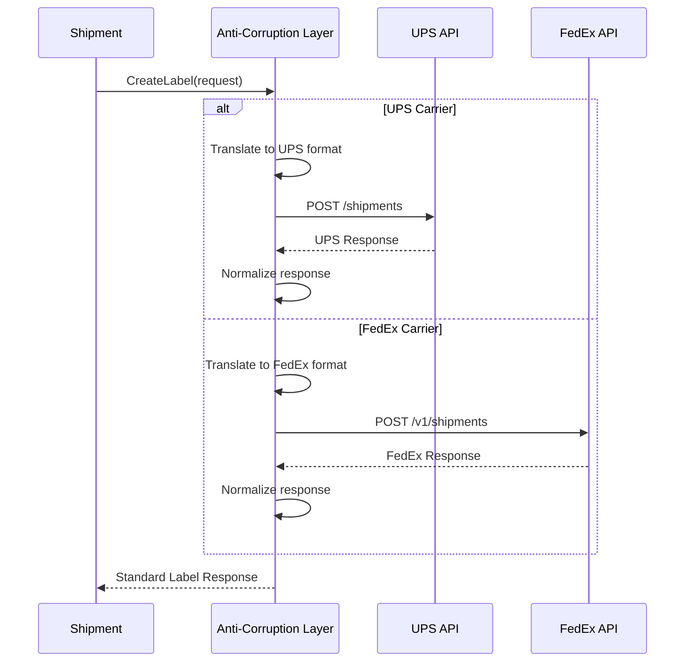

# Shipment Aggregate

The Shipment aggregate manages carrier integration and the SLAM (Scan, Label, Apply, Manifest) process.

## Aggregate Structure



## State Machine



## SLAM Process



## Invariants

| Invariant | Description |
|-----------|-------------|
| Label Required | Must have label before scanning |
| Valid Address | Shipping address must be complete |
| Carrier Selected | Carrier and service must be specified |
| Weight Required | Package weight required for shipping |

## Commands

### CreateShipment

```go
func NewShipment(orderID, packageID string, carrier Carrier, service string, address Address) *Shipment {
    return &Shipment{
        ID:              uuid.New().String(),
        OrderID:         orderID,
        PackageID:       packageID,
        Carrier:         carrier,
        Service:         service,
        Status:          ShipmentStatusCreated,
        ShippingAddress: address,
        CreatedAt:       time.Now(),
    }
}
```

### GenerateLabel

```go
func (s *Shipment) GenerateLabel(ctx context.Context, carrierAPI CarrierAPI) error {
    if s.Status != ShipmentStatusCreated {
        return ErrInvalidStatusTransition
    }

    // Call carrier API to generate label
    labelResponse, err := carrierAPI.CreateLabel(ctx, s.toCarrierRequest())
    if err != nil {
        return fmt.Errorf("carrier API error: %w", err)
    }

    s.Label = &ShippingLabel{
        TrackingNumber: labelResponse.TrackingNumber,
        Barcode:        labelResponse.Barcode,
        LabelData:      labelResponse.LabelData,
        LabelFormat:    labelResponse.Format,
        GeneratedAt:    time.Now(),
    }
    s.TrackingNumber = &labelResponse.TrackingNumber
    s.Status = ShipmentStatusLabelGenerated

    s.addEvent(NewLabelGeneratedEvent(s))
    return nil
}
```

### Scan (SLAM - S)

```go
func (s *Shipment) Scan(scannedPackageID string) error {
    if s.Status != ShipmentStatusLabelGenerated {
        return ErrInvalidStatusTransition
    }

    if scannedPackageID != s.PackageID {
        return ErrPackageMismatch
    }

    s.Status = ShipmentStatusScanned
    return nil
}
```

### VerifyLabel (SLAM - L)

```go
func (s *Shipment) VerifyLabel(scannedTrackingNumber string) error {
    if s.Status != ShipmentStatusScanned {
        return ErrInvalidStatusTransition
    }

    if s.TrackingNumber == nil || scannedTrackingNumber != *s.TrackingNumber {
        return ErrLabelMismatch
    }

    return nil
}
```

### Manifest (SLAM - M)

```go
func (s *Shipment) Manifest(manifestID string) error {
    if s.Status != ShipmentStatusScanned {
        return ErrInvalidStatusTransition
    }

    s.ManifestID = &manifestID
    s.Status = ShipmentStatusManifested
    s.addEvent(NewShipmentManifestedEvent(s))
    return nil
}
```

### Confirm

```go
func (s *Shipment) Confirm() error {
    if s.Status != ShipmentStatusManifested {
        return ErrInvalidStatusTransition
    }

    now := time.Now()
    s.Status = ShipmentStatusShipped
    s.ShippedAt = &now
    s.addEvent(NewShipConfirmedEvent(s))
    return nil
}
```

## Carrier Integration (ACL)



## Domain Events

| Event | Trigger | Data |
|-------|---------|------|
| ShipmentCreatedEvent | Shipment created | Shipment ID, order ID |
| LabelGeneratedEvent | Label created | Shipment ID, tracking number |
| ShipmentManifestedEvent | Added to manifest | Shipment ID, manifest ID |
| ShipConfirmedEvent | Carrier pickup | Shipment ID, shipped at |
| DeliveryConfirmedEvent | Delivery complete | Shipment ID, delivered at |

## Carrier Services

| Carrier | Services | Features |
|---------|----------|----------|
| UPS | Ground, 2-Day, Next Day, Express | Full tracking, residential |
| FedEx | Ground, Express, Priority Overnight | Real-time tracking |
| USPS | Priority, First Class, Parcel Select | Residential delivery |
| DHL | Express Worldwide, eCommerce | International |

## Repository Interface

```go
type ShipmentRepository interface {
    Save(ctx context.Context, shipment *Shipment) error
    FindByID(ctx context.Context, id string) (*Shipment, error)
    FindByOrderID(ctx context.Context, orderID string) (*Shipment, error)
    FindByTrackingNumber(ctx context.Context, trackingNumber string) (*Shipment, error)
    FindByManifestID(ctx context.Context, manifestID string) ([]*Shipment, error)
    Update(ctx context.Context, shipment *Shipment) error
}
```

## Related Documentation

- [Shipping Service](/services/shipping-service) - Service documentation
- [Shipping Workflow](/architecture/sequence-diagrams/shipping-workflow) - SLAM process
- [PackTask Aggregate](./pack-task) - Source of packages
