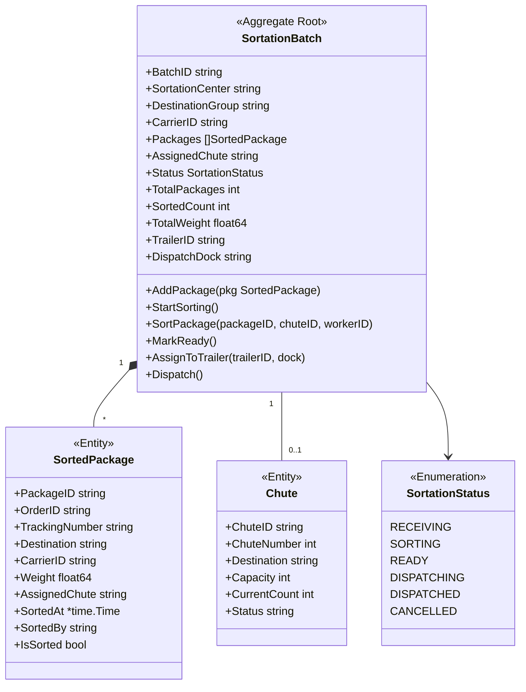
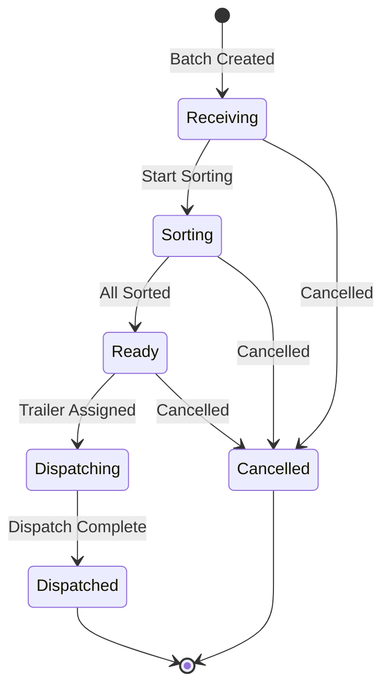

# SortationBatch Aggregate

The SortationBatch aggregate is the root of the Sortation bounded context, managing the grouping and sorting of packages by destination for efficient dispatch.

## Aggregate Structure



## State Machine



## Invariants

| Invariant | Description |
|-----------|-------------|
| Carrier Required | Batch must have carrier assignment |
| Destination Required | Must have destination group (zip prefix/region) |
| Package Uniqueness | Same package cannot be in multiple batches |
| Sort Before Ready | All packages must be sorted before ready |
| Trailer Before Dispatch | Trailer must be assigned before dispatch |
| Status Transitions | Status can only follow valid state machine |

## Commands

### CreateBatch

```go
type CreateBatchCommand struct {
    SortationCenter  string
    DestinationGroup string
    CarrierID        string
}

func (s *SortationService) CreateBatch(ctx context.Context, cmd CreateBatchCommand) (*SortationBatch, error) {
    batch := NewSortationBatch(cmd.SortationCenter, cmd.DestinationGroup, cmd.CarrierID)

    if err := s.repo.Save(ctx, batch); err != nil {
        return nil, err
    }

    s.publisher.Publish(batch.Events())
    return batch, nil
}
```

### AddPackage

```go
func (b *SortationBatch) AddPackage(pkg SortedPackage) error {
    if b.Status != SortationStatusReceiving && b.Status != SortationStatusSorting {
        return ErrInvalidStatusTransition
    }

    pkg.IsSorted = false
    b.Packages = append(b.Packages, pkg)
    b.TotalPackages++
    b.TotalWeight += pkg.Weight

    b.addEvent(NewPackageReceivedForSortationEvent(b, pkg))
    return nil
}
```

### SortPackage

```go
func (b *SortationBatch) SortPackage(packageID, chuteID, workerID string) error {
    if b.Status != SortationStatusSorting && b.Status != SortationStatusReceiving {
        return ErrInvalidStatusTransition
    }

    // Auto-transition to sorting
    if b.Status == SortationStatusReceiving {
        b.Status = SortationStatusSorting
    }

    // Find and update package
    for i := range b.Packages {
        if b.Packages[i].PackageID == packageID {
            if b.Packages[i].IsSorted {
                return ErrPackageAlreadySorted
            }

            now := time.Now()
            b.Packages[i].AssignedChute = chuteID
            b.Packages[i].SortedAt = &now
            b.Packages[i].SortedBy = workerID
            b.Packages[i].IsSorted = true
            b.SortedCount++

            b.addEvent(NewPackageSortedEvent(b, packageID, chuteID, workerID))
            return nil
        }
    }

    return ErrPackageNotFound
}
```

### Dispatch

```go
func (b *SortationBatch) Dispatch() error {
    if b.Status != SortationStatusDispatching {
        return ErrInvalidStatusTransition
    }

    now := time.Now()
    b.Status = SortationStatusDispatched
    b.DispatchedAt = &now

    b.addEvent(NewBatchDispatchedEvent(b))
    return nil
}
```

## Domain Events

| Event | Trigger | Data |
|-------|---------|------|
| SortationBatchCreatedEvent | Batch created | Batch ID, center, destination, carrier |
| PackageReceivedForSortationEvent | Package added | Batch ID, package ID, destination |
| PackageSortedEvent | Package sorted | Batch ID, package ID, chute, worker |
| BatchReadyEvent | All packages sorted | Batch ID, package count, weight |
| BatchDispatchedEvent | Batch dispatched | Batch ID, trailer, dock, packages |

## Repository Interface

```go
type SortationBatchRepository interface {
    Save(ctx context.Context, batch *SortationBatch) error
    FindByID(ctx context.Context, id string) (*SortationBatch, error)
    FindByStatus(ctx context.Context, status SortationStatus) ([]*SortationBatch, error)
    FindByCarrier(ctx context.Context, carrierID string) ([]*SortationBatch, error)
    FindByDestinationGroup(ctx context.Context, group string) ([]*SortationBatch, error)
    FindReady(ctx context.Context, limit int) ([]*SortationBatch, error)
    FindOpenBatch(ctx context.Context, destGroup, carrier string) (*SortationBatch, error)
    Update(ctx context.Context, batch *SortationBatch) error
}
```

## API Endpoints

| Method | Endpoint | Description |
|--------|----------|-------------|
| POST | /api/v1/batches | Create batch |
| GET | /api/v1/batches/{id} | Get batch |
| POST | /api/v1/batches/{id}/packages | Add package |
| POST | /api/v1/batches/{id}/sort | Sort package |
| POST | /api/v1/batches/{id}/ready | Mark ready |
| POST | /api/v1/batches/{id}/dispatch | Dispatch |

## Related Documentation

- [Sortation Service](/services/sortation-service) - Service documentation
- [Shipment Aggregate](./shipment) - Receives dispatched batches
