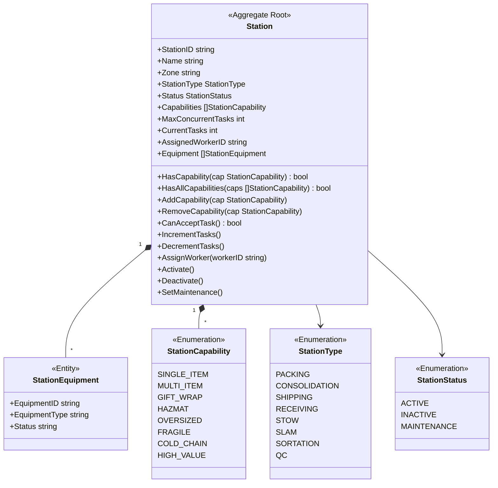
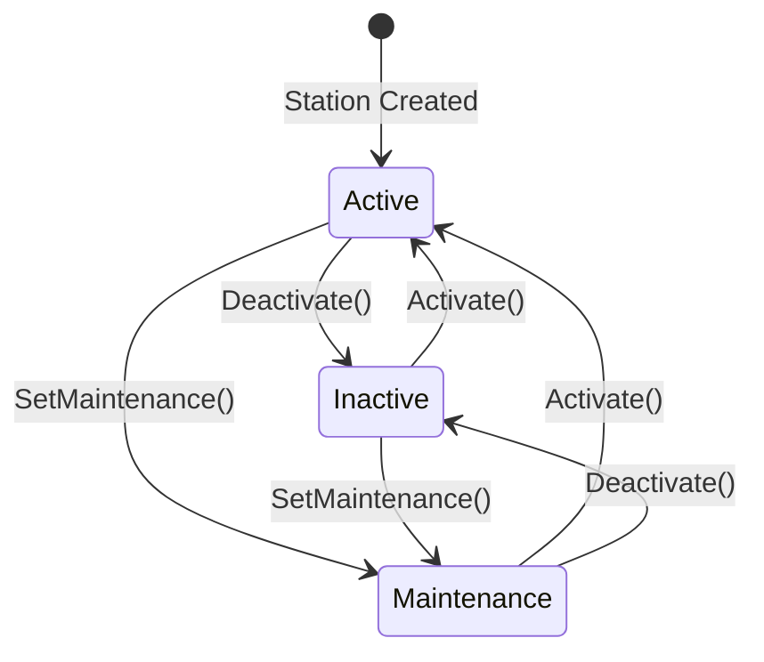
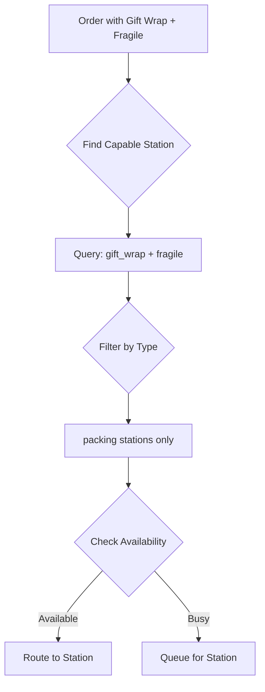

# Station Aggregate

The Station aggregate is the root of the Facility bounded context, managing warehouse stations and their capabilities for process path routing.

## Aggregate Structure



## State Machine



## Invariants

| Invariant | Description |
|-----------|-------------|
| Valid Station Type | Station type must be valid enum value |
| Valid Capabilities | All capabilities must be valid enum values |
| Max Tasks Positive | MaxConcurrentTasks must be > 0 |
| Current &lt;= Max | Current tasks cannot exceed maximum |
| Active for Tasks | Cannot assign tasks to inactive/maintenance stations |
| Unique Capabilities | Cannot add duplicate capabilities |

## Commands

### CreateStation

```go
type CreateStationCommand struct {
    StationID          string
    Name               string
    Zone               string
    StationType        StationType
    Capabilities       []StationCapability
    MaxConcurrentTasks int
}

func (s *FacilityService) CreateStation(ctx context.Context, cmd CreateStationCommand) (*Station, error) {
    station, err := NewStation(cmd.StationID, cmd.Name, cmd.Zone, cmd.StationType, cmd.MaxConcurrentTasks)
    if err != nil {
        return nil, err
    }

    for _, cap := range cmd.Capabilities {
        station.AddCapability(cap)
    }

    if err := s.repo.Save(ctx, station); err != nil {
        return nil, err
    }

    s.publisher.Publish(station.Events())
    return station, nil
}
```

### FindCapableStations

```go
type FindCapableStationsQuery struct {
    Requirements []StationCapability
    StationType  *StationType
    Zone         *string
}

func (s *FacilityService) FindCapableStations(ctx context.Context, query FindCapableStationsQuery) ([]*Station, error) {
    // Get stations with all required capabilities
    stations, err := s.repo.FindByCapabilities(ctx, query.Requirements)
    if err != nil {
        return nil, err
    }

    // Filter by type if specified
    if query.StationType != nil {
        stations = filterByType(stations, *query.StationType)
    }

    // Filter by zone if specified
    if query.Zone != nil {
        stations = filterByZone(stations, *query.Zone)
    }

    // Filter by availability
    result := make([]*Station, 0)
    for _, station := range stations {
        if station.CanAcceptTask() {
            result = append(result, station)
        }
    }

    return result, nil
}
```

### SetCapabilities

```go
func (s *Station) SetCapabilities(capabilities []StationCapability) error {
    for _, cap := range capabilities {
        if !cap.IsValid() {
            return fmt.Errorf("invalid capability: %s", cap)
        }
    }

    s.Capabilities = capabilities
    s.UpdatedAt = time.Now()
    s.addEvent(NewStationCapabilitiesUpdatedEvent(s))
    return nil
}
```

### IncrementTasks

```go
func (s *Station) IncrementTasks() error {
    if !s.CanAcceptTask() {
        if s.Status != StationStatusActive {
            return ErrStationNotActive
        }
        return ErrStationAtCapacity
    }

    s.CurrentTasks++
    s.UpdatedAt = time.Now()
    return nil
}

func (s *Station) CanAcceptTask() bool {
    return s.Status == StationStatusActive && s.CurrentTasks < s.MaxConcurrentTasks
}
```

## Domain Events

| Event | Trigger | Data |
|-------|---------|------|
| StationCreatedEvent | Station created | Station ID, name, zone, type |
| StationCapabilityAddedEvent | Capability added | Station ID, capability |
| StationCapabilityRemovedEvent | Capability removed | Station ID, capability |
| StationCapabilitiesUpdatedEvent | Bulk update | Station ID, capabilities list |
| StationStatusChangedEvent | Status changed | Station ID, old status, new status |
| WorkerAssignedToStationEvent | Worker assigned | Station ID, worker ID |

## Repository Interface

```go
type StationRepository interface {
    Save(ctx context.Context, station *Station) error
    FindByID(ctx context.Context, id string) (*Station, error)
    FindByStatus(ctx context.Context, status StationStatus) ([]*Station, error)
    FindByType(ctx context.Context, stationType StationType) ([]*Station, error)
    FindByZone(ctx context.Context, zone string) ([]*Station, error)
    FindByCapabilities(ctx context.Context, caps []StationCapability) ([]*Station, error)
    FindAvailable(ctx context.Context, stationType StationType) ([]*Station, error)
    Update(ctx context.Context, station *Station) error
    Delete(ctx context.Context, id string) error
}
```

## API Endpoints

| Method | Endpoint | Description |
|--------|----------|-------------|
| POST | /api/v1/stations | Create station |
| GET | /api/v1/stations/{id} | Get station |
| PUT | /api/v1/stations/{id} | Update station |
| DELETE | /api/v1/stations/{id} | Delete station |
| PUT | /api/v1/stations/{id}/capabilities | Set capabilities |
| PUT | /api/v1/stations/{id}/status | Set status |
| POST | /api/v1/stations/find-capable | Find by capabilities |

## Process Path Routing Example



## Related Documentation

- [Facility Service](/services/facility-service) - Service documentation
- [Order Aggregate](./order) - Uses capability routing
