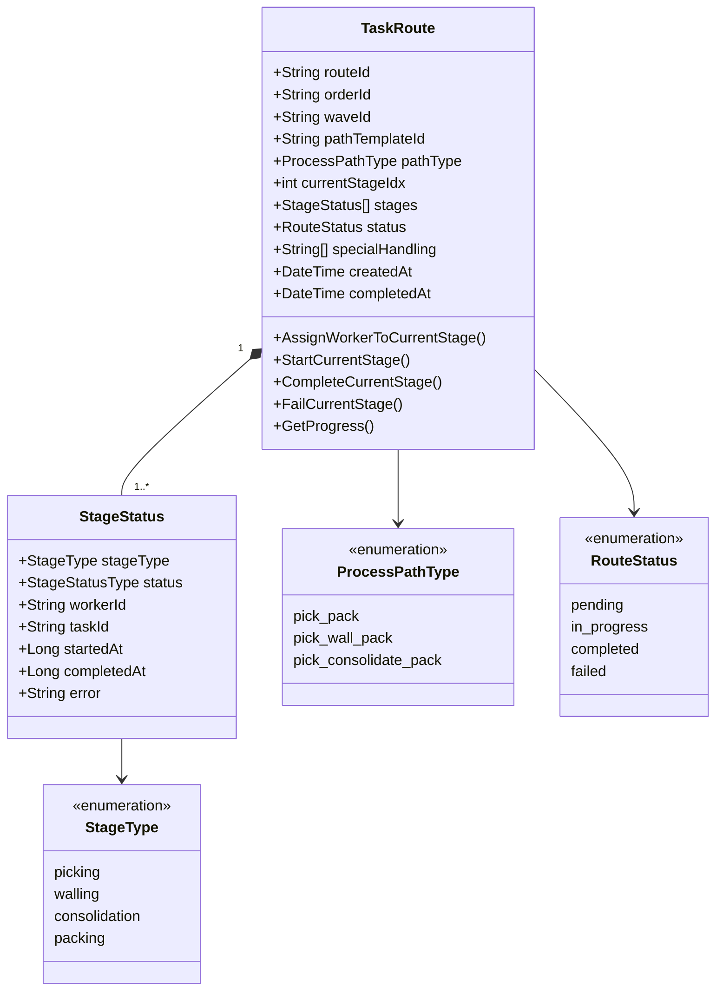
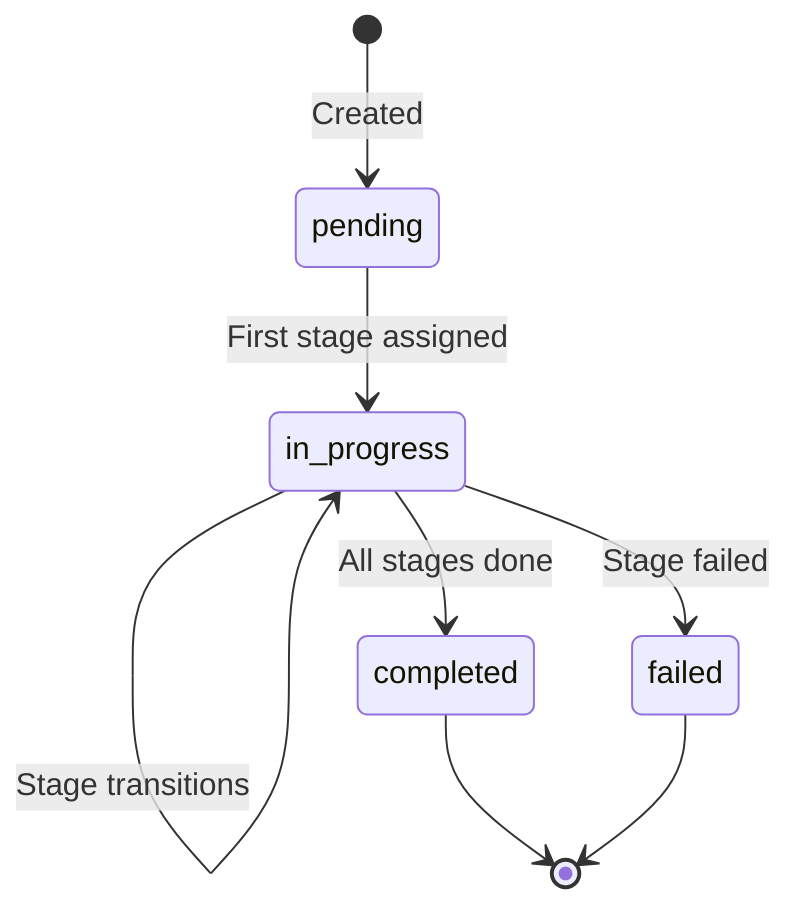
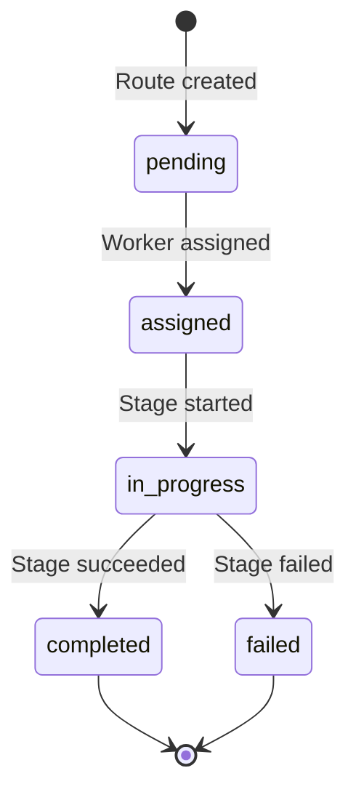

# TaskRoute Aggregate

The TaskRoute aggregate is the core domain model in the WES (Warehouse Execution System) bounded context. It tracks order execution through a sequence of stages.

## Overview

| Property | Value |
|----------|-------|
| **Bounded Context** | WES (Execution) |
| **Aggregate Root** | TaskRoute |
| **Repository** | TaskRouteRepository |
| **Database Collection** | task_routes |

## Aggregate Structure



## State Transitions

### Route Status



### Stage Status



## Invariants

1. **Sequential Stage Execution**: Stages must be completed in order
2. **Single Active Stage**: Only one stage can be in_progress at a time
3. **Worker Assignment Required**: A stage must be assigned before starting
4. **Completed Route Immutable**: No changes allowed after completion
5. **Failed Route Immutable**: No changes allowed after failure

## Domain Events

| Event | Trigger | Data |
|-------|---------|------|
| RouteCreatedEvent | NewTaskRoute() | routeId, orderId, pathType, stageCount |
| StageAssignedEvent | AssignWorkerToCurrentStage() | routeId, stageType, workerId, taskId |
| StageStartedEvent | StartCurrentStage() | routeId, stageType, workerId |
| StageCompletedEvent | CompleteCurrentStage() | routeId, stageType, taskId |
| StageFailedEvent | FailCurrentStage() | routeId, stageType, error |
| RouteCompletedEvent | All stages complete | routeId, orderId, pathType |

## Factory Method

```go
func NewTaskRoute(
    orderID, waveID string,
    template *StageTemplate,
    specialHandling []string,
    processPathID string,
) *TaskRoute
```

Creates a TaskRoute from a StageTemplate:
1. Generates unique routeId (RT-xxxxxxxx)
2. Initializes stages from template definitions
3. Sets all stages to pending status
4. Emits RouteCreatedEvent

## Commands

### AssignWorkerToCurrentStage

```go
func (r *TaskRoute) AssignWorkerToCurrentStage(workerID, taskID string) error
```

- Validates route is not completed/failed
- Validates current stage is pending
- Updates stage with worker and task IDs
- Changes stage status to assigned
- Changes route status to in_progress
- Emits StageAssignedEvent

### StartCurrentStage

```go
func (r *TaskRoute) StartCurrentStage() error
```

- Validates stage is assigned
- Updates stage status to in_progress
- Records start timestamp
- Emits StageStartedEvent

### CompleteCurrentStage

```go
func (r *TaskRoute) CompleteCurrentStage() error
```

- Validates stage is in_progress
- Updates stage status to completed
- Records completion timestamp
- Advances to next stage
- If last stage, marks route as completed
- Emits StageCompletedEvent (and RouteCompletedEvent if done)

### FailCurrentStage

```go
func (r *TaskRoute) FailCurrentStage(errorMsg string) error
```

- Validates route is not completed
- Updates stage status to failed
- Records error message
- Marks route as failed
- Emits StageFailedEvent

## Queries

### GetCurrentStage

```go
func (r *TaskRoute) GetCurrentStage() *StageStatus
```

Returns the current stage (at currentStageIdx) or nil if all stages complete.

### GetProgress

```go
func (r *TaskRoute) GetProgress() (completed int, total int)
```

Returns count of completed stages and total stages.

### IsCompleted / IsFailed

```go
func (r *TaskRoute) IsCompleted() bool
func (r *TaskRoute) IsFailed() bool
```

## Example Usage

```go
// Create from template
template := domain.DefaultPickWallPackTemplate()
route := domain.NewTaskRoute("ORD-123", "WAVE-001", template, []string{"fragile"}, "PATH-001")

// Execute stages
route.AssignWorkerToCurrentStage("PICKER-001", "PT-001")
route.StartCurrentStage()
route.CompleteCurrentStage() // Advances to walling

route.AssignWorkerToCurrentStage("WALLINER-001", "WT-001")
route.StartCurrentStage()
route.CompleteCurrentStage() // Advances to packing

route.AssignWorkerToCurrentStage("PACKER-001", "PK-001")
route.StartCurrentStage()
route.CompleteCurrentStage() // Route completed

// Check status
fmt.Println(route.IsCompleted()) // true
completed, total := route.GetProgress()
fmt.Printf("%d/%d stages\n", completed, total) // 3/3 stages
```

## Related Documentation

- [WES Service](/services/wes-service) - Service using this aggregate
- [WES Execution](/architecture/sequence-diagrams/wes-execution) - Workflow sequence
