# Unit Aggregate

The Unit aggregate provides individual unit-level tracking throughout the warehouse fulfillment process, maintaining a complete audit trail of each physical unit's journey from receiving to shipping.

## Aggregate Structure


## State Machine


## Domain Rules

### Status Transitions

| From Status | Allowed Transitions |
|-------------|-------------------|
| `received` | `reserved`, `exception` |
| `reserved` | `staged`, `picked`, `exception` |
| `staged` | `picked`, `exception` |
| `picked` | `consolidated`, `packed`, `exception` |
| `consolidated` | `packed` |
| `packed` | `shipped` |
| `exception` | (terminal - requires resolution) |

### Movement Tracking

Every status transition creates a `UnitMovement` record:

```go
movement := UnitMovement{
    MovementID:     uuid.New().String(),
    FromLocationID: unit.CurrentLocationID,
    ToLocationID:   newLocationID,
    FromStatus:     unit.Status,
    ToStatus:       newStatus,
    HandlerID:      handlerID,
    Timestamp:      time.Now(),
}
unit.Movements = append(unit.Movements, movement)
```

### Multi-Route Support

For orders spanning multiple picking routes:

| Field | Purpose |
|-------|---------|
| `RouteID` | Which picking route the unit is assigned to |
| `RouteIndex` | Order of routes (for sequencing) |
| `SourceToteID` | Original tote from picking (for consolidation) |

## Invariants

1. **Status Progression**: Status can only transition in allowed directions
2. **Audit Trail**: Every status change creates a movement record
3. **Order Association**: Reserved units must have an OrderID
4. **Exception Handling**: Units in exception status cannot transition until resolved
5. **Single Assignment**: A unit can only be reserved for one order at a time

## Domain Events

| Event | Triggered When |
|-------|---------------|
| `UnitCreatedEvent` | Unit created at receiving |
| `UnitReservedEvent` | Unit reserved for order |
| `UnitStagedEvent` | Unit staged for picking |
| `UnitPickedEvent` | Unit physically picked |
| `UnitConsolidatedEvent` | Unit consolidated with others |
| `UnitPackedEvent` | Unit packed into package |
| `UnitShippedEvent` | Unit shipped |
| `UnitExceptionEvent` | Exception reported |

## Go Implementation

```go
type Unit struct {
    ID                string        `bson:"_id"`
    UnitID            string        `bson:"unitId"`
    SKU               string        `bson:"sku"`
    OrderID           string        `bson:"orderId,omitempty"`
    ShipmentID        string        `bson:"shipmentId,omitempty"`
    Status            UnitStatus    `bson:"status"`
    CurrentLocationID string        `bson:"currentLocationId"`
    AssignedPathID    string        `bson:"assignedPathId,omitempty"`
    ReservationID     string        `bson:"reservationId,omitempty"`
    AllocationID      string        `bson:"allocationId,omitempty"`
    ToteID            string        `bson:"toteId,omitempty"`
    PackageID         string        `bson:"packageId,omitempty"`
    RouteID           string        `bson:"routeId,omitempty"`
    RouteIndex        int           `bson:"routeIndex,omitempty"`
    SourceToteID      string        `bson:"sourceToteId,omitempty"`
    ExceptionID       string        `bson:"exceptionId,omitempty"`
    ExceptionReason   string        `bson:"exceptionReason,omitempty"`
    Movements         []UnitMovement `bson:"movements"`
    ReceivedAt        time.Time     `bson:"receivedAt"`
    ReservedAt        *time.Time    `bson:"reservedAt,omitempty"`
    StagedAt          *time.Time    `bson:"stagedAt,omitempty"`
    PickedAt          *time.Time    `bson:"pickedAt,omitempty"`
    ConsolidatedAt    *time.Time    `bson:"consolidatedAt,omitempty"`
    PackedAt          *time.Time    `bson:"packedAt,omitempty"`
    ShippedAt         *time.Time    `bson:"shippedAt,omitempty"`
}

type UnitStatus string

const (
    UnitStatusReceived     UnitStatus = "received"
    UnitStatusReserved     UnitStatus = "reserved"
    UnitStatusStaged       UnitStatus = "staged"
    UnitStatusPicked       UnitStatus = "picked"
    UnitStatusConsolidated UnitStatus = "consolidated"
    UnitStatusPacked       UnitStatus = "packed"
    UnitStatusShipped      UnitStatus = "shipped"
    UnitStatusException    UnitStatus = "exception"
)
```

## Usage in Workflow

```mermaid
sequenceDiagram
    participant O as Orchestrator
    participant US as Unit Service
    participant PS as Picking Service
    participant CS as Consolidation Service

    O->>US: Reserve units for order
    US-->>O: Reserved unit IDs
    O->>PS: Create pick task with units
    PS->>US: Confirm pick (unit → tote)
    CS->>US: Confirm consolidation
    US-->>O: All units consolidated
```



## Query Patterns

### Get Units for Order

```http
GET /api/v1/units/order/{orderId}
```

Returns all units associated with an order, useful for order tracking.

### Get Unit Audit Trail

```http
GET /api/v1/units/{unitId}/audit
```

Returns complete movement history for a single unit.

### Get Unresolved Exceptions

```http
GET /api/v1/exceptions/unresolved
```

Returns all units in exception status requiring resolution.

## Related Documentation

- [Unit Service](/services/unit-service) - Service documentation
- [Unit Activities](/temporal/activities/unit-activities) - Temporal activities
- [Order Fulfillment](/temporal/workflows/order-fulfillment) - Uses unit tracking
- [Consolidation Workflow](/temporal/workflows/consolidation) - Multi-route consolidation
