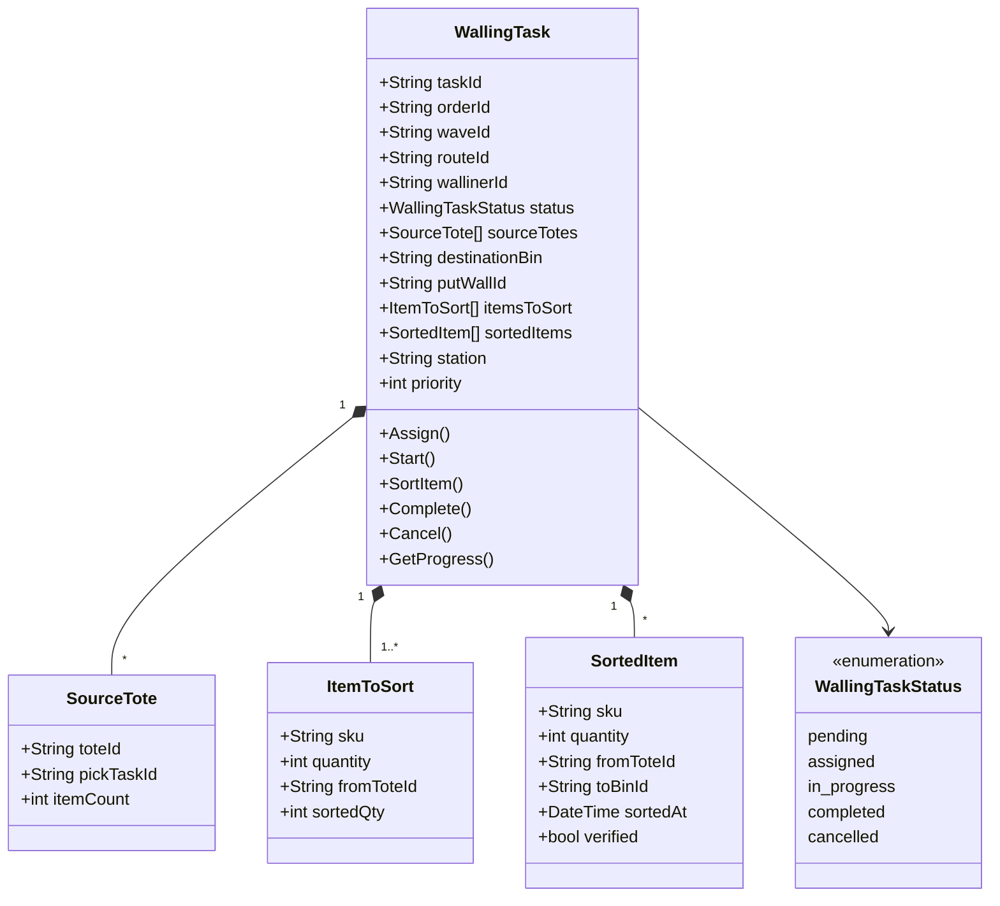
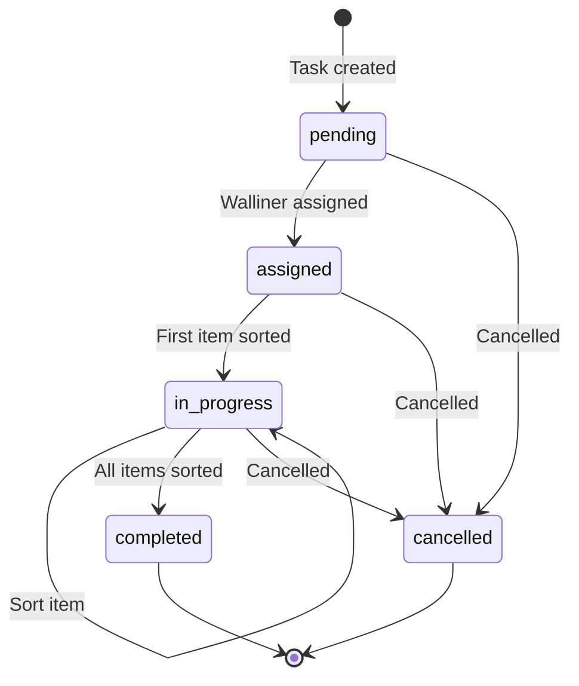
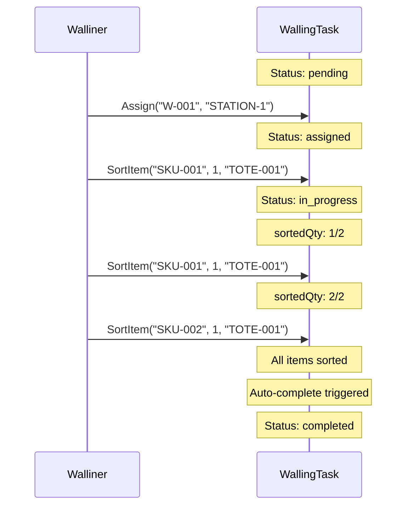

# WallingTask Aggregate

The WallingTask aggregate is the core domain model in the Walling bounded context. It tracks the sorting of picked items from totes into order-specific bins on a put-wall.

## Overview

| Property | Value |
|----------|-------|
| **Bounded Context** | Walling |
| **Aggregate Root** | WallingTask |
| **Repository** | WallingTaskRepository |
| **Database Collection** | walling_tasks |

## Aggregate Structure



## State Transitions



## Invariants

1. **Non-Empty Items**: At least one item required to create task
2. **Sequential Sorting**: Items sorted incrementally (sortedQty tracked)
3. **Quantity Limit**: Cannot sort more than remaining quantity
4. **Completed Immutability**: No changes after completion
5. **Cancelled Immutability**: No changes after cancellation

## Domain Events

| Event | Trigger | Data |
|-------|---------|------|
| WallingTaskCreatedEvent | NewWallingTask() | taskId, orderId, putWallId, itemCount |
| WallingTaskAssignedEvent | Assign() | taskId, wallinerId, station |
| ItemSortedEvent | SortItem() | taskId, sku, quantity, toteId, binId |
| WallingTaskCompletedEvent | Complete() | taskId, orderId, itemsSorted |

## Factory Method

```go
func NewWallingTask(
    orderID, waveID, putWallID, destinationBin string,
    sourceTotes []SourceTote,
    items []ItemToSort,
) (*WallingTask, error)
```

Creates a WallingTask:
1. Validates at least one item
2. Generates unique taskId (WT-xxxxxxxx)
3. Initializes status to pending
4. Emits WallingTaskCreatedEvent

## Commands

### Assign

```go
func (t *WallingTask) Assign(wallinerID, station string) error
```

- Validates task is not completed/cancelled
- Sets walliner ID and station
- Updates status to assigned
- Records assignment timestamp
- Emits WallingTaskAssignedEvent

### SortItem

```go
func (t *WallingTask) SortItem(sku string, quantity int, fromToteId string) error
```

- Validates task is not completed/cancelled
- Auto-starts task if in assigned status
- Finds matching item in itemsToSort
- Validates quantity against remaining
- Records SortedItem with timestamp
- Updates sortedQty on ItemToSort
- Auto-completes if all items sorted
- Emits ItemSortedEvent

### Complete

```go
func (t *WallingTask) Complete() error
```

- Validates task is not already completed
- Updates status to completed
- Records completion timestamp
- Emits WallingTaskCompletedEvent

### Cancel

```go
func (t *WallingTask) Cancel(reason string) error
```

- Validates task is not completed
- Updates status to cancelled

## Queries

### GetProgress

```go
func (t *WallingTask) GetProgress() (sorted int, total int)
```

Returns count of sorted items vs total items to sort.

### AllItemsSorted

```go
func (t *WallingTask) AllItemsSorted() bool
```

Returns true if all items have been fully sorted.

## Example Usage

```go
// Create walling task
items := []domain.ItemToSort{
    {SKU: "SKU-001", Quantity: 2, FromToteID: "TOTE-001"},
    {SKU: "SKU-002", Quantity: 1, FromToteID: "TOTE-001"},
}
totes := []domain.SourceTote{
    {ToteID: "TOTE-001", PickTaskID: "PT-001", ItemCount: 3},
}

task, _ := domain.NewWallingTask("ORD-123", "WAVE-001", "PUTWALL-1", "BIN-A1", totes, items)

// Assign walliner
task.Assign("WALLINER-001", "STATION-1")

// Sort items
task.SortItem("SKU-001", 1, "TOTE-001") // 1 of 2 sorted
task.SortItem("SKU-001", 1, "TOTE-001") // 2 of 2 sorted
task.SortItem("SKU-002", 1, "TOTE-001") // All sorted, auto-complete

// Check status
fmt.Println(task.Status) // completed
sorted, total := task.GetProgress()
fmt.Printf("%d/%d items\n", sorted, total) // 3/3 items
```

## Sorting Flow



## Related Documentation

- [Walling Service](/services/walling-service) - Service using this aggregate
- [Walling Workflow](/architecture/sequence-diagrams/walling-workflow) - Workflow sequence
- [WES Service](/services/wes-service) - Execution orchestration
