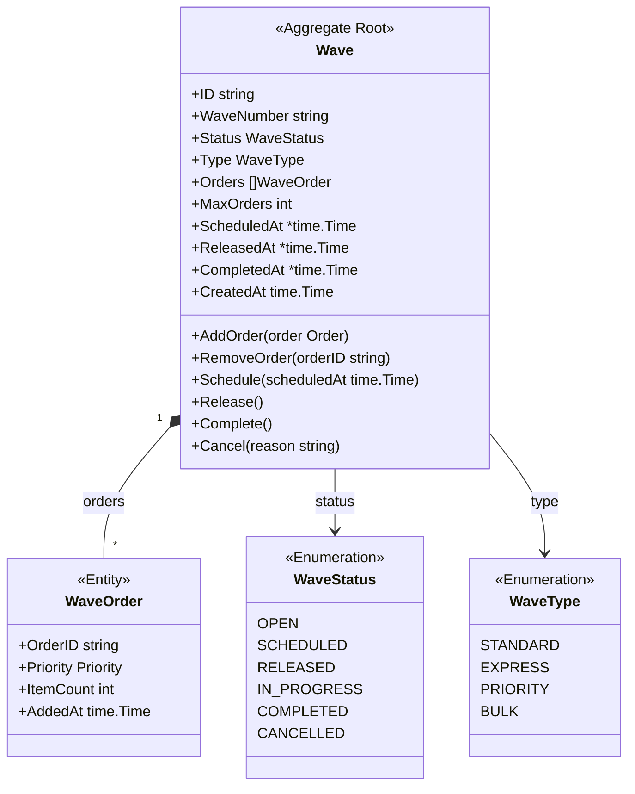
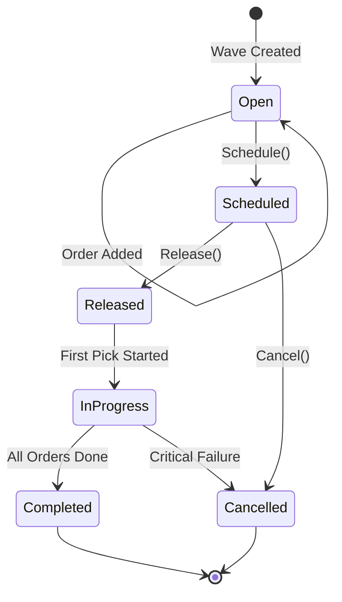
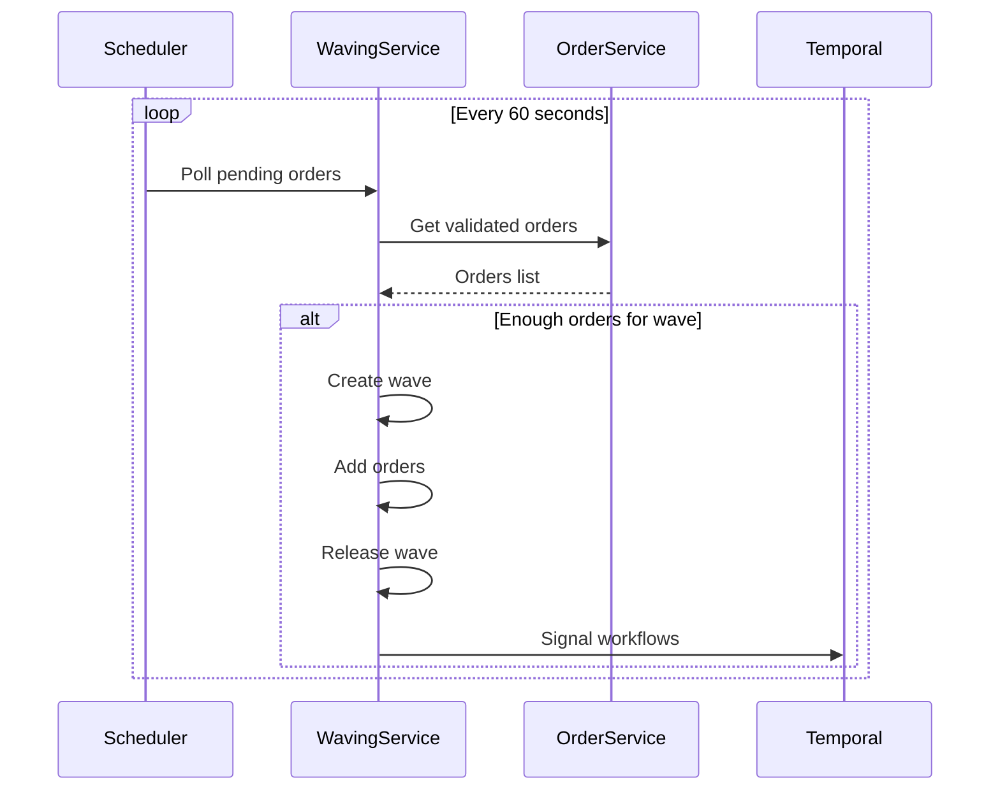

# Wave Aggregate

The Wave aggregate manages batches of orders released together for picking.

## Aggregate Structure



## State Machine



## Invariants

| Invariant | Description |
|-----------|-------------|
| Max Orders | Wave cannot exceed max order limit |
| Open for Adding | Orders can only be added to OPEN waves |
| Priority Consistency | All orders in wave should have compatible priorities |
| Release Requirement | Wave must have at least one order to release |

## Commands

### CreateWave

```go
func NewWave(waveType WaveType) *Wave {
    return &Wave{
        ID:          uuid.New().String(),
        WaveNumber:  generateWaveNumber(),
        Status:      WaveStatusOpen,
        Type:        waveType,
        Orders:      make([]WaveOrder, 0),
        MaxOrders:   getMaxOrdersForType(waveType),
        CreatedAt:   time.Now(),
    }
}
```

### AddOrder

```go
func (w *Wave) AddOrder(order *Order) error {
    if w.Status != WaveStatusOpen {
        return ErrWaveNotOpen
    }

    if len(w.Orders) >= w.MaxOrders {
        return ErrWaveFull
    }

    waveOrder := WaveOrder{
        OrderID:   order.ID,
        Priority:  order.Priority,
        ItemCount: len(order.Items),
        AddedAt:   time.Now(),
    }

    w.Orders = append(w.Orders, waveOrder)
    w.addEvent(NewOrderAddedToWaveEvent(w.ID, order.ID))
    return nil
}
```

### Schedule

```go
func (w *Wave) Schedule(scheduledAt time.Time) error {
    if w.Status != WaveStatusOpen {
        return ErrInvalidStatusTransition
    }

    if len(w.Orders) == 0 {
        return ErrEmptyWave
    }

    w.Status = WaveStatusScheduled
    w.ScheduledAt = &scheduledAt
    w.addEvent(NewWaveScheduledEvent(w))
    return nil
}
```

### Release

```go
func (w *Wave) Release() error {
    if w.Status != WaveStatusScheduled {
        return ErrInvalidStatusTransition
    }

    now := time.Now()
    w.Status = WaveStatusReleased
    w.ReleasedAt = &now
    w.addEvent(NewWaveReleasedEvent(w))
    return nil
}
```

## Domain Events

| Event | Trigger | Data |
|-------|---------|------|
| WaveCreatedEvent | Wave created | Wave ID, type |
| OrderAddedToWaveEvent | Order added | Wave ID, order ID |
| WaveScheduledEvent | Wave scheduled | Wave ID, scheduled time |
| WaveReleasedEvent | Wave released | Wave ID, order IDs, total items |
| WaveCompletedEvent | All orders done | Wave ID, completed at |
| WaveCancelledEvent | Wave cancelled | Wave ID, reason |

## Continuous Waving

The Waving Service includes a scheduler for automatic wave creation and release:



## Repository Interface

```go
type WaveRepository interface {
    Save(ctx context.Context, wave *Wave) error
    FindByID(ctx context.Context, id string) (*Wave, error)
    FindOpen(ctx context.Context) ([]*Wave, error)
    FindByStatus(ctx context.Context, status WaveStatus) ([]*Wave, error)
    Update(ctx context.Context, wave *Wave) error
}
```

## API Endpoints

| Method | Endpoint | Description |
|--------|----------|-------------|
| POST | /api/v1/waves | Create wave |
| GET | /api/v1/waves/{id} | Get wave by ID |
| POST | /api/v1/waves/{id}/orders | Add order to wave |
| PUT | /api/v1/waves/{id}/schedule | Schedule wave |
| PUT | /api/v1/waves/{id}/release | Release wave |

## Related Documentation

- [Waving Service](/services/waving-service) - Service documentation
- [Order Aggregate](./order) - Order details
- [Picking Workflow](/architecture/sequence-diagrams/picking-workflow) - What happens after release
