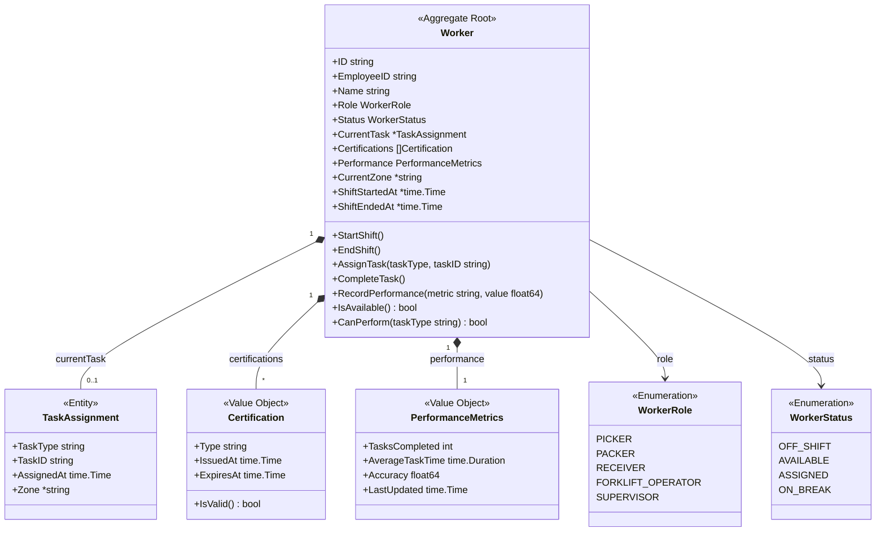
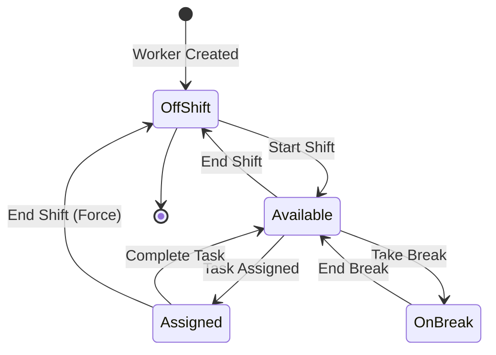
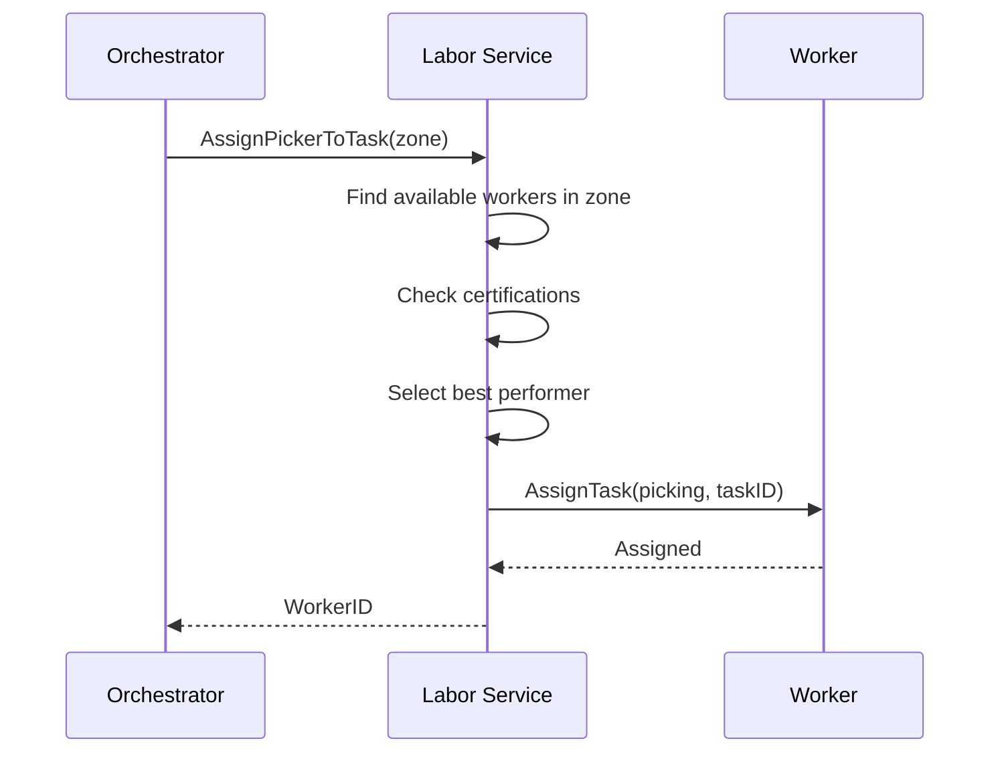

# Worker Aggregate

The Worker aggregate manages warehouse workforce and task assignments.

## Aggregate Structure



## State Machine



## Invariants

| Invariant | Description |
|-----------|-------------|
| Single Task | Worker can only have one active task |
| Valid Certification | Must have valid cert for task type |
| Active Shift | Must be on shift to be assigned |
| Role Match | Task type must match worker role |

## Commands

### StartShift

```go
func (w *Worker) StartShift() error {
    if w.Status != WorkerStatusOffShift {
        return ErrAlreadyOnShift
    }

    now := time.Now()
    w.Status = WorkerStatusAvailable
    w.ShiftStartedAt = &now
    w.ShiftEndedAt = nil

    w.addEvent(NewShiftStartedEvent(w))
    return nil
}
```

### EndShift

```go
func (w *Worker) EndShift() error {
    if w.Status == WorkerStatusOffShift {
        return ErrNotOnShift
    }

    // Force complete current task if assigned
    if w.CurrentTask != nil {
        w.CurrentTask = nil
    }

    now := time.Now()
    w.Status = WorkerStatusOffShift
    w.ShiftEndedAt = &now
    w.CurrentZone = nil

    w.addEvent(NewShiftEndedEvent(w))
    return nil
}
```

### AssignTask

```go
func (w *Worker) AssignTask(taskType, taskID string, zone *string) error {
    if w.Status != WorkerStatusAvailable {
        return ErrWorkerNotAvailable
    }

    if !w.CanPerform(taskType) {
        return ErrWorkerNotCertified
    }

    w.CurrentTask = &TaskAssignment{
        TaskType:   taskType,
        TaskID:     taskID,
        AssignedAt: time.Now(),
        Zone:       zone,
    }
    w.Status = WorkerStatusAssigned
    w.CurrentZone = zone

    w.addEvent(NewTaskAssignedEvent(w, taskType, taskID))
    return nil
}
```

### CompleteTask

```go
func (w *Worker) CompleteTask() error {
    if w.Status != WorkerStatusAssigned || w.CurrentTask == nil {
        return ErrNoActiveTask
    }

    // Calculate task duration
    duration := time.Since(w.CurrentTask.AssignedAt)

    taskType := w.CurrentTask.TaskType
    w.CurrentTask = nil
    w.Status = WorkerStatusAvailable

    // Update performance metrics
    w.updatePerformance(duration)

    w.addEvent(NewTaskCompletedEvent(w, taskType, duration))
    return nil
}
```

### RecordPerformance

```go
func (w *Worker) updatePerformance(taskDuration time.Duration) {
    completed := w.Performance.TasksCompleted + 1

    // Calculate new average
    totalTime := w.Performance.AverageTaskTime * time.Duration(w.Performance.TasksCompleted)
    newAverage := (totalTime + taskDuration) / time.Duration(completed)

    w.Performance.TasksCompleted = completed
    w.Performance.AverageTaskTime = newAverage
    w.Performance.LastUpdated = time.Now()
}
```

## Helper Methods

```go
func (w *Worker) IsAvailable() bool {
    return w.Status == WorkerStatusAvailable
}

func (w *Worker) CanPerform(taskType string) bool {
    requiredCert := getRequiredCertification(taskType)
    if requiredCert == "" {
        return true
    }

    for _, cert := range w.Certifications {
        if cert.Type == requiredCert && cert.IsValid() {
            return true
        }
    }
    return false
}

func (c *Certification) IsValid() bool {
    return time.Now().Before(c.ExpiresAt)
}
```

## Task Type Requirements

| Task Type | Role | Certification |
|-----------|------|---------------|
| picking | PICKER | none |
| packing | PACKER | none |
| receiving | RECEIVER | none |
| forklift | FORKLIFT_OPERATOR | forklift_certified |
| hazmat | any | hazmat_certified |

## Domain Events

| Event | Trigger | Data |
|-------|---------|------|
| ShiftStartedEvent | Shift begins | Worker ID, started at |
| ShiftEndedEvent | Shift ends | Worker ID, ended at |
| TaskAssignedEvent | Task assigned | Worker ID, task type, task ID |
| TaskCompletedEvent | Task done | Worker ID, task type, duration |
| PerformanceRecordedEvent | Metrics updated | Worker ID, metrics |

## Worker Assignment Flow



## Repository Interface

```go
type WorkerRepository interface {
    Save(ctx context.Context, worker *Worker) error
    FindByID(ctx context.Context, id string) (*Worker, error)
    FindByEmployeeID(ctx context.Context, employeeID string) (*Worker, error)
    FindAvailableByZone(ctx context.Context, zone string) ([]*Worker, error)
    FindAvailableByRole(ctx context.Context, role WorkerRole) ([]*Worker, error)
    FindOnShift(ctx context.Context) ([]*Worker, error)
    Update(ctx context.Context, worker *Worker) error
}
```

## API Endpoints

| Method | Endpoint | Description |
|--------|----------|-------------|
| GET | /api/v1/workers | List workers |
| GET | /api/v1/workers/\{id\} | Get worker by ID |
| POST | /api/v1/workers/\{id\}/shift/start | Start shift |
| POST | /api/v1/workers/\{id\}/shift/end | End shift |
| POST | /api/v1/workers/\{id\}/tasks/assign | Assign task |
| POST | /api/v1/workers/\{id\}/tasks/complete | Complete task |

## Related Documentation

- [Labor Service](/services/labor-service) - Service documentation
- [PickTask Aggregate](./pick-task) - Task assignment
- [PackTask Aggregate](./pack-task) - Task assignment
