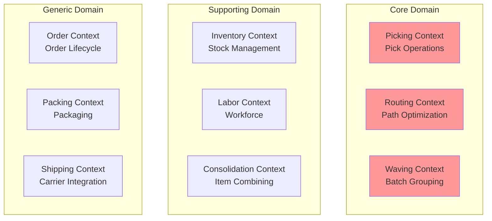
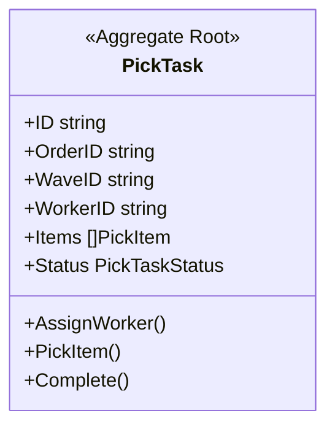
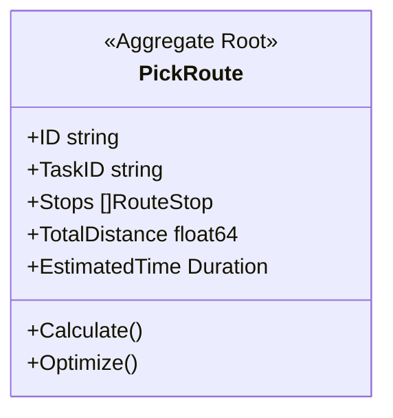
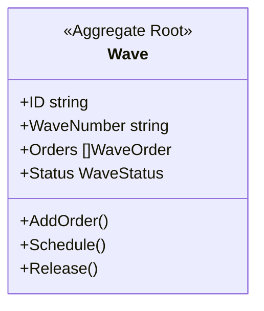
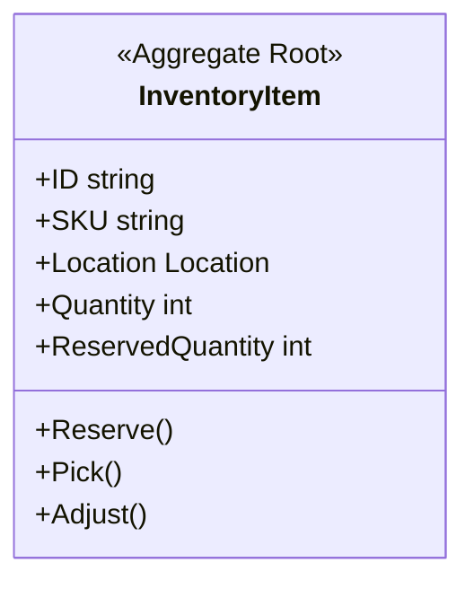
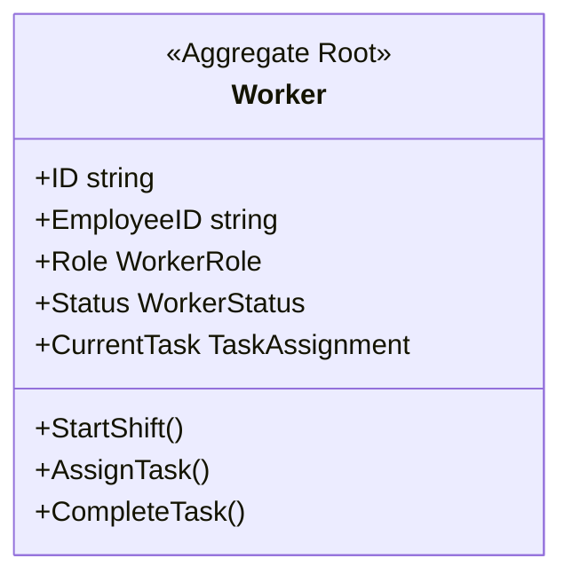
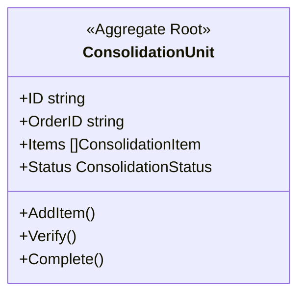
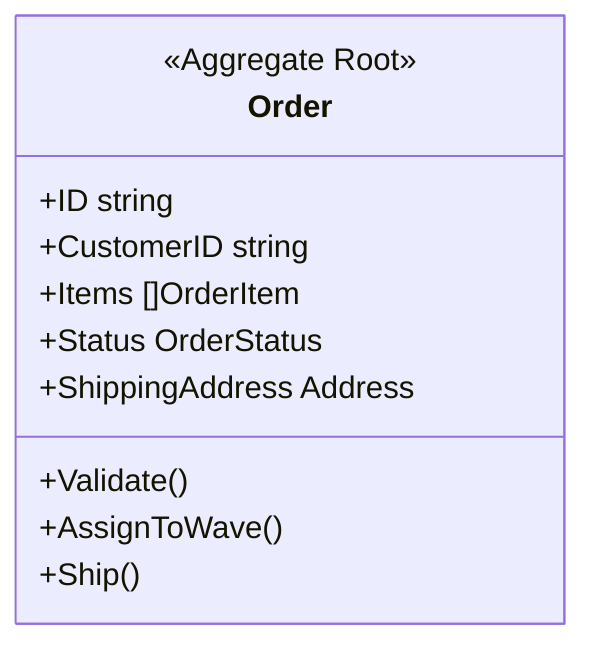
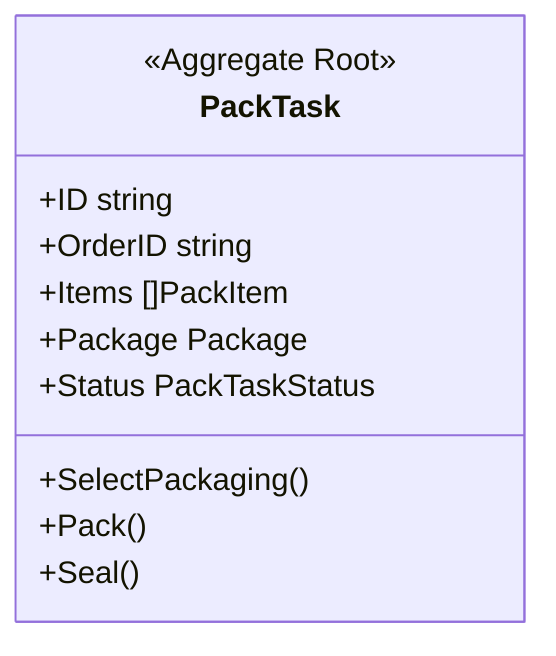
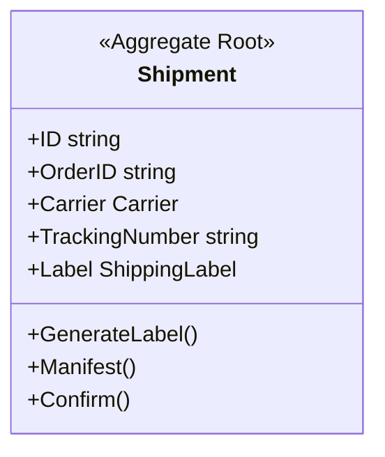

# Bounded Contexts

This document describes the bounded contexts within the WMS Platform and their responsibilities.

## Context Overview

## Core Domain Contexts

### Picking Context

The Picking context handles warehouse picking operations - the physical retrieval of items from storage locations.

| Aspect | Description |
|--------|-------------|
| **Responsibility** | Manage picking task execution |
| **Aggregate Root** | PickTask |
| **Key Entities** | PickItem |
| **Value Objects** | Location, ToteID |
| **Domain Events** | PickTaskCreated, ItemPicked, PickTaskCompleted |

**Why Core Domain?**
- Direct competitive advantage through pick efficiency
- High complexity in optimization
- Unique business rules per warehouse

### Routing Context

The Routing context calculates optimal pick paths through the warehouse.

| Aspect | Description |
|--------|-------------|
| **Responsibility** | Optimize pick path for efficiency |
| **Aggregate Root** | PickRoute |
| **Key Entities** | RouteStop |
| **Value Objects** | Location, Distance |
| **Domain Events** | RouteCalculated, RouteStarted, RouteCompleted |

**Why Core Domain?**
- Directly impacts warehouse throughput
- Complex algorithms (TSP variants)
- Warehouse-specific optimizations

### Waving Context

The Waving context groups orders into batches (waves) for efficient processing.

| Aspect | Description |
|--------|-------------|
| **Responsibility** | Batch orders for picking |
| **Aggregate Root** | Wave |
| **Key Entities** | WaveOrder |
| **Value Objects** | WaveNumber, Priority |
| **Domain Events** | WaveCreated, OrderAddedToWave, WaveReleased |

**Why Core Domain?**
- Impacts overall fulfillment efficiency
- Complex scheduling algorithms
- Business-critical SLA management

## Supporting Domain Contexts

### Inventory Context

The Inventory context manages stock levels and locations.

| Aspect | Description |
|--------|-------------|
| **Responsibility** | Track stock quantities and locations |
| **Aggregate Root** | InventoryItem |
| **Key Entities** | Reservation |
| **Value Objects** | Location, SKU, Quantity |
| **Domain Events** | InventoryReceived, InventoryReserved, InventoryPicked |

**Why Supporting Domain?**
- Essential for operations but not differentiating
- Standard inventory management patterns
- Could potentially use off-the-shelf solutions

### Labor Context

The Labor context manages workforce and task assignments.

| Aspect | Description |
|--------|-------------|
| **Responsibility** | Workforce management and assignment |
| **Aggregate Root** | Worker |
| **Key Entities** | TaskAssignment, Shift |
| **Value Objects** | EmployeeID, Certification |
| **Domain Events** | ShiftStarted, TaskAssigned, TaskCompleted |

**Why Supporting Domain?**
- Necessary for operations
- Standard HR/WFM patterns
- Enables core domain efficiency

### Consolidation Context

The Consolidation context combines picked items for multi-item orders.

| Aspect | Description |
|--------|-------------|
| **Responsibility** | Combine items from multiple picks |
| **Aggregate Root** | ConsolidationUnit |
| **Key Entities** | ConsolidationItem |
| **Value Objects** | ToteID, OrderID |
| **Domain Events** | ConsolidationStarted, ItemConsolidated, ConsolidationCompleted |

**Why Supporting Domain?**
- Supports picking/packing workflow
- Relatively straightforward logic
- Enables multi-item order efficiency

## Generic Domain Contexts

### Order Context

The Order context manages the order lifecycle from receipt to completion.

| Aspect | Description |
|--------|-------------|
| **Responsibility** | Order lifecycle management |
| **Aggregate Root** | Order |
| **Key Entities** | OrderItem |
| **Value Objects** | Address, Money, Priority |
| **Domain Events** | OrderReceived, OrderValidated, OrderShipped |

**Why Generic Domain?**
- Standard e-commerce patterns
- Well-understood domain
- Could use third-party OMS

### Packing Context

The Packing context handles package preparation and labeling.

| Aspect | Description |
|--------|-------------|
| **Responsibility** | Package items for shipping |
| **Aggregate Root** | PackTask |
| **Key Entities** | PackItem, Package |
| **Value Objects** | Dimensions, Weight |
| **Domain Events** | PackTaskCreated, PackageSealed, LabelApplied |

**Why Generic Domain?**
- Standard packing processes
- Industry-standard practices
- Straightforward implementation

### Shipping Context

The Shipping context handles carrier integration and the SLAM process.

| Aspect | Description |
|--------|-------------|
| **Responsibility** | Carrier integration, label generation, manifesting |
| **Aggregate Root** | Shipment |
| **Key Entities** | Package, ShippingLabel |
| **Value Objects** | TrackingNumber, Carrier |
| **Domain Events** | ShipmentCreated, LabelGenerated, ShipConfirmed |

**Why Generic Domain?**
- Standard carrier integration patterns
- Well-defined external APIs
- Could use shipping aggregators

## Context Boundaries

### Strict Boundaries

Each context maintains strict boundaries:

1. **Separate Database** - Each context has its own database
2. **API Communication** - Synchronous calls via REST API
3. **Event Communication** - Asynchronous via Kafka events
4. **No Shared Tables** - No direct database access between contexts

### Shared Concepts

Some concepts are shared across contexts:

| Concept | Contexts | Implementation |
|---------|----------|----------------|
| Location | Routing, Picking | Shared Kernel |
| OrderID | All | Reference by ID |
| WaveID | Waving, Picking, Routing | Reference by ID |

## Related Documentation

- [Context Map](./context-map) - Context relationships
- [Aggregates](./aggregates/order) - Aggregate details
- [Domain Events](./domain-events) - Event catalog
