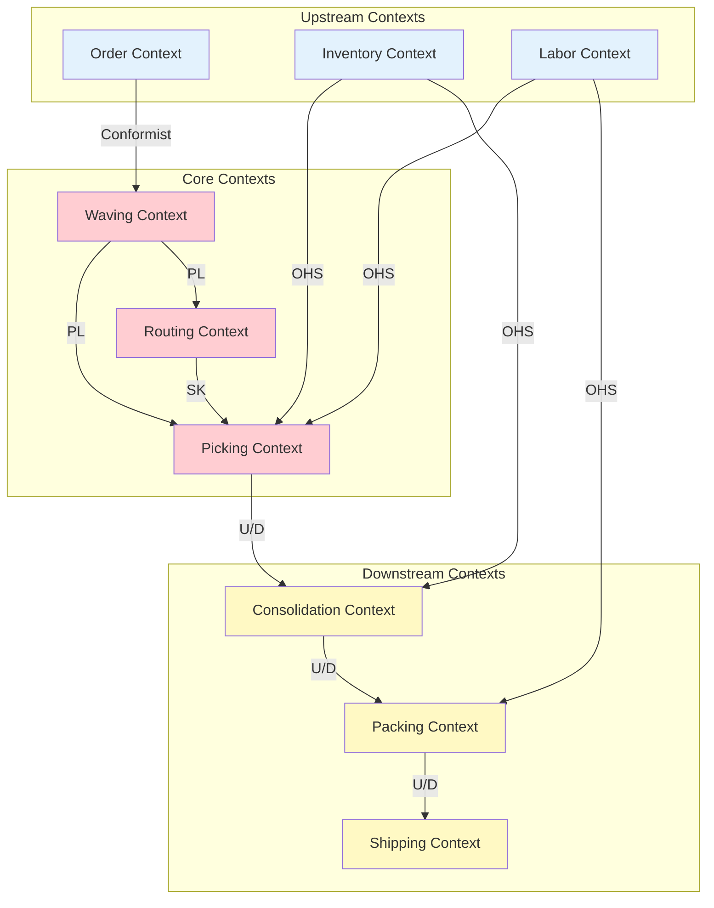
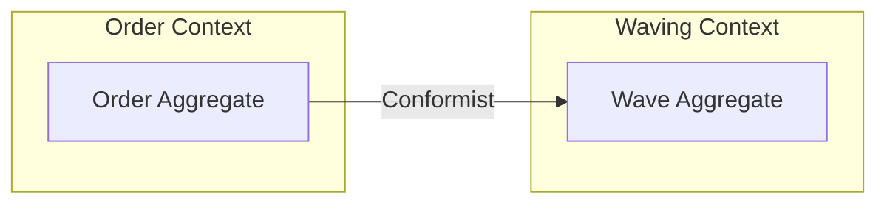
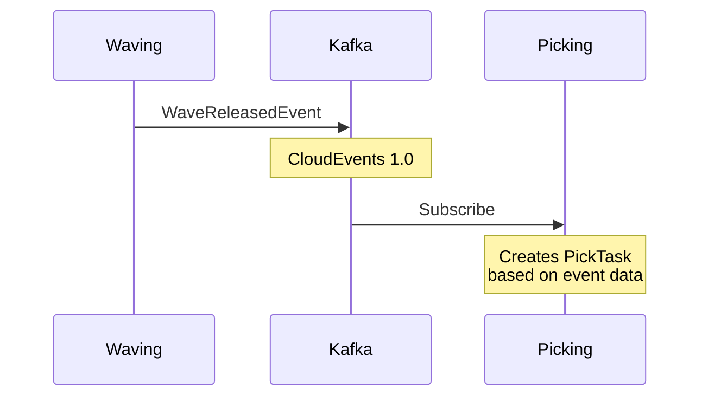
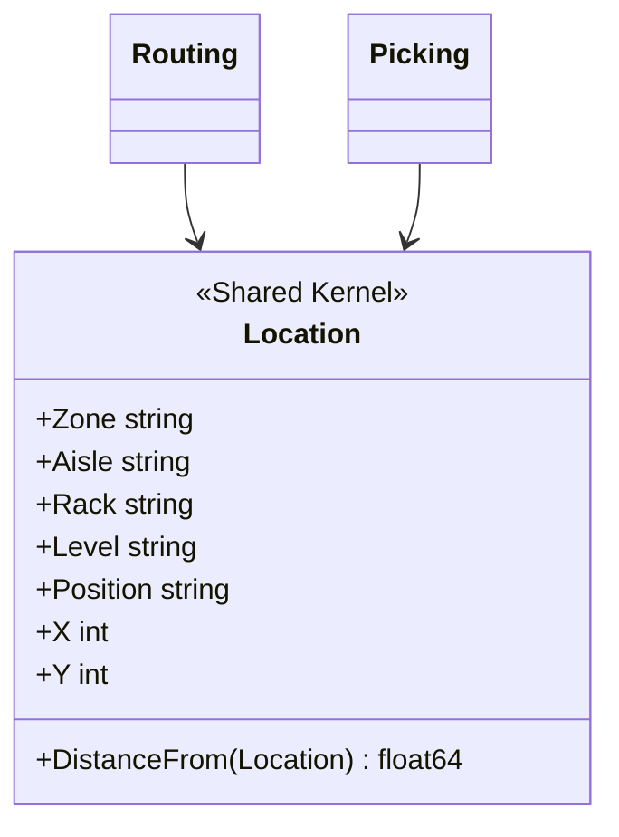
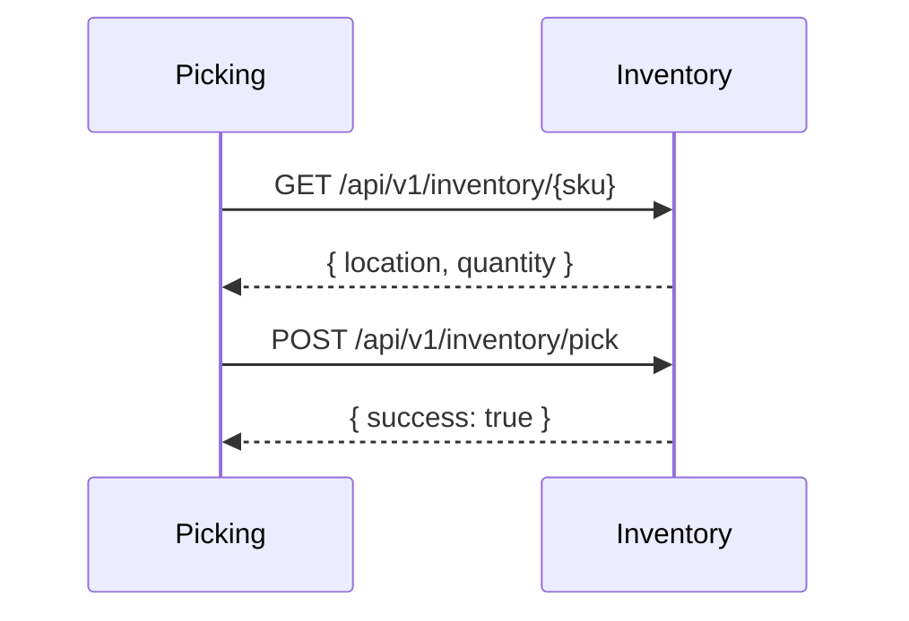
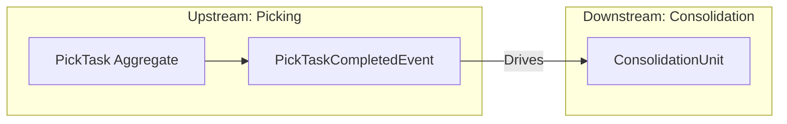
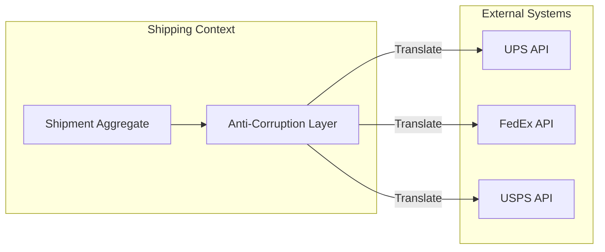
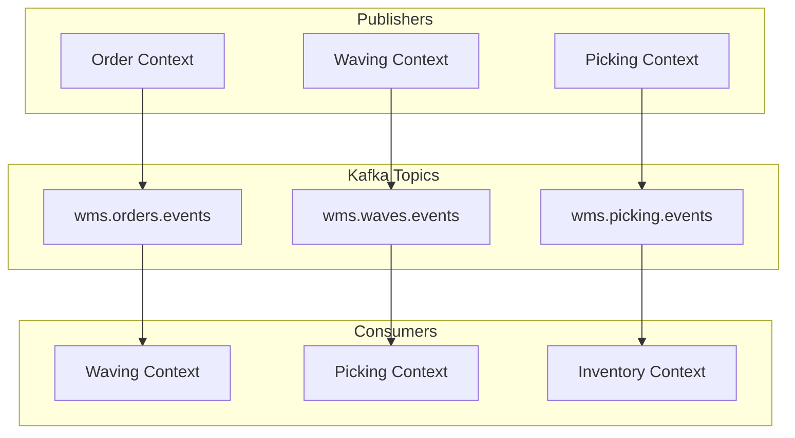
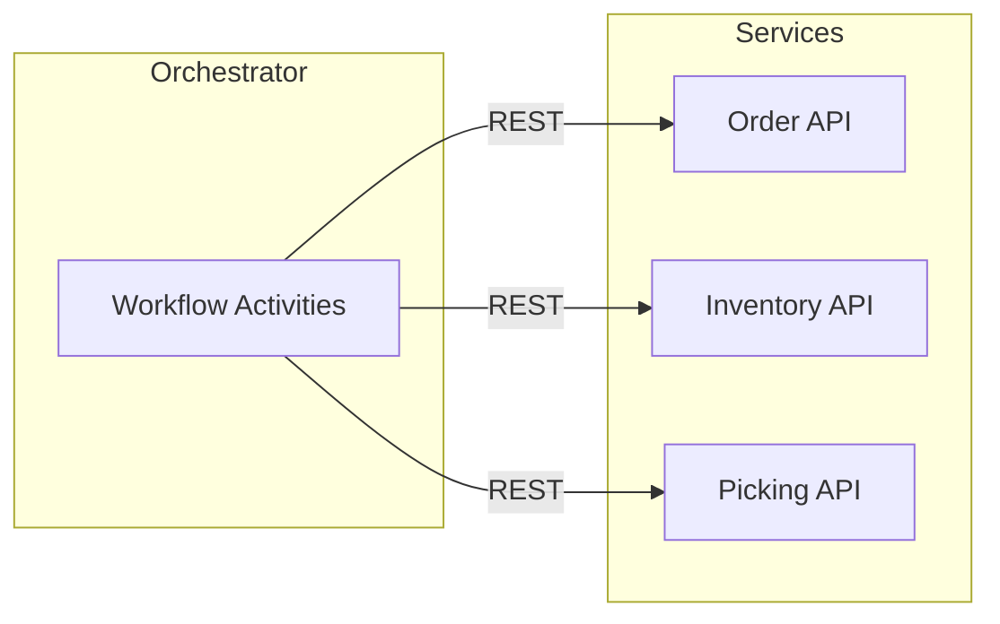

# Context Map

This document shows the relationships between bounded contexts in the WMS Platform.

## Context Map Diagram

## Relationship Types

| Pattern | Abbreviation | Description |
|---------|--------------|-------------|
| **Conformist** | CF | Downstream conforms to upstream model |
| **Customer-Supplier** | U/D | Upstream serves downstream needs |
| **Published Language** | PL | Shared language via events |
| **Shared Kernel** | SK | Shared code between contexts |
| **Open Host Service** | OHS | Public API for multiple consumers |
| **Anti-Corruption Layer** | ACL | Translation layer for external systems |

## Detailed Relationships

### Order → Waving (Conformist)

The Waving context accepts the Order model as-is:
- **Order ID** - Used as reference
- **Priority** - Used for wave scheduling
- **Items** - Used for pick planning

### Waving → Picking (Published Language)

The shared language is CloudEvents:
- `wms.wave.released` event type
- Includes wave ID, order IDs, item details
- Self-contained for processing

### Routing ↔ Picking (Shared Kernel)

The `Location` value object is shared:
- Same code in both contexts
- Coordinated changes required
- Minimized shared surface

### Inventory → Picking (Open Host Service)

Open Host Service characteristics:
- Well-documented REST API
- Multiple consumers supported
- Version-controlled endpoints

### Picking → Consolidation (Customer-Supplier)

Customer-Supplier relationship:
- Picking (upstream) serves Consolidation (downstream)
- Downstream needs influence upstream API design
- Clear ownership and responsibility

### Shipping → Carriers (Anti-Corruption Layer)

ACL responsibilities:
- Translate domain models to carrier formats
- Normalize carrier responses
- Isolate domain from external changes

## Integration Patterns

### Event-Based Integration

### API-Based Integration

## Team Topology

| Context | Team | Communication |
|---------|------|---------------|
| Order | Order Team | Event + API |
| Inventory | Inventory Team | API (OHS) |
| Waving | Fulfillment Team | Event (PL) |
| Routing | Fulfillment Team | Shared Kernel |
| Picking | Fulfillment Team | Event + API |
| Consolidation | Fulfillment Team | Event |
| Packing | Shipping Team | Event |
| Shipping | Shipping Team | Event + ACL |
| Labor | Operations Team | API (OHS) |

## Evolution Patterns

### Adding New Consumer

When a new context needs data from an existing context:

1. **Prefer Events** - Subscribe to existing topics
2. **Request API** - If real-time data needed
3. **Avoid Shared DB** - Never share tables

### Splitting a Context

When a context becomes too large:

1. **Identify Seams** - Find natural boundaries
2. **Define New Context** - New aggregate, new events
3. **Maintain Events** - Publish bridge events during transition

## Related Documentation

- [Bounded Contexts](./bounded-contexts) - Context descriptions
- [Domain Events](./domain-events) - Event catalog
- [Overview](./overview) - DDD overview
