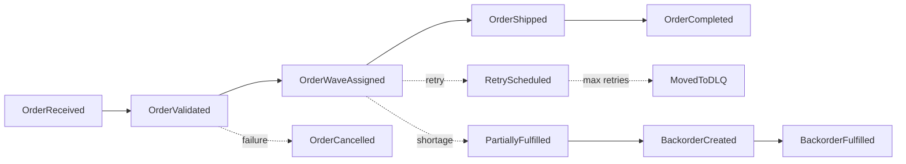
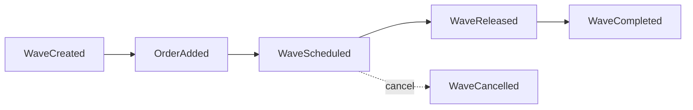
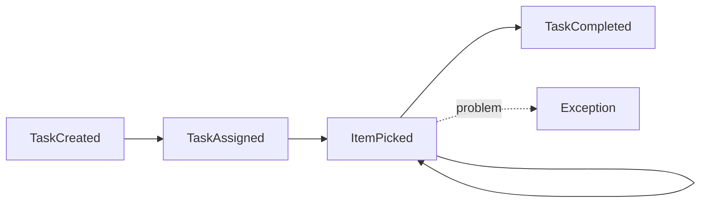
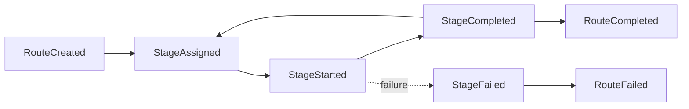
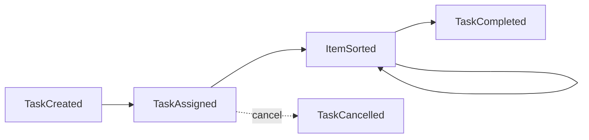
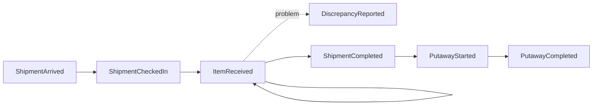
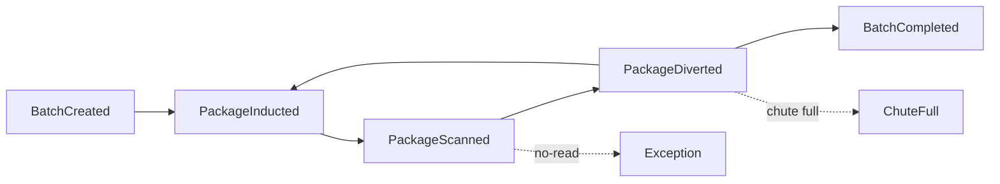
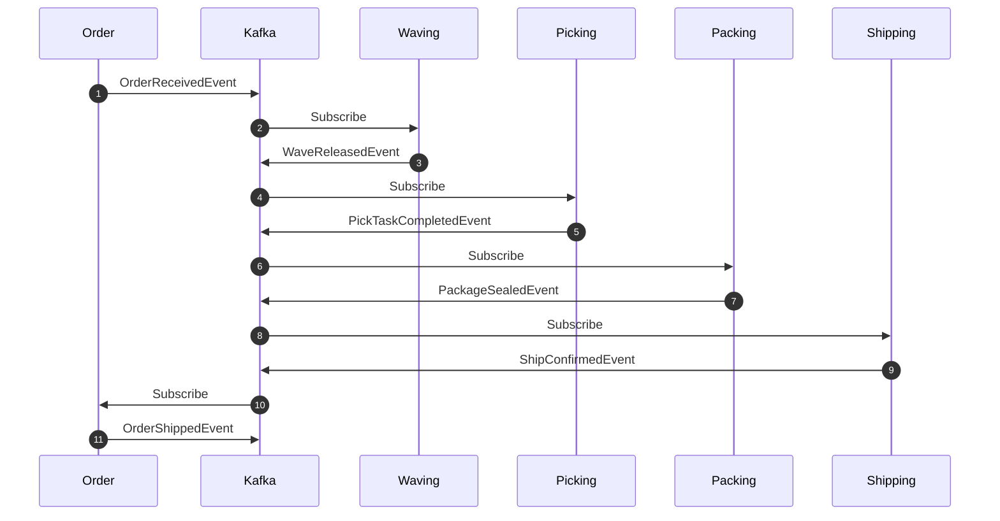

# Domain Events

This document catalogs all domain events in the WMS Platform.

## Event Structure

All events follow the CloudEvents 1.0 specification:

```json
{
  "specversion": "1.0",
  "type": "wms.order.received",
  "source": "/wms/order-service",
  "subject": "ORD-12345",
  "id": "550e8400-e29b-41d4-a716-446655440000",
  "time": "2024-01-15T10:30:00Z",
  "datacontenttype": "application/json",
  "data": {
    "orderId": "ORD-12345",
    "customerId": "CUST-001",
    ...
  }
}
```

## Event Catalog

### Order Events

| Event Type | Topic | Description |
|------------|-------|-------------|
| `wms.order.received` | wms.orders.events | Order placed by customer |
| `wms.order.validated` | wms.orders.events | Order validation passed |
| `wms.order.wave-assigned` | wms.orders.events | Order assigned to wave |
| `wms.order.shipped` | wms.orders.events | Order shipped to carrier |
| `wms.order.cancelled` | wms.orders.events | Order cancelled |
| `wms.order.completed` | wms.orders.events | Order delivered |
| `wms.order.retry-scheduled` | wms.orders.events | Retry scheduled after transient failure |
| `wms.order.moved-to-dlq` | wms.orders.events | Moved to dead letter queue |
| `wms.order.partially-fulfilled` | wms.orders.events | Partial fulfillment due to shortage |
| `wms.order.backorder-created` | wms.orders.events | Backorder created for short items |
| `wms.order.backorder-fulfilled` | wms.orders.events | Backorder fulfilled |



#### OrderReceivedEvent

```json
{
  "type": "wms.order.received",
  "data": {
    "orderId": "ORD-12345",
    "customerId": "CUST-001",
    "priority": "standard",
    "items": [
      {
        "sku": "SKU-001",
        "productName": "Widget A",
        "quantity": 2,
        "price": { "amount": 29.99, "currency": "USD" }
      }
    ],
    "shippingAddress": {
      "street": "123 Main St",
      "city": "New York",
      "state": "NY",
      "zipCode": "10001",
      "country": "US"
    },
    "totalAmount": { "amount": 59.98, "currency": "USD" }
  }
}
```

#### OrderRetryScheduledEvent

```json
{
  "type": "wms.order.retry-scheduled",
  "data": {
    "orderId": "ORD-12345",
    "customerId": "CUST-001",
    "retryNumber": 3,
    "failureStatus": "picking",
    "failureReason": "Inventory unavailable",
    "timestamp": "2024-01-15T10:30:00Z"
  }
}
```

#### OrderMovedToDLQEvent

```json
{
  "type": "wms.order.moved-to-dlq",
  "data": {
    "orderId": "ORD-12345",
    "customerId": "CUST-001",
    "finalFailureStatus": "picking",
    "finalFailureReason": "Max retries exceeded",
    "totalRetryAttempts": 5,
    "timestamp": "2024-01-15T12:00:00Z"
  }
}
```

#### OrderPartiallyFulfilledEvent

```json
{
  "type": "wms.order.partially-fulfilled",
  "data": {
    "orderId": "ORD-12345",
    "customerId": "CUST-001",
    "fulfilledItems": [
      { "sku": "SKU-001", "quantityOrdered": 5, "quantityFulfilled": 3 }
    ],
    "backorderedItems": [
      { "sku": "SKU-001", "quantityOrdered": 5, "quantityShort": 2, "reason": "quantity_mismatch" }
    ],
    "fulfillmentRatio": 0.6
  }
}
```

#### BackorderCreatedEvent

```json
{
  "type": "wms.order.backorder-created",
  "data": {
    "backorderId": "BO-12345",
    "originalOrderId": "ORD-12345",
    "customerId": "CUST-001",
    "items": [
      { "sku": "SKU-001", "quantityOrdered": 5, "quantityShort": 2, "reason": "quantity_mismatch" }
    ],
    "priority": "standard"
  }
}
```

### Wave Events

| Event Type | Topic | Description |
|------------|-------|-------------|
| `wms.wave.created` | wms.waves.events | Wave created |
| `wms.wave.order-added` | wms.waves.events | Order added to wave |
| `wms.wave.scheduled` | wms.waves.events | Wave scheduled for release |
| `wms.wave.released` | wms.waves.events | Wave released for picking |
| `wms.wave.completed` | wms.waves.events | All orders in wave complete |
| `wms.wave.cancelled` | wms.waves.events | Wave cancelled |



#### WaveReleasedEvent

```json
{
  "type": "wms.wave.released",
  "data": {
    "waveId": "WAVE-2024-001",
    "waveNumber": "W-001",
    "orderIds": ["ORD-12345", "ORD-12346"],
    "totalItems": 15,
    "priority": "standard",
    "releasedAt": "2024-01-15T10:30:00Z"
  }
}
```

### Routing Events

| Event Type | Topic | Description |
|------------|-------|-------------|
| `wms.routing.route-calculated` | wms.routes.events | Route optimized |
| `wms.routing.route-started` | wms.routes.events | Picking started on route |
| `wms.routing.stop-completed` | wms.routes.events | Route stop picked |
| `wms.routing.route-completed` | wms.routes.events | Route finished |

#### RouteCalculatedEvent

```json
{
  "type": "wms.routing.route-calculated",
  "data": {
    "routeId": "ROUTE-001",
    "taskId": "PICK-001",
    "stops": [
      { "location": "A-01-01", "sequence": 1, "itemId": "ITEM-001" },
      { "location": "A-02-03", "sequence": 2, "itemId": "ITEM-002" }
    ],
    "totalDistance": 150.5,
    "estimatedTime": "PT15M"
  }
}
```

### Picking Events

| Event Type | Topic | Description |
|------------|-------|-------------|
| `wms.picking.task-created` | wms.picking.events | Pick task created |
| `wms.picking.task-assigned` | wms.picking.events | Worker assigned to task |
| `wms.picking.item-picked` | wms.picking.events | Single item picked |
| `wms.picking.exception` | wms.picking.events | Pick exception reported |
| `wms.picking.task-completed` | wms.picking.events | All items picked |



#### PickTaskCompletedEvent

```json
{
  "type": "wms.picking.task-completed",
  "data": {
    "taskId": "PICK-001",
    "orderId": "ORD-12345",
    "waveId": "WAVE-2024-001",
    "workerId": "WORKER-001",
    "itemsPicked": 5,
    "duration": "PT12M30S",
    "toteId": "TOTE-001",
    "completedAt": "2024-01-15T10:45:00Z"
  }
}
```

### WES Events

| Event Type | Topic | Description |
|------------|-------|-------------|
| `wms.wes.route-created` | wms.wes.events | Task route created for order |
| `wms.wes.stage-assigned` | wms.wes.events | Worker assigned to stage |
| `wms.wes.stage-started` | wms.wes.events | Stage execution started |
| `wms.wes.stage-completed` | wms.wes.events | Stage execution completed |
| `wms.wes.stage-failed` | wms.wes.events | Stage execution failed |
| `wms.wes.route-completed` | wms.wes.events | All stages completed |
| `wms.wes.route-failed` | wms.wes.events | Route execution failed |



#### RouteCreatedEvent

```json
{
  "type": "wms.wes.route-created",
  "data": {
    "routeId": "RT-a1b2c3d4",
    "orderId": "ORD-12345",
    "waveId": "WAVE-2024-001",
    "pathType": "pick_wall_pack",
    "stages": ["picking", "walling", "packing"],
    "createdAt": "2024-01-15T10:30:00Z"
  }
}
```

#### StageCompletedEvent

```json
{
  "type": "wms.wes.stage-completed",
  "data": {
    "routeId": "RT-a1b2c3d4",
    "orderId": "ORD-12345",
    "stageType": "picking",
    "stageIndex": 0,
    "taskId": "PT-001",
    "workerId": "WORKER-001",
    "duration": "PT12M30S",
    "completedAt": "2024-01-15T10:45:00Z"
  }
}
```

### Walling Events

| Event Type | Topic | Description |
|------------|-------|-------------|
| `wms.walling.task-created` | wms.walling.events | Walling task created |
| `wms.walling.task-assigned` | wms.walling.events | Walliner assigned to task |
| `wms.walling.item-sorted` | wms.walling.events | Item sorted to bin |
| `wms.walling.task-completed` | wms.walling.events | All items sorted |
| `wms.walling.task-cancelled` | wms.walling.events | Walling task cancelled |



#### WallingTaskCreatedEvent

```json
{
  "type": "wms.walling.task-created",
  "data": {
    "taskId": "WT-a1b2c3d4",
    "orderId": "ORD-12345",
    "waveId": "WAVE-2024-001",
    "routeId": "RT-xyz",
    "putWallId": "PUTWALL-1",
    "destinationBin": "BIN-A1",
    "itemCount": 5,
    "sourceTotes": ["TOTE-001", "TOTE-002"],
    "createdAt": "2024-01-15T10:30:00Z"
  }
}
```

#### ItemSortedEvent

```json
{
  "type": "wms.walling.item-sorted",
  "data": {
    "taskId": "WT-a1b2c3d4",
    "orderId": "ORD-12345",
    "sku": "SKU-001",
    "quantity": 1,
    "fromToteId": "TOTE-001",
    "toBinId": "BIN-A1",
    "sortedAt": "2024-01-15T10:35:00Z"
  }
}
```

#### WallingTaskCompletedEvent

```json
{
  "type": "wms.walling.task-completed",
  "data": {
    "taskId": "WT-a1b2c3d4",
    "orderId": "ORD-12345",
    "routeId": "RT-xyz",
    "itemsSorted": 5,
    "duration": "PT8M15S",
    "completedAt": "2024-01-15T10:38:15Z"
  }
}
```

### Consolidation Events

| Event Type | Topic | Description |
|------------|-------|-------------|
| `wms.consolidation.started` | wms.consolidation.events | Consolidation started |
| `wms.consolidation.item-consolidated` | wms.consolidation.events | Item added |
| `wms.consolidation.completed` | wms.consolidation.events | All items consolidated |

### Packing Events

| Event Type | Topic | Description |
|------------|-------|-------------|
| `wms.packing.task-created` | wms.packing.events | Pack task created |
| `wms.packing.packaging-suggested` | wms.packing.events | Package type selected |
| `wms.packing.package-sealed` | wms.packing.events | Package sealed |
| `wms.packing.label-applied` | wms.packing.events | Label affixed |
| `wms.packing.task-completed` | wms.packing.events | Packing complete |

### Shipping Events

| Event Type | Topic | Description |
|------------|-------|-------------|
| `wms.shipping.shipment-created` | wms.shipping.events | Shipment created |
| `wms.shipping.label-generated` | wms.shipping.events | Label printed |
| `wms.shipping.manifested` | wms.shipping.events | Added to manifest |
| `wms.shipping.confirmed` | wms.shipping.events | Carrier pickup confirmed |
| `wms.shipping.delivered` | wms.shipping.events | Delivery confirmed |

#### ShipConfirmedEvent

```json
{
  "type": "wms.shipping.confirmed",
  "data": {
    "shipmentId": "SHIP-001",
    "orderId": "ORD-12345",
    "trackingNumber": "1Z999AA10123456784",
    "carrier": "UPS",
    "service": "GROUND",
    "weight": { "value": 2.5, "unit": "kg" },
    "shippedAt": "2024-01-15T14:00:00Z"
  }
}
```

### Receiving Events

| Event Type | Topic | Description |
|------------|-------|-------------|
| `wms.receiving.shipment-arrived` | wms.receiving.events | Inbound shipment arrived at dock |
| `wms.receiving.shipment-checked-in` | wms.receiving.events | Shipment checked in and documented |
| `wms.receiving.item-received` | wms.receiving.events | Individual item received and scanned |
| `wms.receiving.discrepancy-reported` | wms.receiving.events | Quantity or quality discrepancy found |
| `wms.receiving.shipment-completed` | wms.receiving.events | All items received for shipment |
| `wms.receiving.putaway-started` | wms.receiving.events | Putaway process started |
| `wms.receiving.putaway-completed` | wms.receiving.events | All items stowed to locations |



#### ShipmentArrivedEvent

```json
{
  "type": "wms.receiving.shipment-arrived",
  "data": {
    "shipmentId": "SHIP-IN-001",
    "carrierId": "UPS",
    "dockId": "DOCK-01",
    "expectedItems": 50,
    "purchaseOrderIds": ["PO-001", "PO-002"],
    "arrivedAt": "2024-01-15T08:00:00Z"
  }
}
```

#### ItemReceivedEvent

```json
{
  "type": "wms.receiving.item-received",
  "data": {
    "shipmentId": "SHIP-IN-001",
    "sku": "SKU-001",
    "quantity": 100,
    "lotNumber": "LOT-2024-001",
    "expirationDate": "2025-01-15",
    "receivingLocationId": "RECV-DOCK-01",
    "receivedBy": "WORKER-001",
    "receivedAt": "2024-01-15T08:30:00Z"
  }
}
```

### Sortation Events

| Event Type | Topic | Description |
|------------|-------|-------------|
| `wms.sortation.batch-created` | wms.sortation.events | Sortation batch created |
| `wms.sortation.package-inducted` | wms.sortation.events | Package inducted into sorter |
| `wms.sortation.package-scanned` | wms.sortation.events | Package barcode scanned |
| `wms.sortation.package-diverted` | wms.sortation.events | Package diverted to chute |
| `wms.sortation.chute-full` | wms.sortation.events | Chute capacity reached |
| `wms.sortation.batch-completed` | wms.sortation.events | All packages in batch sorted |
| `wms.sortation.exception` | wms.sortation.events | Sorting exception (no-read, recirculate) |



#### PackageDivertedEvent

```json
{
  "type": "wms.sortation.package-diverted",
  "data": {
    "batchId": "BATCH-001",
    "packageId": "PKG-12345",
    "orderId": "ORD-12345",
    "chuteId": "CHUTE-A1",
    "carrier": "UPS",
    "destination": "CA-94105",
    "divertedAt": "2024-01-15T14:30:00Z"
  }
}
```

#### SortationExceptionEvent

```json
{
  "type": "wms.sortation.exception",
  "data": {
    "batchId": "BATCH-001",
    "packageId": "PKG-12345",
    "exceptionType": "no_read",
    "action": "recirculate",
    "attempts": 2,
    "occurredAt": "2024-01-15T14:35:00Z"
  }
}
```

### Inventory Events

| Event Type | Topic | Description |
|------------|-------|-------------|
| `wms.inventory.received` | wms.inventory.events | Stock received |
| `wms.inventory.reserved` | wms.inventory.events | Stock reserved for order |
| `wms.inventory.picked` | wms.inventory.events | Stock picked |
| `wms.inventory.adjusted` | wms.inventory.events | Manual adjustment |
| `wms.inventory.low-stock-alert` | wms.inventory.events | Below threshold |

### Labor Events

| Event Type | Topic | Description |
|------------|-------|-------------|
| `wms.labor.shift-started` | wms.labor.events | Worker shift began |
| `wms.labor.shift-ended` | wms.labor.events | Worker shift ended |
| `wms.labor.task-assigned` | wms.labor.events | Task assigned to worker |
| `wms.labor.task-completed` | wms.labor.events | Worker completed task |
| `wms.labor.performance-recorded` | wms.labor.events | Performance metrics updated |

## Event Flow Diagram



## Kafka Topics

| Topic | Events | Retention |
|-------|--------|-----------|
| wms.orders.events | Order events | 7 days |
| wms.waves.events | Wave events | 7 days |
| wms.wes.events | WES execution events | 7 days |
| wms.walling.events | Walling events | 7 days |
| wms.routes.events | Routing events | 7 days |
| wms.picking.events | Picking events | 7 days |
| wms.consolidation.events | Consolidation events | 7 days |
| wms.packing.events | Packing events | 7 days |
| wms.shipping.events | Shipping events | 7 days |
| wms.receiving.events | Receiving/inbound events | 7 days |
| wms.sortation.events | Sortation events | 7 days |
| wms.inventory.events | Inventory events | 7 days |
| wms.labor.events | Labor events | 7 days |

## Related Documentation

- [Overview](./overview) - DDD overview
- [Bounded Contexts](./bounded-contexts) - Context descriptions
- [API Events](/api/events-api) - AsyncAPI specification
