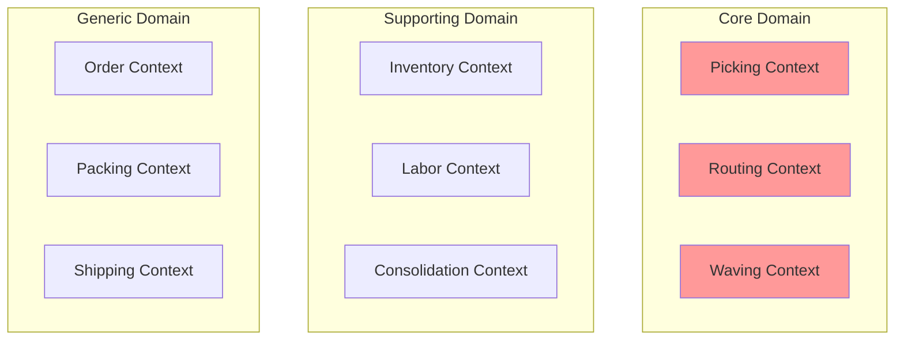
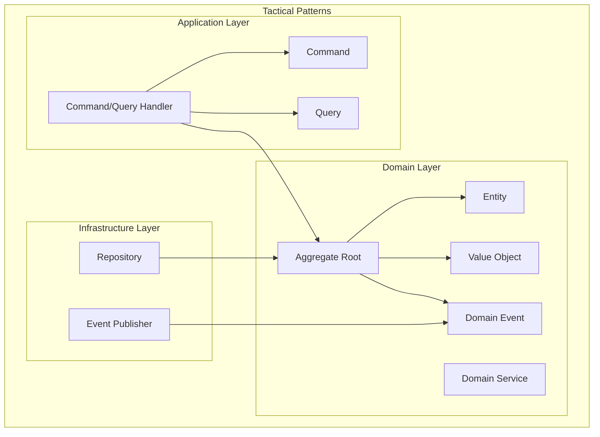
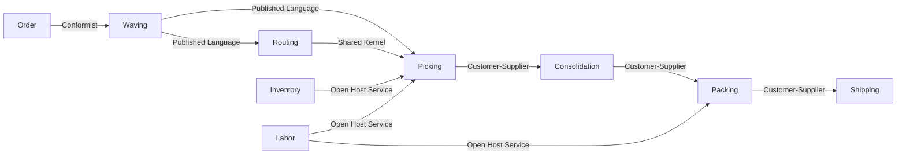
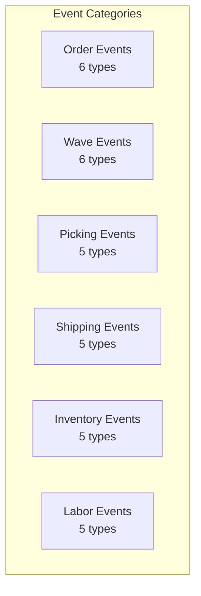
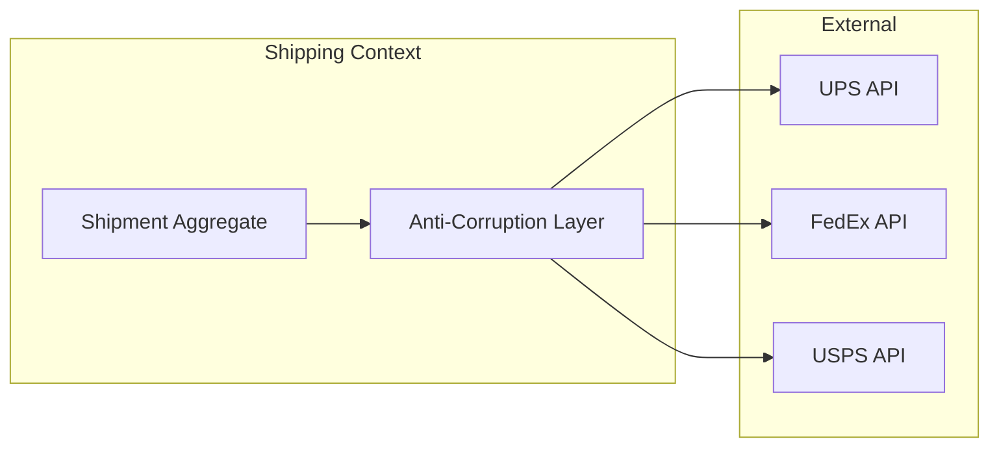

# Domain-Driven Design Overview

The WMS Platform is built following Domain-Driven Design (DDD) principles, organizing the system into bounded contexts with rich domain models.

## Strategic Design

### Domain Classification

### Domain Types

| Type | Description | Examples |
|------|-------------|----------|
| **Core Domain** | Competitive advantage, highest complexity | Picking, Routing, Waving |
| **Supporting Domain** | Necessary for core, but not differentiating | Inventory, Labor, Consolidation |
| **Generic Domain** | Standard functionality, can be outsourced | Order, Packing, Shipping |

## Tactical Design

### Building Blocks

### Pattern Usage

| Pattern | Purpose | Example |
|---------|---------|---------|
| **Aggregate** | Transactional boundary | Order, Wave, PickTask |
| **Entity** | Identity-based object | OrderItem, PickItem |
| **Value Object** | Immutable, no identity | Address, Money, Location |
| **Domain Event** | State change notification | OrderReceivedEvent |
| **Repository** | Aggregate persistence | OrderRepository |

## Bounded Contexts

The WMS Platform consists of 9 bounded contexts:

| Context | Responsibility | Aggregate Root |
|---------|---------------|----------------|
| **Order** | Order lifecycle management | Order |
| **Waving** | Batch order grouping | Wave |
| **Routing** | Pick path optimization | PickRoute |
| **Picking** | Warehouse picking operations | PickTask |
| **Consolidation** | Multi-item order combining | ConsolidationUnit |
| **Packing** | Package preparation | PackTask |
| **Shipping** | Carrier integration & SLAM | Shipment |
| **Inventory** | Stock management | InventoryItem |
| **Labor** | Workforce management | Worker |

## Ubiquitous Language

### Order Management Terms

| Term | Definition |
|------|------------|
| **Order** | Customer request for product fulfillment |
| **Order Line** | Single product/quantity within an order |
| **Priority** | Fulfillment urgency (same_day, next_day, standard) |
| **Validation** | Verification of order completeness and eligibility |

### Warehouse Operations Terms

| Term | Definition |
|------|------------|
| **Wave** | Batch of orders released together for picking |
| **Pick Route** | Optimized path through warehouse for picking |
| **Pick Task** | Assignment to pick items for an order |
| **Tote** | Container used during picking |
| **Location** | Physical position in warehouse (zone/aisle/rack/level) |

### Fulfillment Terms

| Term | Definition |
|------|------------|
| **Consolidation** | Combining picked items for multi-item orders |
| **Packing** | Placing items in shipping container |
| **SLAM** | Scan, Label, Apply, Manifest - shipping process |
| **Manifest** | List of packages for carrier pickup |

## Context Mapping

### Relationship Types

| Relationship | Description |
|--------------|-------------|
| **Conformist** | Downstream accepts upstream model |
| **Published Language** | Shared via events (CloudEvents) |
| **Shared Kernel** | Shared code (Location value object) |
| **Open Host Service** | Public API for consumers |
| **Customer-Supplier** | Upstream serves downstream |

## Domain Events

The platform uses 58+ domain events across 11 Kafka topics:

## Anti-Corruption Layer

The Shipping context uses an ACL for carrier integration:

## Implementation Guidelines

### Aggregate Design Rules

1. **Reference by ID** - Aggregates reference other aggregates only by ID
2. **Small Aggregates** - Keep aggregates small for performance
3. **Transactional Boundary** - One aggregate per transaction
4. **Eventual Consistency** - Between aggregates, use domain events

### Event Design Rules

1. **Past Tense** - Events describe what happened (OrderReceived, not CreateOrder)
2. **Immutable** - Events never change once published
3. **Self-Contained** - Include all necessary data
4. **CloudEvents** - Use CloudEvents 1.0 specification

## Related Documentation

- [Bounded Contexts](./bounded-contexts) - Detailed context descriptions
- [Context Map](./context-map) - Context relationships
- [Aggregates](./aggregates/order) - Aggregate documentation
- [Domain Events](./domain-events) - Event catalog
