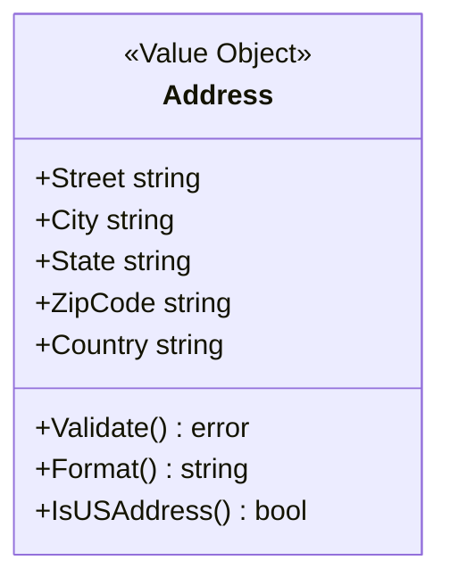
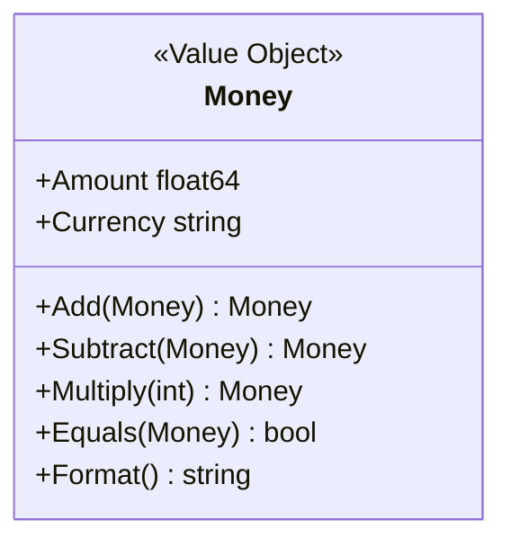
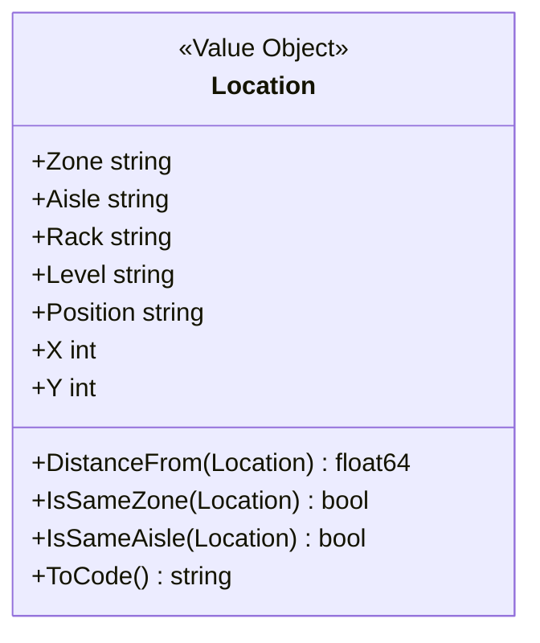
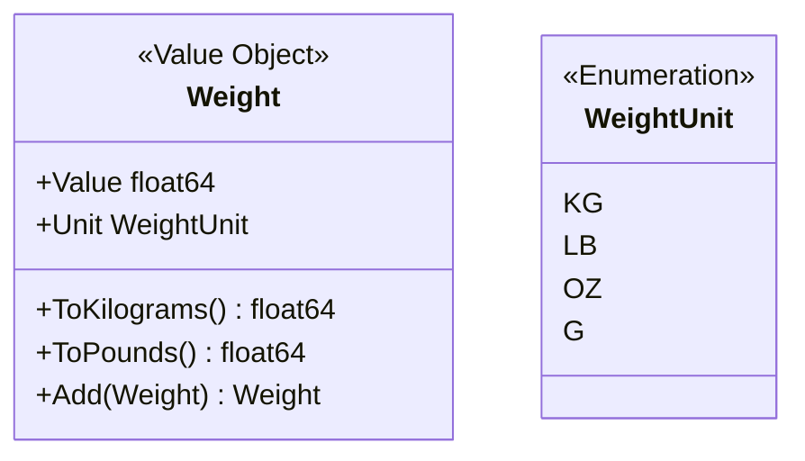
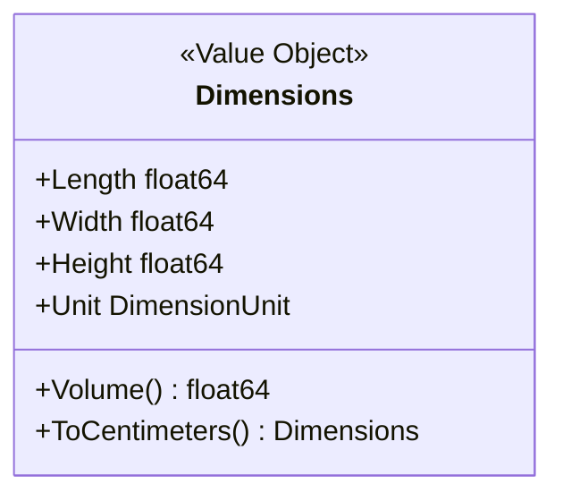
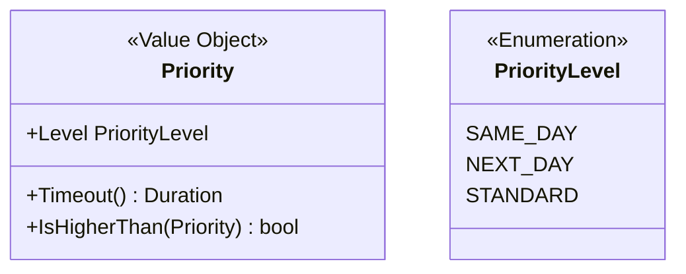
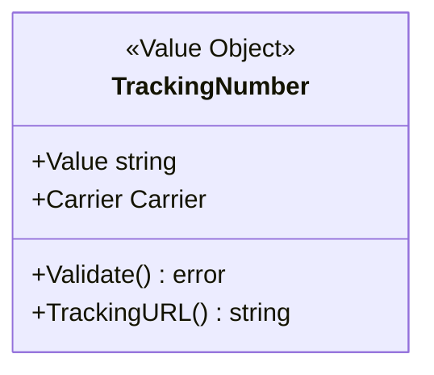
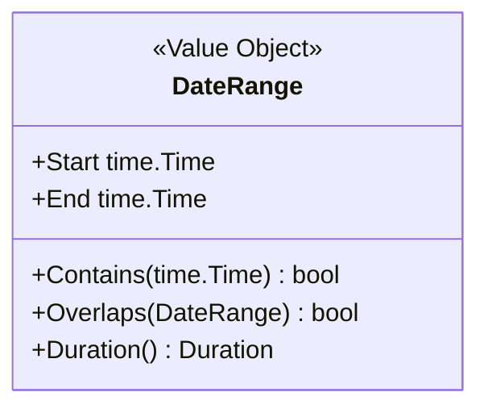

# Value Objects

This document describes the value objects used across the WMS Platform.

## Value Object Principles

Value objects are:
- **Immutable** - Cannot be changed after creation
- **Equality by Value** - Two objects with same values are equal
- **No Identity** - No unique identifier
- **Self-Validating** - Validate on construction

## Common Value Objects

### Address

Used for shipping and billing addresses.



```go
type Address struct {
    Street  string `bson:"street" json:"street"`
    City    string `bson:"city" json:"city"`
    State   string `bson:"state" json:"state"`
    ZipCode string `bson:"zipCode" json:"zipCode"`
    Country string `bson:"country" json:"country"`
}

func (a Address) Validate() error {
    if a.Street == "" || a.City == "" {
        return errors.New("address incomplete")
    }
    return nil
}
```

### Money

Used for prices and monetary amounts.



```go
type Money struct {
    Amount   float64 `bson:"amount" json:"amount"`
    Currency string  `bson:"currency" json:"currency"`
}

func (m Money) Add(other Money) (Money, error) {
    if m.Currency != other.Currency {
        return Money{}, errors.New("currency mismatch")
    }
    return Money{
        Amount:   m.Amount + other.Amount,
        Currency: m.Currency,
    }, nil
}
```

### Location

Used for warehouse positions (Shared Kernel between Routing and Picking).



```go
type Location struct {
    Zone     string `bson:"zone" json:"zone"`
    Aisle    string `bson:"aisle" json:"aisle"`
    Rack     string `bson:"rack" json:"rack"`
    Level    string `bson:"level" json:"level"`
    Position string `bson:"position" json:"position"`
    X        int    `bson:"x" json:"x"`
    Y        int    `bson:"y" json:"y"`
}

func (l Location) DistanceFrom(other Location) float64 {
    dx := float64(l.X - other.X)
    dy := float64(l.Y - other.Y)
    return math.Sqrt(dx*dx + dy*dy)
}

func (l Location) ToCode() string {
    return fmt.Sprintf("%s-%s-%s-%s", l.Zone, l.Aisle, l.Rack, l.Level)
}
```

### Weight

Used for package and item weights.



```go
type WeightUnit string

const (
    WeightUnitKG WeightUnit = "kg"
    WeightUnitLB WeightUnit = "lb"
    WeightUnitOZ WeightUnit = "oz"
    WeightUnitG  WeightUnit = "g"
)

type Weight struct {
    Value float64    `bson:"value" json:"value"`
    Unit  WeightUnit `bson:"unit" json:"unit"`
}

func (w Weight) ToKilograms() float64 {
    switch w.Unit {
    case WeightUnitKG:
        return w.Value
    case WeightUnitLB:
        return w.Value * 0.453592
    case WeightUnitOZ:
        return w.Value * 0.0283495
    case WeightUnitG:
        return w.Value / 1000
    default:
        return w.Value
    }
}
```

### Dimensions

Used for package dimensions.



```go
type Dimensions struct {
    Length float64 `bson:"length" json:"length"`
    Width  float64 `bson:"width" json:"width"`
    Height float64 `bson:"height" json:"height"`
    Unit   string  `bson:"unit" json:"unit"` // cm, in
}

func (d Dimensions) Volume() float64 {
    return d.Length * d.Width * d.Height
}
```

### Priority

Used for order and wave priority.



```go
type Priority string

const (
    PrioritySameDay Priority = "same_day"
    PriorityNextDay Priority = "next_day"
    PriorityStandard Priority = "standard"
)

func (p Priority) WaveTimeout() time.Duration {
    switch p {
    case PrioritySameDay:
        return 30 * time.Minute
    case PriorityNextDay:
        return 2 * time.Hour
    default:
        return 4 * time.Hour
    }
}
```

### TrackingNumber

Used for shipment tracking.



```go
type TrackingNumber struct {
    Value   string `bson:"value" json:"value"`
    Carrier string `bson:"carrier" json:"carrier"`
}

func (t TrackingNumber) TrackingURL() string {
    switch t.Carrier {
    case "UPS":
        return "https://www.ups.com/track?tracknum=" + t.Value
    case "FEDEX":
        return "https://www.fedex.com/fedextrack/?trknbr=" + t.Value
    case "USPS":
        return "https://tools.usps.com/go/TrackConfirmAction?tLabels=" + t.Value
    default:
        return ""
    }
}
```

### DateRange

Used for time periods.



```go
type DateRange struct {
    Start time.Time `bson:"start" json:"start"`
    End   time.Time `bson:"end" json:"end"`
}

func (dr DateRange) Contains(t time.Time) bool {
    return !t.Before(dr.Start) && !t.After(dr.End)
}

func (dr DateRange) Duration() time.Duration {
    return dr.End.Sub(dr.Start)
}
```

## Value Object vs Entity

| Aspect | Value Object | Entity |
|--------|--------------|--------|
| Identity | None | Unique ID |
| Equality | By value | By ID |
| Mutability | Immutable | Mutable |
| Lifecycle | Created/discarded | Tracked over time |
| Example | Address, Money | Order, PickTask |

## Best Practices

1. **Make them immutable** - Return new instances for operations
2. **Validate on creation** - Use constructors that validate
3. **Keep them small** - Focused on one concept
4. **No side effects** - Methods should be pure functions
5. **Override equality** - Implement value-based comparison

## Related Documentation

- [Aggregates](./aggregates/order) - Using value objects in aggregates
- [Domain Events](./domain-events) - Events containing value objects
