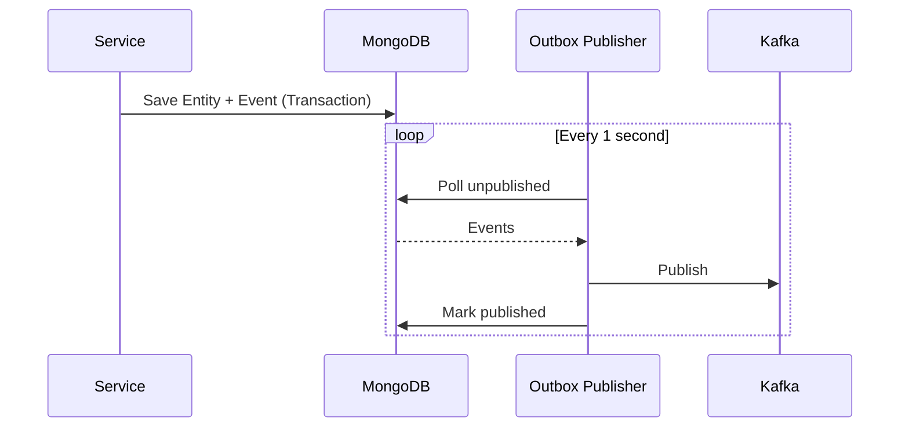

# Apache Kafka

Apache Kafka serves as the event streaming platform for the WMS Platform.

## Configuration

### Broker Address

```
wms-kafka-kafka-bootstrap.kafka.svc.cluster.local:9092
```

### Topics

| Topic | Partitions | Replication | Retention |
|-------|------------|-------------|-----------|
| wms.orders.events | 3 | 3 | 7 days |
| wms.waves.events | 3 | 3 | 7 days |
| wms.routes.events | 3 | 3 | 7 days |
| wms.picking.events | 6 | 3 | 7 days |
| wms.consolidation.events | 3 | 3 | 7 days |
| wms.packing.events | 3 | 3 | 7 days |
| wms.shipping.events | 3 | 3 | 7 days |
| wms.inventory.events | 6 | 3 | 7 days |
| wms.labor.events | 3 | 3 | 7 days |

## Deployment (Strimzi)

### Kafka Cluster

```yaml
apiVersion: kafka.strimzi.io/v1beta2
kind: Kafka
metadata:
  name: wms-kafka
  namespace: kafka
spec:
  kafka:
    version: 3.6.0
    replicas: 3
    listeners:
      - name: plain
        port: 9092
        type: internal
        tls: false
    config:
      offsets.topic.replication.factor: 3
      transaction.state.log.replication.factor: 3
      transaction.state.log.min.isr: 2
      default.replication.factor: 3
      min.insync.replicas: 2
    storage:
      type: persistent-claim
      size: 50Gi
  zookeeper:
    replicas: 3
    storage:
      type: persistent-claim
      size: 10Gi
```

### Topics

```yaml
apiVersion: kafka.strimzi.io/v1beta2
kind: KafkaTopic
metadata:
  name: wms.orders.events
  namespace: kafka
  labels:
    strimzi.io/cluster: wms-kafka
spec:
  partitions: 3
  replicas: 3
  config:
    retention.ms: 604800000  # 7 days
```

## Consumer Groups

| Consumer Group | Service | Topics |
|----------------|---------|--------|
| wms-waving | Waving Service | wms.orders.events |
| wms-picking | Picking Service | wms.waves.events |
| wms-inventory | Inventory Service | wms.orders.events, wms.picking.events |
| wms-analytics | Analytics | All |

## Transactional Outbox



## Kafka UI

Deploy Kafka UI for monitoring:

```yaml
apiVersion: apps/v1
kind: Deployment
metadata:
  name: kafka-ui
  namespace: kafka
spec:
  template:
    spec:
      containers:
        - name: kafka-ui
          image: provectuslabs/kafka-ui:latest
          env:
            - name: KAFKA_CLUSTERS_0_NAME
              value: wms-kafka
            - name: KAFKA_CLUSTERS_0_BOOTSTRAPSERVERS
              value: wms-kafka-kafka-bootstrap:9092
          ports:
            - containerPort: 8080
```

Access: `kubectl port-forward svc/kafka-ui 8080:8080 -n kafka`

## Monitoring

Key metrics:
- `kafka_server_broker_topic_metrics_messages_in_total`
- `kafka_consumer_consumer_fetch_manager_metrics_records_lag`
- `kafka_producer_producer_metrics_record_send_total`

## Related Documentation

- [Events API](/api/events-api) - Event specifications
- [Domain Events](/domain-driven-design/domain-events) - Event catalog
