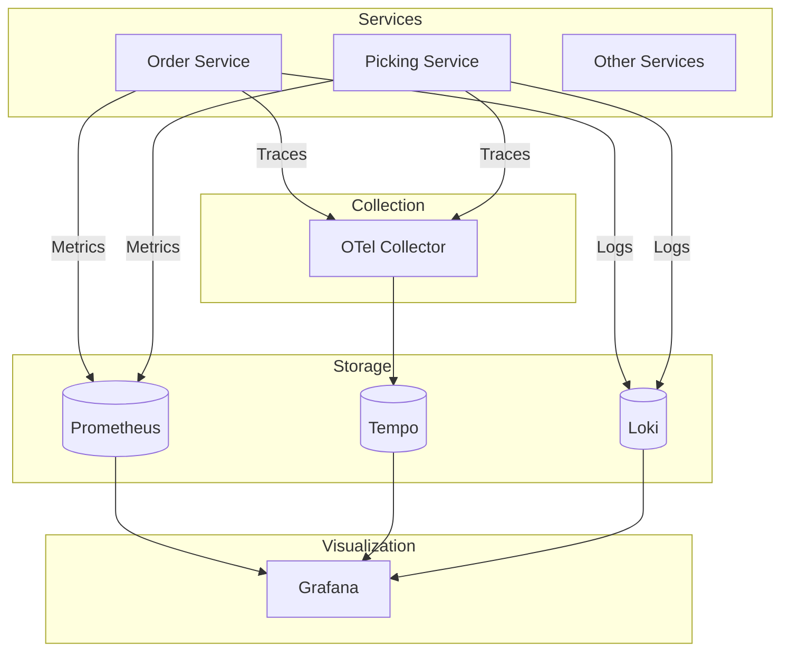
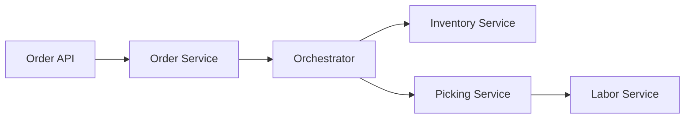

# Observability

The WMS Platform uses a comprehensive observability stack for monitoring, logging, and tracing.

## Stack Components



## Prometheus (Metrics)

### Service Metrics

| Metric | Type | Description |
|--------|------|-------------|
| http_requests_total | Counter | Total HTTP requests |
| http_request_duration_seconds | Histogram | Request latency |
| orders_created_total | Counter | Orders created |
| picks_completed_total | Counter | Pick tasks completed |
| outbox_events_published_total | Counter | Outbox events published |
| outbox_events_pending | Gauge | Pending outbox events |

### Scrape Configuration

All services expose `/metrics` endpoint:

```yaml
scrape_configs:
  - job_name: 'wms-services'
    kubernetes_sd_configs:
      - role: pod
    relabel_configs:
      - source_labels: [__meta_kubernetes_pod_annotation_prometheus_io_scrape]
        action: keep
        regex: true
```

### Dashboards

Pre-built Grafana dashboards:
- Service Overview
- Order Processing
- Picking Performance
- Outbox Monitoring
- Kafka Consumer Lag

## Tempo (Tracing)

### OpenTelemetry Configuration

```yaml
exporters:
  otlp:
    endpoint: tempo.observability.svc.cluster.local:4317
    tls:
      insecure: true
```

### Trace Propagation

Services propagate trace context via headers:
- `traceparent`
- `tracestate`

### Example Trace



## Loki (Logging)

### Log Format

Structured JSON logs:

```json
{
  "timestamp": "2024-01-15T10:30:00Z",
  "level": "info",
  "message": "Order created",
  "service": "order-service",
  "traceId": "abc123",
  "orderId": "ORD-12345"
}
```

### Querying

LogQL examples:

```logql
# Errors in last hour
{service="order-service"} |= "error"

# Orders with specific ID
{service=~".*-service"} | json | orderId="ORD-12345"
```

## Grafana

### Accessing Dashboards

```bash
kubectl port-forward svc/grafana 3000:3000 -n observability
```

URL: `http://localhost:3000`
Default credentials: admin/admin

### Data Sources

| Source | Type | Purpose |
|--------|------|---------|
| Prometheus | prometheus | Metrics |
| Tempo | tempo | Traces |
| Loki | loki | Logs |

### Dashboard Hierarchy

```
WMS Platform
├── Overview
│   ├── Service Health
│   ├── Request Rate
│   └── Error Rate
├── Services
│   ├── Order Service
│   ├── Picking Service
│   └── ... (all services)
├── Infrastructure
│   ├── MongoDB
│   ├── Kafka
│   └── Temporal
└── Business
    ├── Order Fulfillment
    ├── Picking Performance
    └── Shipping Metrics
```

## Alerting

### Alert Rules

```yaml
groups:
  - name: wms-alerts
    rules:
      - alert: HighErrorRate
        expr: rate(http_requests_total{status="5xx"}[5m]) > 0.1
        for: 5m
        labels:
          severity: critical

      - alert: OutboxBacklog
        expr: outbox_events_pending > 1000
        for: 10m
        labels:
          severity: warning
```

### Notification Channels

- Slack
- PagerDuty
- Email

## SLIs and SLOs

| SLI | SLO | Measurement |
|-----|-----|-------------|
| Availability | 99.9% | Successful requests / Total |
| Latency (p99) | < 500ms | Request duration |
| Error Rate | < 0.1% | 5xx responses / Total |
| Order Fulfillment | 99% | Orders shipped on time |

## Deployment

```bash
# Install kube-prometheus-stack
helm install prometheus prometheus-community/kube-prometheus-stack \
  -n observability --create-namespace

# Install Tempo
helm install tempo grafana/tempo \
  -n observability

# Install Loki
helm install loki grafana/loki-stack \
  -n observability
```

## Related Documentation

- [Infrastructure Overview](./overview) - System topology
- [Deployment](/architecture/system-diagrams/deployment) - Kubernetes setup
