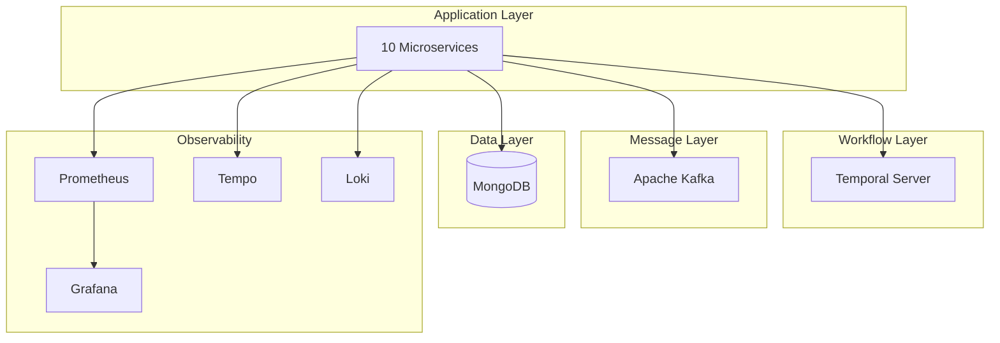

# Infrastructure Overview

This document provides an overview of the WMS Platform infrastructure components.

## Infrastructure Components



## Component Summary

| Component | Purpose | Port |
|-----------|---------|------|
| MongoDB | Document database | 27017 |
| Apache Kafka | Event streaming | 9092 |
| Temporal | Workflow orchestration | 7233 |
| Prometheus | Metrics collection | 9090 |
| Grafana | Visualization | 3000 |
| Tempo | Distributed tracing | 4317 |
| Loki | Log aggregation | 3100 |

## Kubernetes Namespaces

| Namespace | Components |
|-----------|------------|
| wms-platform-dev | Application services |
| temporal | Temporal server |
| kafka | Kafka + Zookeeper |
| mongodb | MongoDB ReplicaSet |
| observability | Prometheus, Grafana, Tempo, Loki |

## Deployment Options

### Local Development (Kind)

```bash
# Create Kind cluster
kind create cluster --name wms-platform

# Deploy infrastructure
make infra-deploy

# Deploy services
make wms-deploy
```

### Production (Kubernetes)

```bash
# Deploy with Helm
helm upgrade --install wms-platform ./helm/wms-platform \
  -f ./helm/wms-platform/values-production.yaml \
  -n wms-platform
```

## Related Documentation

- [MongoDB](./mongodb) - Database setup
- [Kafka](./kafka) - Message broker
- [Temporal](./temporal) - Workflow engine
- [Observability](./observability) - Monitoring stack
